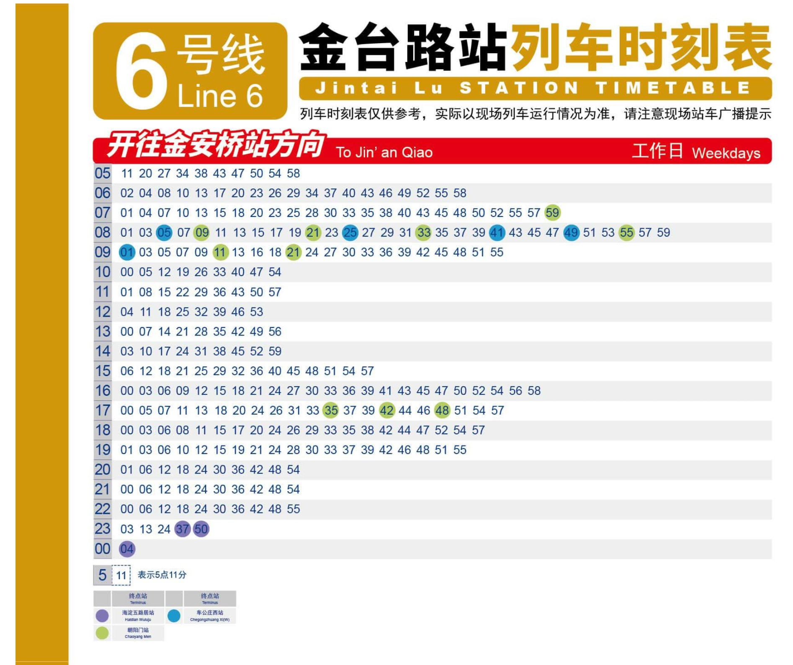

# Create a New Subway Line from Scratch
Note: this guide will be tailored specifically towards adding a line in Beijing.
Other cities may have different scenarios, but the basic principles should be the same.

So you want to add the data of a newly opened subway line?
Welcome!
The process of adding a new line into this tool mainly consists of describing its timetables.
By timetable, I am referring to a table of train departure times like this:


Our main goal is to translate the above timetable into a JSON5 specification:
[see here for the translation of the above timetable](https://github.com/Mick235711/Beijing-Subway-Tools/blob/9f00be42059ece0b3ebf59a2ff571197154b9ac0/data/beijing/line6.json5#L1950-L1987).

## 1. Create the City
If you are describing the first line of a new city, then you first need to create the city metadata.
To achieve this, add a new folder under `data/`, and edit `data/<city>/metadata.json5` to add the following field:
```json5
{
    city_name: "北京",
    city_aliases: ["Peking"],
    transfers: {}
}
```
Note that the literal pinyin translation (like Beijing) will be automatically calculated, so only secondary English
names are needed in the aliases field.

Then, you need to register the carriage types used within the city in `carriage_types.json5`, like follows:
```json5
{
    // 标准A型
    "A": {
        name: "A型车",
        aliases: ["Type A"],
        capacity: 310
    },
    // ...
}
```
The specification is available [here](specification.md#carriage-specification-format).
[Beijing's carriage type specs](../data/beijing/carriage_types.json5) contains most of the common carriage types used
within mainland China, so you can copy that file over and modify on top of that.

## 2. Populate Line Metadata
Create a new JSON5 file under the city folder (name can be anything as long as it
does not clash with metadata, carriage type or starts with `map_`).
Then, you need to fill out the basic metadata for this line, like follows:
(specs available [here](specification.md#line-specification-format))
```json5
{
    name: "N号线",
    aliases: ["Line N"],
    carriage_num: 8,
    carriage_type: "B",  // keys in carriage_types.json5
    design_speed: 100,  // in km/h
    stations: [
        {name: "Station 1"},
        {name: "Station 2", dist: 1000},  // distance from station 1 to 2 in meters
        {name: "Station 3", dist: 2000},  // distance from station 2 to 3 in meters
        // ...
    ],
    train_routes: {
        // Adapt as needed, this specifies the general directions (usually only 2)
        "东行": {
            aliases: ["Eastbound"],
            "全程车": {},
            "出库车": {starts_with: "Station 2"},
            "回库车": {ends_with: "Station 3"},
            // ...
        },
        "西行": {
            aliases: ["Westbound"],
            reversed: true,
            "全程车": {},
            "出库车": {starts_with: "Station 3"},
            "回库车": {ends_with: "Station 2"},
            // ...
        }
    },
    date_groups: {
        // usually only those two, you can add more if needed
        "工作日": {weekday: [1, 2, 3, 4, 5], aliases: ["Weekdays"]},
        "双休日": {weekday: [6, 7], aliases: ["Weekends"]}
    },
    timetable: {},
}
```
For loop lines, you need to add `loop: true`, append `loop_last_segment`
(lower-bound estimation of the minutes required from last station to first station), and also add a `dist` to the first
station to represent the distance in meters between the last and the first station.

For express lines that have special fare rules (such as airport expresses, maglev, etc.),
you need to specify `must_include` field to include stations that must be arriving at/leaving from when using this line.

As for how to get the distance between stations, you can use Google Maps or Baidu Maps to measure the distance.
Also, many metro systems also have the distance between stations listed on their official website.
For Beijing Subway's data, the following sources are used:
- Beijing Subway Official Website Station Distance Data: [here](https://www.bjsubway.com/station/zjgls/)
- BJMTR Official Website Station Distance Data: [here](https://www.mtr.bj.cn/service/line/distable/line-4.html)
- BJMOA Official Website Station Distance Data: [here](https://www.bjmoa.cn/indishare/sitemaster.nsf/frmsecondcxcx_xm?openform&database=bjmtroa/lwczzjjxx.nsf&view=vwPublicedByCatforsite_xm&path=1code&mkfl=cxcx)

## 3. Fill the Timetable
Now we try to fill the timetable for each station.
In general, we choose one direction, start from the first station and progress along the line until the end,
and then start from the first station in other directions until the whole line is recorded.
Usually, different date group's timetable is recorded together
(for example, Westbound Weekday -> Westbound Weekends -> Eastbound).

As for how to get a timetable for a particular station?
Some good metro systems will also publish timetables for each station on their official website,
such as Beijing Subway's data listed [here](https://www.bjsubway.com/station/xltcx/line1/).
In other cases, Google/Apple/Baidu/AutoNavi Maps often have some data about possible leaving time of trains.

### 3.1. First Station
As the first station in a line, we cannot use relative time delta to deduce a timetable.
Therefore, we need to fill the timetable manually.

First, you need to obtain a text version of timetable,
either by OCR-ing the timetable image or obtain from some data source.
For example, the text representation for the above picture is like:
```
05 11 20 27 34 38 43 47 50 54 58
06 02 04 08 10 13 17 20 23 26 29 34 37 40 43 46 49 52 55 58
07 01 04 07 10 13 15 18 20 23 25 28 30 33 35 38 40 43 45 48 50 52 55 57 59
08 01 03 05 07 09 11 13 15 17 19 21 23 25 27 29 31 33 35 37 39 41 43 45 47 49 51 53 55 57 59
09 01 03 05 07 09 11 13 16 18 21 24 27 30 33 36 39 42 45 48 51 55
10 00 05 12 19 26 33 40 47 54
11 01 08 15 22 29 36 43 50 57
12 04 11 18 25 32 39 46 53
13 00 07 14 21 28 35 42 49 56
14 03 10 17 24 31 38 45 52 59
15 06 12 18 21 25 29 32 36 40 45 48 51 54 57
16 00 03 06 09 12 15 18 21 24 27 30 33 36 39 41 43 45 47 50 52 54 56 58
17 00 05 07 11 13 18 20 24 26 31 33 35 37 39 42 44 46 48 51 54 57
18 00 03 06 08 11 15 17 20 24 26 29 33 35 38 42 44 47 52 54 57
19 01 03 06 10 12 15 19 21 24 28 30 33 37 39 42 46 48 51 55
20 01 06 12 18 24 30 36 42 48 54
21 00 06 12 18 24 30 36 42 48 54
22 00 06 12 18 24 30 36 42 48 55
23 03 13 24 37 50
00 04
```
Note that if you use OCR, it is common for some numbers to be misidentified, please double check the correctness of the OCR result.
After obtaining this text, you need to add a pipe to separate the hour and minutes
(so that the first line looks like `05|11 20 27 ...`).

After doing the preprocessing, it is time to fill in the routes. To fill in the routes, first we need to understand the brace conventions:

#### 3.1.1. Braces Conventions
Braces are an integral part of the route-filling syntax. You can use them to specify routes in inputs, and they will
represent different routes in outputs. There are four basic kind of braces: `()`, `[]`, `{}`, and `<>`.
More braces can be constructed by repeating basic kinds. For example, `(())` can be a valid brace.

Every brace will represent a different route. For example:
- No brace will typically represent trains that run the full journey
- `()` represents trains that stars from Station A
- `[]` represents trains that ends at Station B
- Then, `([])` represents trains that starts from Station A and ends at Station B

If you must combine two braces constructed from the same basic kind, to avoid ambiguity, a plus sign is inserted.
For example, the combination of `()` and `(())` is written as `(+(())+)`.

Now you know about the braces, let's amend the timetable. The above timetable should be modified like this:
```
05|11 20 27 34 38 43 47 50 54 58
06|02 04 08 10 13 17 20 23 26 29 34 37 40 43 46 49 52 55 58
07|01 04 07 10 13 15 18 20 23 25 28 30 33 35 38 40 43 45 48 50 52 55 57 (59)
08|01 03 {05} 07 (09) 11 13 15 17 19 (21) 23 {25} 27 29 31 (33) 35 37 39 {41} 43 45 47 {49} 51 53 (55) 57 59
09|{01} 03 05 07 09 (11) 13 16 18 (21) 24 27 30 33 36 39 42 45 48 51 55
10|00 05 12 19 26 33 40 47 54
11|01 08 15 22 29 36 43 50 57
12|04 11 18 25 32 39 46 53
13|00 07 14 21 28 35 42 49 56
14|03 10 17 24 31 38 45 52 59
15|06 12 18 21 25 29 32 36 40 45 48 51 54 57
16|00 03 06 09 12 15 18 21 24 27 30 33 36 39 41 43 45 47 50 52 54 56 58
17|00 05 07 11 13 18 20 24 26 31 33 (35) 37 39 (42) 44 46 (48) 51 54 57
18|00 03 06 08 11 15 17 20 24 26 29 33 35 38 42 44 47 52 54 57
19|01 03 06 10 12 15 19 21 24 28 30 33 37 39 42 46 48 51 55
20|01 06 12 18 24 30 36 42 48 54
21|00 06 12 18 24 30 36 42 48 54
22|00 06 12 18 24 30 36 42 48 55
23|03 13 24 [37] [50]
00|[04]
```
Notice how each different colored number in the original image corresponds to a different route.

Then, you need to fill the timetable in the JSON5 file by calling [`src/timetable/input_to_timetable.py`](tools.md#input_to_timetablepy-parse-text-input-into-timetable-description).
In general, you can use `-l 5` to specify the required indent for JSON5 files if you follow the above format.
Simply copy the amended timetable text into the input, and then send an EOF (Ctrl-D on Linux/macOS, Ctrl-Z + Enter on Windows).
The program will then ask for the route name associated with each kind of braces. Those route names correspond to the keys under `train_routes.<direction>` in the line metadata file.

Then, the program will output the JSON5 description of the timetable, which you can copy and paste into the line metadata file.
Notice that the `timetable` dictionary is structured like follows:
```json5
{
    timetable: {
        "Station A": {
            "Direction 1 (such as 东行)": {
                "Date Group 1 (such as 工作日)": {
                    /* Outputted specs here, schedule/filter should be the keys */
                }
                // Other date groups
            }
            // Other directions
        }
        // Other stations
    }
}
```
See [`line1.json5`](../data/beijing/line1.json5) for an example.

### 3.2. The Following Stations
After filling out the first station's timetable, the following stations are easier to fill.
In general, there are three viable approaches to fill an intermediate station's timetable.

#### 3.2.1. Fill By Relative Time Delta
In general, we know that trains usually need a constant time between two stations. Therefore, different train's arriving time difference between two stations
is usually the same. For example, if one train need 2 minutes to travel from Station A to Station B, then the next train will usually also need 2 minutes to travel from Station A to Station B.

In this case, we can call [`src/timetable/timetable_from_prev.py`](tools.md#timetable_from_prevpy-create-next-timetable-from-previous-stations-timetable) to fill the timetable following this principle.
You need to first enter the last station and the corresponding filling direction and date group (note on tips for [Answering Prompts](tools.md#answering-prompts)),
and then the program will prompt for the minutes required between last and this station.
This time difference can usually be obtained by noticing the first train's arriving time difference between two stations.

The program will then enter the timetable modification mode. The last station's timetable will be displayed, with the same
minute number added to each train. Since it is possible that some trains runs faster, or simply the time required between two
stations is not a whole minute number, the resulting timetable is usually different from the real one.
Therefore, you need to input modification lines.

As a concrete example: (*Italic* means the input from the user)
<pre>
City default: &lt;北京: 24 lines&gt;
? Please select a line: <i>5号线</i>
? Please select a direction: <i>南行</i>
? Please select a station (default: 宋家庄): <i>惠新西街南口</i>
? Please select a date group: <i>工作日</i>
? What is the running time (in minutes) to next station? <i>3</i>
Current Timetable:
05| 22 27 31 35 39 43 47 51 55
06| 00 04 09 13 17 21 25 29 33 37 41 46 50 54 57 59
07| 02 04 06 08 10 13 15 17 19 21 23 25 27 29 31 33 35 37 39 42 44 46 48 50 53 55 57 59
08| 01 03 06 08 10 12 14 16 18 20 22 24 26 28 30 32 35 37 39 41 43 46 48 50 52 54 57 59
09| 01 03 05 08 10 12 14 16 18 20 22 24 26 28 30 32 34 37 39 41 43 45 47 50 53 57
10| 01 05 09 13 17 21 25 29 33 37 41 45 50 54 59
11| 04 10 16 22 28 34 40 46 52 58
12| 04 10 16 22 28 34 40 46 52 58
13| 04 10 16 22 28 34 40 46 52 58
14| 04 10 16 22 28 34 40 46 52 58
15| 04 10 16 22 28 33 38 42 47 51 55
16| 00 04 09 13 17 22 26 30 34 38 42 46 51 55 59
17| 03 07 09 11 13 15 18 20 22 24 26 28 30 32 34 36 38 40 42 44 47 49 51 53 55 57
18| 00 02 04 06 08 11 13 15 17 19 21 23 25 27 29 31 33 35 37 40 42 44 46 48 51 53 55 57
19| 00 04 07 11 14 18 21 25 28 32 35 39 42 46 50 54 58
20| 02 06 10 14 18 23 27 32 37 42 47 52 57
21| 02 08 13 20 27 33 39 45 50 57
22| 03 08 14 22 30 38 46 (53)
23| (00) (07) (14) (21) (28) (36) (44) (52)
00| (00)

() = <[南行] 大屯路东始发空车: 大屯路东 -> 雍和宫 -> 崇文门 -> 宋家庄>
? Enter a modification (or ok):
</pre>

There are many possible prompts. The most common ones are:
- Directly enter a single hour's specification line. For example, `05|11 (22) 33` will delete all previous trains in the 05 line, and then insert those three trains.
- Add/minute minutes. For example, `05|+2` will add 2 minutes to all trains in the 05 line.
- Segmented addition/subtraction. For example, `05|+1[:5]` will add 1 minute to the first 5 trains in the 05 line. Other Python slice syntax such as step is also supported.

After each modification, the then-current timetable will be shown again. When the timetable matches the real one, you can simply
enter `ok` or an empty prompt to finish modifying. The specification will then be outputted.

#### 3.2.2. Fill By OCR
If you feel confident on OCR result (i.e., the time taken to correct the mis-identification is acceptable), then you can also use OCR to fill the timetable.
Specifically, we can use the `-v` and `-e` flag for [`src/timetable/input_to_timetable.py`](tools.md#input_to_timetablepy-parse-text-input-into-timetable-description).
In this case, we no longer need to do most of the processing for the timetable text: you don't need to add pipe symbols,
and you don't need to add braces. The program will automatically detect the routes from the last station's timetable and fill accordingly.

If you specify `-v -e`, then after sending the EOF the program will ask for the last station and direction/date group.
Some common error cases are handled, see the above file name link for more information.

#### 3.2.3. Fill Manually
Of course, filling manually like introduced in the ["First Station"](#31-first-station) section is also a viable option.
However, since manual filling will not include any kind of validation, this method is generally not recommended.

### 3.3. Last Station
The last station in each direction is another special case, since most lines will not actually publish any timetable for the last
station in each direction, as you cannot board the train here. If this is the case, then the recommended practice is to
find out the time needed between the second-to-last station and the last station from the opposite direction (usually by observing the first train's
required time or use [`src/routing/show_station_time.py`](tools.md#show_station_timepy-show-time-needed-for-trains-to-travel-between-two-stations-on-a-line)).

Then, you can simply guess the last station's timetable by using the method in ["Fill By Relative Time Delta"](#321-fill-by-relative-time-delta),
entering the minutes and directly save without any modification. It is a rough guess, but without any data we cannot really do better.

When you finished specifying a direction, please make sure to run [`src/routing/show_trains.py`](tools.md#show_trainspy-show-all-trains-calculated-in-a-line)
to validate the direction's timetable. Please enter a few trains to see if there are any irregularities.

### 3.4. Special Cases
#### 3.4.1. Loop Lines
As mentioned before, for loop lines, you need to add `loop: true`, and append `loop_last_segment` and `dist` fields.
After doing this, specify as normal, and the trains will be automatically ended at the start station to complete the loop.

However, a small detail is that you will need to choose a split. In other words, even if it is a loop line, you still need
to specify a starting station. In this case, some sectional routes will seem strange, but are perfectly valid:
```json5
{
    // Assume the line is A -> B -> C -> D -> A
    train_routes: {
        "外环": {
            aliases: ["Counter-clockwise"],
            "全程车": {}, // A -> B -> C -> D -> A
            "回库车": {ends_with: "Station D"}
            // duplicate for normal line, but actually represents A -> B -> C -> D and then stop trains
            // starts_with A is the same principle
        }
    }
}
```

After specifying a direction for a loop line, you may additionally want to run [`src/routing/show_segments.py`](tools.md#show_segmentspy-train-segment-analyzer) to validate the loop line's timetable.

#### 3.4.2. Express/Rapid Service
Occasionally, you may need to specify that a rapid train will skip a few stations to obtain higher speed.
To do this, you can specify [the `skip` field](specification.md#routing-specification-format) in the route.

However, notice that you still need to specify the timetable as usual for skipped stations. The only difference is that
the time recorded for those stations will then be regarded as "passing time" instead of "stopping time". In other words,
it will be assumed that you cannot board/disembark on those stations.

After specifying a direction for a rapid service, you may additionally want to run [`src/routing/show_express_trains.py`](tools.md#show_express_trainspy-express-train-analyzer) to analyze the specified express service.

## 4. Fill the Transfer Times
After specifying all the directions (and validated that all the trains behave as expected), it is time to integrate
the line into the whole network.

By default, it is assumed that you can transfer between all the stations with the same name in different lines.
If scenarios like the Pudian Road station in Shanghai Metro exists (where both line have a station with the same name,
but you cannot transfer between them), it is advisable to name them differently (e.g. "Pudian Road (Line 4)").

To specify the transfers, you need to append the transfer times to the `transfers` field in the city metadata file:
```json5
{
    transfers: {
        "Station A": [
            {from: "Line 1", to: "Line 2", minutes: 3.5},
            {from: "Line 2", to: "Line 1", minutes: 0.5},
            // The transfer from 1 to 2 only takes 1 minute if happen before 6:30am or after 8:30pm
            {
                from: "Line 1", to: "Line 2", minutes: 1,
                apply_time: [{end: "06:30"}, {start: "20:30"}]
            }
        ],
        // ...
    },
    // Record possible transfer between differently named stations
    virtual_transfers: [
        {
            // AAA is on Line 1/2, BBB is on Line 3
            from_station: "Station AAA", to_station: "Station BBB",
            times: [
                {from: "Line 1", to: "Line 3", minutes: 11},
                {from: "Line 2", to: "Line 3", minutes: 10}
            ]
        },
        // ...
    ]
}
```
If you only provide the minutes required for transfer from A to B, it is assumed that the reverse direction (B to A) will cost the same duration.
You can also specify directions if the platform for different direction is not on the same level (e.g. non-island platform, cross-platform transfers, etc.).

Since we don't really care about fares in this project, if the transfer requires exiting the gates and re-entering,
we still consider it as a valid transfer (albeit a long one). Also notice that since timetables are only specified in minutes,
a 3.1-minute transfer has the same effect as a 3.9-minute transfer. As a result, it is recommended to stick to whole minutes or .5 minutes.

After specifying all the transfers, you should be able to run [`src/bfs/shortest_path.py`](tools.md#shortest_pathpy-find-the-shortest-path-between-two-stations)
to find routes using the new lines.

Transfer time data can come from various sources. For Beijing Subway, I used the following sources:
- Transfer Time Data Collection (stations opened before 2021): [here](http://www.ditiezu.com/forum.php?mod=viewthread&tid=71145)
- Bilibili POVs (as documented in the metadata files)

## 5. Chart on Maps
Finally, to finalize the addition, you need to chart your new line on a map to enable drawing equ-time images.
To do this for a new city, put a high-resolution image of the official route map under `data/<city>/maps/`,
and then create a new JSON5 file starting with `map_`, containing the follows:
```json5
{
    name: "Official Map",
    path: "maps/<your-map>.png",
    radius: 34, // radius of the station circle in pixels
    transfer_radius: 57, // radius of the transfer station circle in pixels
    coordinates: {
        // Note: these are the upper-left corner coordinates, not the center coordinates!
        // (0, 0) should be at the upper-left of the entire image
        "Station 1": {x: 2577, y: 8157},
        "Station 2": {x: 2886, y: 8157},
        // ...
    }
}
```
The equ-time visualization works by drawing white circles on station coordinates, and then filling in the average minute number.

After specifying all the coordinates of the new stations, you should be able to run [`src/graph/draw_map.py`](tools.md#draw_mappy-draw-equ-time-map-originating-from-a-station)
to draw new versions of the equ-time map.

## 6. Advanced Topics
### 6.1. Branch

### 6.2. Single-Direction Service

### 6.3. Through Train

### 6.4. Multi-Carriage-Number Trains

### 6.5. Wrong Timetable