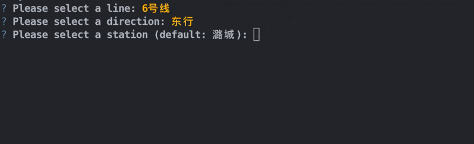

# Tools Usage
This project does not require any kind of installation. Just clone the repo and with
a valid installation of Python (3.10+ required) and a few packages (listed on the homepage), you can start
using the tools provided.

This document describes the usage, parameter, and intended result of each tool in detail.

# General
### General Structure
Due to the design of relative imports, please run all the programs from the **root** directory of the project.
For example, (You may need to prepend `export PYTHONPATH=.`)
```shell
$ python3 src/timetable/print_timetable.py  # Correct
$ cd src/timetable; python3 print_timetable.py  # Wrong
```
Also, a lot of the program files are support files and cannot be run.
Only those documented below are intended to be run directly from the command line.

All the runnable program utilize `argparse` to parse their arguments, so passing `-h` or `--help` will
show the help message of the program.

### Answering Prompts
Most of the programs in this project will ask for information such as city, line and starting station.
Those prompts will be handled by `questionary`.
Notice that both Chinese and English auto-complete are supported,
and you can always press TAB to get a list of possible answers.

Regarding Pinyin inputs, all possible tones/readings are supported:


Notice that also, directional verbs can be completed from East/West/etc.

# [`timetable/`](/src/timetable): Creating and Modifying Timetables
### [`print_timetable.py`](/src/timetable/print_timetable.py): Print any station's timetable
```
usage: print_timetable.py [-h] [-e] [-i INCLUDE_ROUTES | -x EXCLUDE_ROUTES]

options:
  -h, --help            show this help message and exit
  -e, --empty           Show empty timetable
  -i INCLUDE_ROUTES, --include-routes INCLUDE_ROUTES
                        Include routes
  -x EXCLUDE_ROUTES, --exclude-routes EXCLUDE_ROUTES
                        Exclude routes
```
Simply print any station's timetable. The program will ask for city, line, station and direction.
If `-e` is specified, the printing will be without any kind of route information or brace decoration.

Additionally, options `-i` and `-x` can be used to include/exclude specific routes.
For instance, `-x A站始发空车,B站回库车` exclude trains with these routes in the output.

Example Usage: (Notice that everything *italicized* is input)
<pre>
$ python3 src/timetable/print_timetable.py
City default: &lt;北京: 24 lines&gt;
? Please select a line: <i>6号线</i>
? Please select a direction: <i>东行</i>
? Please select a station (default: 潞城): <i>金安桥</i>
? Please select a date group: <i>工作日</i>
05| 06 14 22 30 37 45 52
06| 00 07 15 22 30 34 37 41 45 {49} 52 56 {59}
07| 02 05 {08} 11 14 {17} 20 23 {26} 29 32 35 38 41 44 47 50 (53) 56 (59)
08| 02 05 (08) 10 (12) 15 (18) 20 22 (24) 26 29 32 (34) 40 (45) 48 (50) 55 (59)
09| 03 07 09 (12) 15 18 21 (24) 26 (29) 32 36 39 (42) 45 (48) 51 (54) 57
10| (00) 03 (06) 10 (13) 16 (19) 23 (26) 29 35 42 48 54
11| 00 07 13 20 27 34 41 48 55
12| 02 09 16 23 30 37 44 51 58
13| 05 12 19 26 33 40 47 54
14| 01 08 15 22 29 36 43 50 57
15| 04 11 18 25 32 39 46 53
16| 00 04 10 14 18 22 26 30 34 37 40 43 46 49 52 55 58
17| 01 04 [08] 11 [15] 18 20 22 25 29 [31] 33 35 37 [39] 42 44 [46] 48 50 [52] 55 57 59
18| [01] 03 05 08 [10] 12 14 16 [18] 21 (23) 25 27 (29) 31 34 (36) 38 (40) 43 46 (49) 52 (55) 58
19| (01) 04 (07) 10 (13) 16 (19) 22 (25) 28 (31) 34 (37) 40 (44) 47 (50) 53 (56) 59
20| (02) 05 (08) 11 (14) 17 (20) 23 (26) 29 (32) 35 (38) 41 (44) 48 54
21| 00 06 12 18 24 30 36 42 48 54
22| 00 06 12 18 24 (30) (36) (42) (48) (54)
23| (00) (06) (12) (18) (24) (30) (35)

() = <[东行] 草房回库车: 金安桥 -> 白石桥南 -> 东大桥 -> 草房>
[] = <[东行] 通州北关小交路: 金安桥 -> 白石桥南 -> 呼家楼 -> 通州北关>
{} = <[东行] 出城快车: 金安桥 -> 车公庄西 -> 青年路 -> 潞城 (skip 8 stations)>
</pre>

### [`input_to_timetable.py`](/src/timetable/input_to_timetable.py): Parse text input into timetable description
```
usage: input_to_timetable.py [-h] [-l LEVEL] [-b BREAK_ENTRIES] [-v] [-e] [--skip-prev]

options:
  -h, --help            show this help message and exit
  -l LEVEL, --level LEVEL
                        Indentation level before each line
  -b BREAK_ENTRIES, --break BREAK_ENTRIES
                        Entry break
  -v, --validate        Validate the result
  -e, --empty           Store empty timetable
  --skip-prev           Skip checking for stations more than 1
```
Parse a text input into a timetable JSON5 specification.
See [here](a-new-line-from-scratch.md#31-first-station) for a detailed description of its usage.

- `-b` determines the threshold of number of entries to break two consecutive `schedule` specification (defaults to 15).
- `-l N` will append `4 * N` spaces before each line. (Default behavior is to not prepend spaces; `-l 5` is recommended for storing timetable specs)
- `-v` will validate the result after parsing. (i.e., compare with previous station's timetable and validate correctness)
- `-e` will assume inputs are empty timetables without any brace/route specs. If used together with `-v`, routes will be calculated from the previous station's timetable.
This also enables tolerance modes, and will try to correct some common mistakes like missing hour specification:
```
5 22 33
01 06  # under -e, assumed to be hour 06
7 02 03
```

Example Usage:
<pre>
$ python3 src/timetable/input_to_timetable.py -- -l 5
<i>05| 22 27 31 35 39 43 47 51 55
06| 00 04 09 13 17 21 25 29 33 37 41 46 50 54 57 59
07| 02 04 06 08 10 13 15 17 19 21 23 25 27 29 31 33 35 37 39 42 44 46 48 50 53 55 57 59
08| 01 03 06 08 10 12 14 16 18 20 22 24 26 28 30 32 35 37 39 41 43 46 48 50 52 54 57 59
09| 01 03 05 08 10 12 14 16 18 20 22 24 26 28 30 32 34 37 39 41 43 45 47 50 53 57
10| 01 05 09 13 17 21 25 29 33 37 41 45 50 54 59
11| 04 10 16 22 28 34 40 46 52 58
12| 04 10 16 22 28 34 40 46 52 58
13| 04 10 16 22 28 34 40 46 52 58
14| 04 10 16 22 28 34 40 46 52 58
15| 04 10 16 22 28 33 38 42 47 51 55
16| 00 04 09 13 17 22 26 30 34 38 42 46 51 55 59
17| 03 07 09 11 13 15 18 20 22 24 26 28 30 32 34 36 38 40 42 44 47 49 51 53 55 57
18| 00 02 04 06 08 11 13 15 17 19 21 23 25 27 29 31 33 35 37 40 42 44 46 48 51 53 55 57
19| 00 04 07 11 14 18 21 25 28 32 35 39 42 46 50 54 58
20| 02 06 10 14 18 23 27 32 37 42 47 52 57
21| 02 08 13 20 27 33 39 45 50 57
22| 03 08 14 22 30 38 46 (53)
23| (00) (07) (14) (21) (28) (36) (44) (52)
00| (00)</i>
(Press Ctrl-D (Linux/macOS) / Ctrl-Z (Windows) to send EOF here)
() = <i>回库车</i>
                    schedule: [
                        {first_train: "05:22", delta: [5, [7, [4]], 5, 4, 5, [8, [4]], 5, 4, 4, 3, [2, [2, 3, 2, 2, 2]]]},
                        {first_train: "07:21", delta: [[9, [2]], [2, [3, 2, 2, 2, 2]], 2, 3, [13, [2]], [4, [3, 2, 2, 2, 2]]]},
                        {first_train: "09:18", delta: [[8, [2]], 3, [5, [2]], 3, 3, [13, [4]], 5, 4, 5, 5, [43, [6]]]},
                        {first_train: "15:28", delta: [5, [2, [5, 4, 5, 4, 4]], 5, [6, [4]], 5, 4, 4, 4]},
                        {first_train: "17:07", delta: [2, 2, 2, 2, 3, [13, [2]], 3, [5, [2]], [2, [3, 2, 2, 2, 2]]]},
                        {first_train: "18:21", delta: [[8, [2]], 3, 2, [2, [2, 2, 2, 3]], [6, [4, 3]], [9, [4]]]},
                        {first_train: "20:23", delta: [4, [7, [5]], 6, 5, 7, 7, 6, 6, 6, 5, 7, 6, 5]},
                        {first_train: "22:14", delta: [8, 8, 8, 8, [6, [7]], 8, 8, 8, 8]}
                    ],
                    filters: [
                        {plan: "回库车", first_train: "22:53", until: "00:00"}
                    ]
</pre>

### [`timetable_from_prev.py`](/src/timetable/timetable_from_prev.py): Create next timetable from previous station's timetable
```
usage: timetable_from_prev.py [-h] [-l LEVEL] [-b BREAK_ENTRIES] [-e] [-d]

options:
  -h, --help            show this help message and exit
  -l LEVEL, --level LEVEL
                        Indentation level before each line
  -b BREAK_ENTRIES, --break BREAK_ENTRIES
                        Entry break
  -e, --empty           Show empty timetable
  -d, --do-not-remove   Don't remove soon-to-be-end trains
```
Generate a new timetable by adding a constant minutes number to the previous station's timetable.
See [here](a-new-line-from-scratch.md#321-fill-by-relative-time-delta) for a detailed description of its usage.

- `-b` determines the threshold of number of entries to break two consecutive `schedule` specification (defaults to 15).
- `-l N` will append `4 * N` spaces before each line. (Default behavior is to not prepend spaces; `-l 5` is recommended for storing timetable specs)
- `-e` will show empty timetable in modification mode
- By default, trains that end at the previous station specified will be automatically removed. Specify `-d` to disable this behavior.

Example Usage:
<pre>
$ python3 src/timetable/timetable_from_prev.py -l 5 -d
City default: &lt;北京: 24 lines&gt;
? Please select a line: <i>4号线</i>
? Please select a direction: <i>北行</i>
? Please select a station (default: 安河桥北): <i>生物医药基地</i>
? Please select a date group: <i>工作日</i>
? What is the running time (in minutes) from 生物医药基地 to 义和庄? <i>3</i>
Current Timetable:
05| 10 17 23 29 34 38 42 46 50 54
06| 00 06 12 18 24 30 34 38 42 46 50 54 58
07| 02 06 10 14 18 22 26 30 34 38 42 46 50 54 58
08| 00 04 08 12 16 20 24 28 33 38 43 48 53 58
09| 04 09 13 19 25 31 37 43 49 55
10| 01 07 13 19 25 31 37 43 49 55
11| 01 07 13 19 25 31 37 43 49 55
12| 01 07 13 19 25 31 37 43 49 55
13| 01 07 13 19 25 31 37 43 49 55
14| 01 07 13 19 25 31 37 43 49 54 59
15| 04 09 14 19 24 29 34 39 44 49 53 57
16| 01 05 09 13 17 21 25 29 33 37 41 45 49 53 56 59
17| 02 05 09 12 15 18 21 25 29 33 36 40 44 48 51 55 59
18| 03 06 10 15 20 25 30 35 41 47 53 59
19| 05 11 17 23 29 35 41 47 53 59
20| 05 11 17 23 29 35 41 47 53 59
21| 05 11 17 23 29 35 40 46 53 59
22| 05 11 18 26 34 42 50

? Enter a modification (or ok): <i>08| 01 04 08 12 16 20 24 28 33 38 43 48 53 58</i>
Current Timetable:
05| 10 17 23 29 34 38 42 46 50 54
06| 00 06 12 18 24 30 34 38 42 46 50 54 58
07| 02 06 10 14 18 22 26 30 34 38 42 46 50 54 58
08| 01 04 08 12 16 20 24 28 33 38 43 48 53 58
09| 04 09 13 19 25 31 37 43 49 55
10| 01 07 13 19 25 31 37 43 49 55
11| 01 07 13 19 25 31 37 43 49 55
12| 01 07 13 19 25 31 37 43 49 55
13| 01 07 13 19 25 31 37 43 49 55
14| 01 07 13 19 25 31 37 43 49 54 59
15| 04 09 14 19 24 29 34 39 44 49 53 57
16| 01 05 09 13 17 21 25 29 33 37 41 45 49 53 56 59
17| 02 05 09 12 15 18 21 25 29 33 36 40 44 48 51 55 59
18| 03 06 10 15 20 25 30 35 41 47 53 59
19| 05 11 17 23 29 35 41 47 53 59
20| 05 11 17 23 29 35 41 47 53 59
21| 05 11 17 23 29 35 40 46 53 59
22| 05 11 18 26 34 42 50

? Enter a modification (or ok): <i>10|+1</i>
Current Timetable:
05| 10 17 23 29 34 38 42 46 50 54
06| 00 06 12 18 24 30 34 38 42 46 50 54 58
07| 02 06 10 14 18 22 26 30 34 38 42 46 50 54 58
08| 01 04 08 12 16 20 24 28 33 38 43 48 53 58
09| 04 09 13 19 25 31 37 43 49 55
10| 02 08 14 20 26 32 38 44 50 56
11| 01 07 13 19 25 31 37 43 49 55
12| 01 07 13 19 25 31 37 43 49 55
13| 01 07 13 19 25 31 37 43 49 55
14| 01 07 13 19 25 31 37 43 49 54 59
15| 04 09 14 19 24 29 34 39 44 49 53 57
16| 01 05 09 13 17 21 25 29 33 37 41 45 49 53 56 59
17| 02 05 09 12 15 18 21 25 29 33 36 40 44 48 51 55 59
18| 03 06 10 15 20 25 30 35 41 47 53 59
19| 05 11 17 23 29 35 41 47 53 59
20| 05 11 17 23 29 35 41 47 53 59
21| 05 11 17 23 29 35 40 46 53 59
22| 05 11 18 26 34 42 50

? Enter a modification (or ok): (Press Enter)
                    schedule: [
                        {first_train: "05:10", delta: [7, 6, 6, 5, [5, [4]], [6, [6]], [22, [4]], 3, 3, [6, [4]], [5, [5]]]},
                        {first_train: "08:58", delta: [6, 5, 4, [7, [6]], 7, [9, [6]], 5, [38, [6]], [12, [5]], [15, [4]]]},
                        {first_train: "16:53", delta: [[2, [3, 3, 3, 3, 4]], [3, [4, 4, 3, 4]], [5, [5]], [29, [6]]]},
                        {first_train: "21:35", delta: [5, 6, 7, 6, 6, 6, 7, 8, 8, 8, 8]}
                    ],
                    filters: []
</pre>

# [`routing/`](/src/routing): Train Storing & Loop/Express Train Analyze
### [`show_trains.py`](/src/routing/show_trains.py): Show all trains calculated in a line
```
usage: show_trains.py [-h] [-s]

options:
  -h, --help        show this help message and exit
  -s, --with-speed  Display segment speeds
```
Show all trains passing through a station, in a specific line, direction and date group.
If `-s` is specified, segment speed (travel speed) is also shown in the train display.

Example Usage:
<pre>
$ python3 src/routing/show_trains.py -s
City default: &lt;北京: 24 lines&gt;
? Please select a line: <i>5号线</i>
? Please select a direction: <i>北行</i>
? Please select a date group: <i>工作日</i>
? Please select a train: <i>37# 5号线 北行 全程车 [6B] 宋家庄 07:28 -> 天通苑北 08:20</i>
5号线 北行 全程车 [6B] 宋家庄 07:28 -> 天通苑北 08:20 (52min, 27.06km, 31.22km/h)

宋家庄 07:28
(3min, 1.67km, 33.40km/h)
刘家窑 07:31       (+3min, +1.67km)
(2min, 905m, 27.15km/h)
蒲黄榆 07:33       (+5min, +2.58km)
(3min, 1.90km, 38.00km/h)
天坛东门 07:36     (+8min, +4.47km)
(2min, 1.18km, 35.49km/h)
磁器口 07:38       (+10min, +5.66km)
(2min, 877m, 26.31km/h)
崇文门 07:40       (+12min, +6.54km)
(2min, 822m, 24.66km/h)
东单 07:42         (+14min, +7.36km)
(3min, 945m, 18.90km/h)
灯市口 07:45       (+17min, +8.30km)
(2min, 848m, 25.44km/h)
东四 07:47         (+19min, +9.15km)
(2min, 1.02km, 30.51km/h)
张自忠路 07:49     (+21min, +10.17km)
(2min, 791m, 23.73km/h)
北新桥 07:51       (+23min, +10.96km)
(1min, 866m, 51.96km/h)
雍和宫 07:52       (+24min, +11.82km)
(3min, 1.15km, 23.02km/h)
和平里北街 07:55   (+27min, +12.97km)
(2min, 1.06km, 31.77km/h)
和平西桥 07:57     (+29min, +14.03km)
(2min, 1.03km, 30.78km/h)
惠新西街南口 07:59 (+31min, +15.06km)
(2min, 1.12km, 33.63km/h)
惠新西街北口 08:01 (+33min, +16.18km)
(3min, 1.84km, 36.76km/h)
大屯路东 08:04     (+36min, +18.02km)
(4min, 2.96km, 44.34km/h)
北苑路北 08:08     (+40min, +20.98km)
(2min, 1.33km, 39.90km/h)
立水桥南 08:10     (+42min, +22.30km)
(3min, 1.31km, 26.12km/h)
立水桥 08:13       (+45min, +23.61km)
(3min, 1.54km, 30.88km/h)
天通苑南 08:16     (+48min, +25.16km)
(2min, 964m, 28.92km/h)
天通苑 08:18       (+50min, +26.12km)
(2min, 941m, 28.23km/h)
天通苑北 08:20     (+52min, +27.06km)
</pre>

### [`export_trains.py`](/src/routing/export_trains.py): Export all trains calculated in a line to a JSON file
```
usage: export_trains.py [-h] [--indent INDENT] [-o OUTPUT] [--all-lines] [--all-directions] [--all-date-groups]

options:
  -h, --help            show this help message and exit
  --indent INDENT       Indentation level before each line
  -o OUTPUT, --output OUTPUT
                        Output path
  --all-lines           Export all lines
  --all-directions      Export all directions of a line
  --all-date-groups     Export all date groups
```
Export all trains recorded into a JSON file.
The format is similar to those mandated in the
[beijing_subway_schedule](https://github.com/BoyInTheSun/beijing-subway-schedule) README.
- `--indent` will append `N` spaces before each line and also indent the JSON output (not passing this will cause all output be in one line).
- `-o` specifies the output file. (Not passing this result in the output being directly printed.)
- `--all-*` will output date for all lines, directions or date groups.

Notice that `--all-directions` will be the default if `--all-lines` is passed.

Example Usage:
<pre>
$ python3 src/routing/export_trains.py --indent 4
City default: &lt;北京: 24 lines&gt;
? Please select a line: <i>1号线</i>
? Please select a direction: <i>东行</i>
? Please enter the travel date (yyyy-mm-dd): <i>2024-06-20</i>
{
    "0": [
        ["古城", "04:57"],
        ["八角游乐园", "05:00"],
        ["八宝山", "05:03"],
        ["玉泉路", "05:06"],
        ["五棵松", "05:08"],
        ["万寿路", "05:11"],
        ["公主坟", "05:13"],
        ["军事博物馆", "05:16"],
        ["木樨地", "05:18"],
        ["南礼士路", "05:20"],
        ["复兴门", "05:22"],
        ["西单", "05:25"],
        ["天安门西", "05:27"],
        ["天安门东", "05:29"],
        ["王府井", "05:31"],
        ["东单", "05:33"],
        ["建国门", "05:35"],
        ["永安里", "05:38"],
        ["国贸", "05:40"],
        ["大望路", "05:42"],
        ["四惠", "05:45"],
        ["四惠东", "05:48"],
        ["高碑店", "05:51"],
        ["传媒大学", "05:54"],
        ["双桥", "05:57"],
        ["管庄", "05:59"],
        ["八里桥", "06:02"],
        ["通州北苑", "06:05"],
        ["果园", "06:08"],
        ["九棵树", "06:10"],
        ["梨园", "06:12"],
        ["临河里", "06:14"],
        ["土桥", "06:16"],
        ["花庄", "06:19"],
        ["环球度假区", "06:22"]
    ],
    "1": [
        ["土桥", "04:59"],
        ["花庄", "05:02"],
        ["环球度假区", "05:05"]
    ],
    ...
}
</pre>

### [`show_first_train.py`](/src/routing/show_first_train.py): Show first/last train time of a station
```
usage: show_first_train.py [-h] [-m {station,line}] [--full-mode {direction,true_full}]

options:
  -h, --help            show this help message and exit
  -m {station,line}, --mode {station,line}
                        First/Last Train Mode
  --full-mode {direction,true_full}
                        Only include train that runs the full journey
```
Show the first/last train for a station. Displays are for each line and direction.

For `--mode`:
- The default (`station`) shows the first/last time for a single station
- `line` shows the first/last time for all stations in a line

For `--full-mode`, `direction` means that "full train" here only considers whether the last station is reachable.
`true_full` forces all the train to run the full journey (equivalent to `--full-only` in other programs).
The default is `direction`.

Example Usage:
<pre>
$ python3 src/routing/show_first_train.py
City default: &lt;北京: 24 lines&gt;
? Please select a station: <i>北新桥</i>

5号线:
    南行 - 工作日:
          First Train: 05:28 (天通苑北 04:59 -&gt; 北新桥 05:28 -&gt; 宋家庄 05:50)
           Last Train: 00:06 (+1) (大屯路东 23:52 -&gt; 北新桥 00:06 (+1) -&gt; 宋家庄 00:28 (+1))
    南行 - 双休日:
          First Train: 05:28 (天通苑北 04:59 -&gt; 北新桥 05:28 -&gt; 宋家庄 05:50)
           Last Train: 00:06 (+1) (大屯路东 23:52 -&gt; 北新桥 00:06 (+1) -&gt; 宋家庄 00:28 (+1))
    北行 - 工作日:
          First Train: 05:41 (宋家庄 05:19 -&gt; 北新桥 05:41 -&gt; 天通苑北 06:10)
  Last Full-Dir Train: 22:17 (宋家庄 21:55 -&gt; 北新桥 22:17 -&gt; 天通苑北 22:46)
           Last Train: 23:32 (宋家庄 23:10 -&gt; 北新桥 23:32 -&gt; 大屯路东 23:46)
    北行 - 双休日:
          First Train: 05:41 (宋家庄 05:19 -&gt; 北新桥 05:41 -&gt; 天通苑北 06:10)
  Last Full-Dir Train: 22:17 (宋家庄 21:55 -&gt; 北新桥 22:17 -&gt; 天通苑北 22:46)
           Last Train: 23:32 (宋家庄 23:10 -&gt; 北新桥 23:32 -&gt; 大屯路东 23:46)

首都机场线:
    进城 - 全日:
          First Train: 07:05 (3号航站楼 06:22 -&gt; 北新桥 07:05)
           Last Train: 23:38 (3号航站楼 22:52 -&gt; 北新桥 23:38)
    出城 - 全日:
          First Train: 05:56 (北新桥 05:56 -&gt; 2号航站楼 06:36)
           Last Train: 22:26 (北新桥 22:26 -&gt; 2号航站楼 23:10)
</pre>

### [`show_last_advanced.py`](/src/routing/show_last_advanced.py): Show advanced last train time of a line
```
usage: show_last_advanced.py [-h] [-m {station,train}] [--output-format {long,short}] [--exclude-edge] [--exclude-virtual] [--full-mode {direction,true_full}] [--this-full-only] [--show-all]

options:
  -h, --help            show this help message and exit
  -m, --mode {station,train}
                        Selection Mode
  --output-format {long,short}
                        Display Format
  --exclude-edge        Exclude edge case in transfer
  --exclude-virtual     Exclude virtual transfers
  --full-mode {direction,true_full}
                        Only include train that runs the full journey
  --this-full-only      Only include train in this line that runs the full journey
  --show-all            Show all results (including impossible cases)
```
Show the advanced last train information for a line with connection info.
Passing `--output-format long` will show more detailed information.

`--show-all` will show all possible transfer directions, regardless of whether it is actually possible to board.

`--full-mode` and `--this-full-only` will only include trains that run the full journey.
The different is that `--full-mode` controls the transferred-to lines, while `--this-full-only` controls the current line.
Also, `--full-mode` use full-distance mode (only care about reachability of final destination) by default.

Example Usage:
<pre>
$ python3 src/routing/show_last_advanced.py
City default: &lt;北京: 24 lines&gt;
? Please select a station: <i>安河桥北</i>
? Please enter the travel date (yyyy-mm-dd): <i>2024-10-24</i>

4号线 - 南行:
                                                                                              Station
-------------------------+++++++++++++++++++++++++++++++++++++++++++++++++++++++++++++++++++============+++++++++++++++++++++++++++++++------------------------
                          22:48 22:40 22:48 22:22 22:48 22:35 22:48 22:22 22:40 22:16 22:40   安河桥北   22:16 22:40 22:48 22:40 22:48
                            |     |     |     |     |     |     |     |     |     |     |      北宫门      |     |     |     |     |
   南行 16号线 &lt;- 23:01 - 22:51 22:45 22:51 22:30 22:51 22:39 22:51 22:30 22:45 22:23 22:45     西苑     22:23 22:45 22:51 22:45 22:51 - 23:25 -&gt; 16号线 北行
                                  |     |     |     |     |     |     |     |     |     |      圆明园      |     |     |     |     |
                                  |     |     |     |     |     |     |     |     |     |   北京大学东门   |     |     |     |     |
                                  |     |     |     |     |     |     |     |     |     |      中关村      |     |     |     |     |
   内环 10号线 &lt;- 22:59 ------- 22:54 23:00 22:39 23:00 22:47 23:00 22:39 22:54 22:32 22:54   海淀黄庄   22:32 22:54 23:00 22:54 23:00 - 24:15 -&gt; 10号线 外环
                                        |     |     |     |     |     |     |     |     |     人民大学     |     |     |     |
                                        |     |     |     |     |     |     |     |     |      魏公村      |     |     |     |
    南行 9号线 &lt;- 23:18 ------------- 23:07 22:46 23:07 22:54 23:07 22:46 23:01 22:39 23:01  国家图书馆  22:39 23:01 23:07 23:01
   南行 16号线 &lt;- 23:15 ----------------|     |     |     |     |     |     |     |     |   ------------   |     |     |---------------- 23:11 -&gt; 16号线 北行
                                              |     |     |     |     |     |     |     |      动物园      |     |     |
    外环 2号线 &lt;- 22:59 ------------------- 22:51 23:12 22:59 23:12 22:51 23:06 22:44 23:06    西直门    22:44 23:06 23:12 ------------- 23:43 -&gt; 2号线 内环
   东行 13号线 &lt;- 23:54 ----------------------------|     |     |     |     |     |     |   ------------   |     |     |
                                                    |     |     |     |     |     |     |      新街口      |     |     |
    东行 6号线 &lt;- 24:07 ------------------------- 23:17 23:04 23:17 22:56 23:10 22:49 23:10    平安里    22:49 23:10 23:17 ------------- 24:23 -&gt; 6号线 西行
   南行 19号线 &lt;- 23:17 ----------------------------------|     |     |     |     |     |   ------------   |     |     |---------------- 23:44 -&gt; 19号线 北行
                                                                |     |     |     |     |       西四       |     |     |
                                                                |     |     |     |     |     灵境胡同     |     |     |
    东行 1号线 &lt;- 24:01 ------------------------------------- 23:23 23:02 23:16 22:55 23:16     西单     22:55 23:16 23:23 ------------- 23:53 -&gt; 1号线 西行
    外环 2号线 &lt;- 23:11 ------------------------------------------- 23:04 23:19 22:57 23:19    宣武门    22:57 23:19 23:25 ------------- 23:32 -&gt; 2号线 内环
    东行 7号线 &lt;- 23:24 ------------------------------------------------- 23:21 22:59 23:21    菜市口    22:59 23:21 23:27 ------------- 23:58 -&gt; 7号线 西行
                                                                                  |     |      陶然亭      |     |
 东北行 14号线 &lt;- 23:12 ------------------------------------------------------- 23:04 23:26   北京南站   23:04 23:26 ------------------- 23:33 -&gt; 14号线 西南行
                                                                                        |      马家堡      |
   内环 10号线 &lt;- 23:37 ------------------------------------------------------------- 23:31    角门西    23:09 ------------------------- 23:13 -&gt; 10号线 外环
                                                                                              公益西桥     |
                                                                                                新宫       |---------------------------- 23:24 -&gt; 19号线 北行
                                                                                               西红门
                                                                                              高米店北
                                                                                              高米店南
                                                                                                枣园
                                                                                               清源路
                                                                                             黄村西大街
                                                                                             黄村火车站
                                                                                               义和庄
                                                                                            生物医药基地
                                                                                               天宫院
</pre>

### [`show_station_time.py`](/src/routing/show_station_time.py): Show time needed for trains to travel between two stations on a line
```
usage: show_station_time.py [-h] [--exclude-express] [-i INCLUDE_ROUTES | -x EXCLUDE_ROUTES] [--staircase {time,accurate_time,station,distance,fare,max,min}]

options:
  -h, --help            show this help message and exit
  --exclude-express     Exclude express trains
  -i INCLUDE_ROUTES, --include-routes INCLUDE_ROUTES
                        Include routes
  -x EXCLUDE_ROUTES, --exclude-routes EXCLUDE_ROUTES
                        Exclude routes
  --staircase {time,accurate_time,station,distance,fare,max,min}
                        Staircase mode
```

Show the time needed between two stations in a line. This is intended to show the different time needed to travel
between the same station pair by all trains in a line, so the time will be displayed similar to a timetable.
Each entry represents that the corresponding train needs this much time to travel.

See [`print_timetable.py`](#print_timetablepy-print-any-stations-timetable) for usage of command-line arguments.

In addition, there is a `--staircase` option that allows outputting staircase-like information between every pair
of stations in a line. Information that can be displayed includes average time, distance, fare, and more.

Example Usage:
<pre>
$ python3 src/routing/show_station_time.py
City default: &lt;北京: 24 lines&gt;
? Please select a line: <i>6号线</i>
? Please select a starting station: <i>金安桥</i>
? Please select an ending station: <i>潞城</i>
? Please select a date group: <i>工作日</i>
05| 86 86 86 86 86 86 86
06| 86 86 86 85 85 85 85 85 87 79 85 87 79
07| 87 87 79 87 87 79 87 87 79 85 87 86 85 85 86 85 85 85
08| 85 86 85 86 85 85 85 86 85 85 85 85
09| 85 85 85 85 85 85 85 85 85 85 85 85 85
10| 85 85 85 85 85 85 85 85 85
11| 85 85 85 85 85 85 85 85 85
12| 85 85 85 85 85 85 85 85 85
13| 85 85 85 85 85 85 85 85
14| 85 85 85 85 85 85 85 85 85
15| 85 85 85 85 85 85 85 85
16| 85 85 85 85 86 85 85 85 85 85 85 85 85 85 85 85 85
17| 85 85 85 85 85 85 86 84 85 85 85 84 85 85 85 84 85 85
18| 85 85 84 85 85 85 84 85 85 85 84 85 85 85 85 85
19| 85 85 85 85 85 85 85 85 85 85
20| 85 85 85 85 85 85 85 85 85
21| 85 85 85 85 85 85 85 85 85 85
22| 85 85 85 85 86
23|

Total 266 trains. Average time = 85.00 minutes (stddev = 1.10) (min 79 - max 87)
Distance: 52927m (52.93km)
Average Speed: 37.36km/h (min 36.50 - max 40.20)
</pre>

### [`show_segments.py`](/src/routing/show_segments.py): Train segment analyzer
```
usage: show_segments.py [-h] [-s] [-f]

options:
  -h, --help        show this help message and exit
  -s, --with-speed  Display segment speeds
  -f, --find-train  Find a train in the segment
```

This is the train segment analyzer, who tries to chain together different trains to form a trace of a real-life carriage
in a day. It will display all segments that a carriage travels throughout a scheduling day.

**NOTE: Segment analysis for non-loop lines is imprecise.**

Similar to `show_trains.py`, `-s` cause segment speeds to be displayed. If `-f` is specified, then you will be able to find
a specific carriage simply by typing the start/end time of one segment.

Example Usage:
<pre>
$ python3 src/routing/show_segments.py -s
City default: &lt;北京: 24 lines&gt;
? Please select a line: <i>2号线</i>
? Please select a date group: <i>工作日</i>
? Please select a train: <i>4# 积水潭 16:54 -> ... -> 西直门 23:36</i>
Total: 9 loops, 6h42min, 205.10km
Loop #1: 2号线 内环 积水潭出库车 [6B-] 积水潭 16:54 -> 积水潭 17:38 (loop) (44min, 23.00km, 31.36km/h)
Loop #2: 2号线 内环 环行 [6B-] 积水潭 17:38 -> 积水潭 18:22 (loop) (44min, 23.00km, 31.36km/h)
Loop #3: 2号线 内环 环行 [6B-] 积水潭 18:22 -> 积水潭 19:06 (loop) (44min, 23.00km, 31.36km/h)
Loop #4: 2号线 内环 环行 [6B-] 积水潭 19:06 -> 积水潭 19:50 (loop) (44min, 23.00km, 31.36km/h)
Loop #5: 2号线 内环 环行 [6B-] 积水潭 19:50 -> 积水潭 20:38 (loop) (48min, 23.00km, 28.75km/h)
Loop #6: 2号线 内环 环行 [6B-] 积水潭 20:38 -> 积水潭 21:23 (loop) (45min, 23.00km, 30.67km/h)
Loop #7: 2号线 内环 环行 [6B-] 积水潭 21:23 -> 积水潭 22:10 (loop) (47min, 23.00km, 29.36km/h)
Loop #8: 2号线 内环 环行 [6B-] 积水潭 22:10 -> 积水潭 22:55 (loop) (45min, 23.00km, 30.67km/h)
Loop #9: 2号线 内环 西直门回库车 [6B-] 积水潭 22:55 -> 西直门 23:36 (41min, 21.10km, 30.88km/h)
</pre>

### [`show_express_trains.py`](/src/routing/show_express_trains.py): Express train analyzer
(This program has no command-line arguments.)

This is the express train analyzer, who tries to calculate useful information on express trains.
For example, it will output what normal train is overrun by this express train, and more.

Example Usage:
<pre>
$ python3 src/routing/show_express_trains.py
City default: &lt;北京: 24 lines&gt;
Line default: &lt;6号线: [8B] 金安桥 - 潞城, 34 stations, 52.93km&gt;
? Please select a direction: <i>西行</i>
? Please select a date group: <i>工作日</i>
? Please select a train: <i>2# 6号线 西行 进城快车1 [8B] 潞城 17:37 -> 金安桥 18:58</i>
Train basic info:
6号线 西行 进城快车1 [8B] 潞城 17:37 -> 金安桥 18:58 (1h21min, 52.93km, 39.21km/h)

潞城 17:37
(2min, 1.19km, 35.82km/h)
东夏园 17:39     (+2min, +1.19km)
(2min, 1.35km, 40.41km/h)
郝家府 17:41     (+4min, +2.54km)
北运河东 17:43   (passing)
北运河西 17:45   (passing)
通州北关 17:49   (passing)
物资学院路 17:52 (passing)
草房 17:54       (passing)
常营 17:56       (passing)
黄渠 17:58       (passing)
褡裢坡 18:00     (passing)
(22min, 18.71km, 51.03km/h)
青年路 18:03     (+26min, +21.25km)
(3min, 1.28km, 25.66km/h)
十里堡 18:06     (+29min, +22.54km)
(2min, 2.04km, 61.11km/h)
金台路 18:08     (+31min, +24.57km)
(3min, 1.45km, 29.00km/h)
呼家楼 18:11     (+34min, +26.02km)
(2min, 846m, 25.38km/h)
东大桥 18:13     (+36min, +26.87km)
(3min, 1.67km, 33.38km/h)
朝阳门 18:16     (+39min, +28.54km)
(2min, 1.40km, 42.00km/h)
东四 18:18       (+41min, +29.94km)
(4min, 1.94km, 29.05km/h)
南锣鼓巷 18:22   (+45min, +31.87km)
(2min, 1.35km, 40.47km/h)
北海北 18:24     (+47min, +33.22km)
(2min, 1.32km, 39.66km/h)
平安里 18:26     (+49min, +34.55km)
(3min, 1.44km, 28.88km/h)
车公庄 18:29     (+52min, +35.99km)
(2min, 887m, 26.61km/h)
车公庄西 18:31   (+54min, +36.88km)
(2min, 888m, 26.64km/h)
二里沟 18:33     (+56min, +37.76km)
(2min, 777m, 23.31km/h)
白石桥南 18:35   (+58min, +38.54km)
(2min, 1.17km, 35.01km/h)
花园桥 18:37     (+1h, +39.71km)
(2min, 1.43km, 42.93km/h)
慈寿寺 18:39     (+1h2min, +41.14km)
(3min, 1.51km, 30.18km/h)
海淀五路居 18:42 (+1h5min, +42.65km)
(3min, 2.14km, 42.80km/h)
田村 18:45       (+1h8min, +44.79km)
(3min, 2.28km, 45.52km/h)
廖公庄 18:48     (+1h11min, +47.06km)
(3min, 1.79km, 35.88km/h)
西黄村 18:51     (+1h14min, +48.86km)
(2min, 1.79km, 53.76km/h)
杨庄 18:53       (+1h16min, +50.65km)
(2min, 839m, 25.17km/h)
苹果园 18:55     (+1h18min, +51.49km)
(3min, 1.44km, 28.76km/h)
金安桥 18:58     (+1h21min, +52.93km)

Express segment: 6号线 西行 进城快车1 [8B] 郝家府 17:41 -> 青年路 18:03 (9 stations, 22min, 18.71km)
Skip 8 stations
Segment speed: 22min, 51.03km/h

This train overtakes 1 train.
Overtake #1: 6号线 西行 全程车 [8B] 郝家府 17:37 -> 青年路 18:05 (9 stations, 28min, 18.71km)
Overtaken train's average segment speed: 28min, 40.09km/h

Average over all 223 trains, segment speed: 26.38min, 42.67km/h
</pre>

# [`bfs/`](/src/bfs): Shortest Path Related Tools
### [`shortest_path.py`](/src/bfs/shortest_path.py): Find the shortest path between two stations
```
usage: shortest_path.py [-h] [-d {time,station,distance,fare}] [-k NUM_PATH] [--exclude-next-day] [-i INCLUDE_LINES | -x EXCLUDE_LINES] [--exclude-virtual] [--exclude-edge] [--include-express] [--exclude-single]

options:
  -h, --help            show this help message and exit
  -d, --data-source {time,station,distance,fare}
                        Shortest path criteria
  -k, --num-path NUM_PATH
                        Show first k path
  --exclude-next-day    Exclude path that spans into next day
  -i, --include-lines INCLUDE_LINES
                        Include lines
  -x, --exclude-lines EXCLUDE_LINES
                        Exclude lines
  --exclude-virtual     Exclude virtual transfers
  --exclude-edge        Exclude edge case in transfer
  --include-express     Include non-essential use of express lines
  --exclude-single      Exclude single-direction lines
```
Use BFS and Yen's algorithm to find the shortest K routes (in terms of time spent) between two stations.
The argument `-k` specifies the number of routes to be found (only available in `--data-source time` mode).

**NOTE: Larger `-k` value will result in longer computation time.**

`--exclude-edge` is a common flag that is present in most of the programs below too.
When specified, it will assume a "slower" person and round up the transfer time.
In this mode, you can no longer have a 0-minute waiting time (i.e., after transfer just enough time to board).

`--include-express` is also a common flag that is present in most of the programs below.
When specified, higher-fare lines like Airport Express will be allowed to be utilized in all cases, even if
its usage is not required.

If `--exclude-single` is specified, no single-direction (end circle) line will be allowed.
If `--exclude-virtual` is specified, no virtual transfers will be allowed.

Example Usage:
<pre>
$ python3 src/bfs/shortest_path.py -k 5
City default: &lt;北京: 24 lines&gt;
? Please select a starting station: <i>燕山</i>
? Please select an ending station: <i>俸伯</i>
? Please enter the travel date (yyyy-mm-dd): <i>2024-03-04</i>
? Please enter the travel time (hh:mm or first or last): <i>12:00</i>
Found 1-th shortest path!
Found 2-th shortest path!
Found 3-th shortest path!
Found 4-th shortest path!
Found 5-th shortest path!

Shortest Path #1:
12:00 -> 15:03
Total time: 3h3min, total distance: 103.48km, 55 stations, 4 transfers.

燕房线 进城 全程车 [4B] 燕山 12:00 -> 阎村东 12:23 (8 stations, 23min, 13.25km)
Transfer at 阎村东: 燕房线 -> 房山线, 0 minutes
Waiting time: 4 minutes
房山线 进城 全程车 [6B] 阎村东 12:27 -> 首经贸 13:09 (14 stations, 42min, 29.93km)
Transfer at 首经贸: 房山线 -> 10号线, 2 minutes
Waiting time: 3 minutes
10号线 外环 环行 [6B] 首经贸 13:14 -> 十里河 13:39 (10 stations, 25min, 13.79km)
Transfer at 十里河: 10号线 -> 14号线, 3 minutes
Waiting time: 5 minutes
14号线 东北行 全程车 [6A] 十里河 13:47 -> 望京 14:19 (12 stations, 32min, 17.83km)
Transfer at 望京: 14号线 -> 15号线, 2.5 minutes
Waiting time: 3.5 minutes
15号线 东行 全程车 [6B] 望京 14:25 -> 俸伯 15:03 (11 stations, 38min, 28.67km)

Shortest Path #2:
12:00 -> 15:03
Total time: 3h3min, total distance: 103.23km, 57 stations, 4 transfers.

燕房线 进城 全程车 [4B] 燕山 12:00 -> 阎村东 12:23 (8 stations, 23min, 13.25km)
Transfer at 阎村东: 燕房线 -> 房山线, 0 minutes
Waiting time: 4 minutes
房山线 进城 全程车 [6B] 阎村东 12:27 -> 首经贸 13:09 (14 stations, 42min, 29.93km)
Transfer at 首经贸: 房山线 -> 10号线, 2 minutes
Waiting time: 3 minutes
10号线 外环 环行 [6B] 首经贸 13:14 -> 芍药居 14:04 (22 stations, 50min, 27.46km)
Transfer at 芍药居: 10号线 -> 13号线, 3 minutes
Waiting time: 5 minutes
13号线 西行 全程车 [6B-] 芍药居 14:12 -> 望京西 14:15 (1 station, 3min, 2.15km)
Transfer at 望京西: 13号线 -> 15号线, 5 minutes
Waiting time: 2 minutes
15号线 东行 全程车 [6B] 望京西 14:22 -> 俸伯 15:03 (12 stations, 41min, 30.43km)

Shortest Path #3:
12:00 -> 15:03
Total time: 3h3min, total distance: 105.11km, 58 stations, 4 transfers.

燕房线 进城 全程车 [4B] 燕山 12:00 -> 阎村东 12:23 (8 stations, 23min, 13.25km)
Transfer at 阎村东: 燕房线 -> 房山线, 0 minutes
Waiting time: 4 minutes
房山线 进城 全程车 [6B] 阎村东 12:27 -> 首经贸 13:09 (14 stations, 42min, 29.93km)
Transfer at 首经贸: 房山线 -> 10号线, 2 minutes
Waiting time: 1 minute
10号线 内环 环行 [6B] 首经贸 13:12 -> 芍药居 14:06 (23 stations, 54min, 29.34km)
Transfer at 芍药居: 10号线 -> 13号线, 3 minutes
Waiting time: 3 minutes
13号线 西行 全程车 [6B-] 芍药居 14:12 -> 望京西 14:15 (1 station, 3min, 2.15km)
Transfer at 望京西: 13号线 -> 15号线, 5 minutes
Waiting time: 2 minutes
15号线 东行 全程车 [6B] 望京西 14:22 -> 俸伯 15:03 (12 stations, 41min, 30.43km)

Shortest Path #4:
12:00 -> 15:03
Total time: 3h3min, total distance: 104.02km, 59 stations, 4 transfers.

燕房线 进城 全程车 [4B] 燕山 12:00 -> 阎村东 12:23 (8 stations, 23min, 13.25km)
Transfer at 阎村东: 燕房线 -> 房山线, 0 minutes
Waiting time: 4 minutes
房山线 进城 全程车 [6B] 阎村东 12:27 -> 首经贸 13:09 (14 stations, 42min, 29.93km)
Transfer at 首经贸: 房山线 -> 10号线, 2 minutes
Waiting time: 3 minutes
10号线 外环 环行 [6B] 首经贸 13:14 -> 宋家庄 13:31 (7 stations, 17min, 9.26km)
Transfer at 宋家庄: 10号线 -> 5号线, 1 minute
5号线 北行 全程车 [6B] 宋家庄 13:32 -> 大屯路东 14:08 (16 stations, 36min, 18.02km)
Transfer at 大屯路东: 5号线 -> 15号线, 4.5 minutes
Waiting time: 3.5 minutes
15号线 东行 全程车 [6B] 大屯路东 14:16 -> 俸伯 15:03 (14 stations, 47min, 33.56km)

Shortest Path #5:
12:00 -> 15:03
Total time: 3h3min, total distance: 105.94km, 59 stations, 4 transfers.

燕房线 进城 全程车 [4B] 燕山 12:00 -> 阎村东 12:23 (8 stations, 23min, 13.25km)
Transfer at 阎村东: 燕房线 -> 房山线, 0 minutes
Waiting time: 4 minutes
房山线 进城 全程车 [6B] 阎村东 12:27 -> 郭公庄 13:02 (11 stations, 35min, 25.33km)
Transfer at 郭公庄: 房山线 -> 9号线, 0 minutes
9号线 北行 全程车 [6B] 郭公庄 13:02 -> 七里庄 13:13 (5 stations, 11min, 6.03km)
Transfer at 七里庄: 9号线 -> 14号线, 0.5 minutes
Waiting time: 5.5 minutes
14号线 东北行 全程车 [6A] 七里庄 13:19 -> 望京 14:19 (24 stations, 1h, 32.65km)
Transfer at 望京: 14号线 -> 15号线, 2.5 minutes
Waiting time: 3.5 minutes
15号线 东行 全程车 [6B] 望京 14:25 -> 俸伯 15:03 (11 stations, 38min, 28.67km)
</pre>
(Notice that you can also enter `first` or `last` in the time field to calculate the earliest/latest arrival routes.)

When determining the shortest route, the following criteria are considered in this order:
- Total time spent
- Total transfer times
- Total station traveled
- Total distance traveled

### [`avg_shortest_time.py`](/src/bfs/avg_shortest_time.py): Calculate the average time needed between two stations
```
usage: avg_shortest_time.py [-h] [-s LIMIT_START] [-e LIMIT_END] [-d {time,stddev,transfer,station,distance,fare,max,min}] [-v | -p] [-n LIMIT_NUM | -t TO_STATION] [-i INCLUDE_LINES | -x EXCLUDE_LINES]
                            [--exclude-virtual] [--exclude-edge] [--include-express]

options:
  -h, --help            show this help message and exit
  -s LIMIT_START, --limit-start LIMIT_START
                        Limit start time of the search
  -e LIMIT_END, --limit-end LIMIT_END
                        Limit end time of the search
  -d {time,stddev,transfer,station,distance,fare,max,min}, --data-source {time,stddev,transfer,station,distance,fare,max,min}
                        Station sort criteria
  -v, --verbose         Increase verbosity
  -p, --show-path       Show detailed path
  -n LIMIT_NUM, --limit-num LIMIT_NUM
                        Limit number of output
  -t TO_STATION, --to-station TO_STATION
                        Only show average time to specified stations
  -i INCLUDE_LINES, --include-lines INCLUDE_LINES
                        Include lines
  -x EXCLUDE_LINES, --exclude-lines EXCLUDE_LINES
                        Exclude lines
  --exclude-virtual     Exclude virtual transfers
  --exclude-edge        Exclude edge case in transfer
  --include-express     Include non-essential use of express lines
```
Find the average shortest time (shortest time average over every minute in a day), starting from a station.

**NOTE: This essentially runs BFS for ~500 times, so expect the results to take a few minutes to generate.**

There are a lot of flags:
- `-s` and `-e` can specify the start and end time of the search (e.g. `-s 06:00` averages from 6am to end of day.)
- `-n` and `-t` can limit the result. If `-n` is specified, then the nearest and farthest N stations are displayed.  If `-t` is specified, then only the specified stations are displayed.
- `-v` and `-p` enable verbose output. `-v` will show the detailed path percentage of each station, and `-p` (implies `-v`) will add the max/min path display.
- `-d` allows you to choose the sorting criteria.

Example Usage:
<pre>
$ python3 src/bfs/avg_shortest_time.py -p -t 俸伯,3号航站楼
City default: &lt;北京: 24 lines&gt;
? Please select a station: <i>天安门西</i>
? Please enter the travel date (yyyy-mm-dd): <i>2024-03-04</i>
Calculating 天安门西: 100%|█████████████████████████████████████████████████████████████████████████████████████████████████████████████████████████████████████████████████████████| 582/582 [01:19<00:00,  7.33it/s]
#271: 3号航站楼, 49.12 minutes (min 40 - max 68) (avg: transfer = 2.00, station = 9.00, distance = 28.74km)
Percentage of each path:
    100.00% 天安门西 --- 1号线 (东行) --> 建国门 --- 2号线 (外环) --> 东直门 --- 首都机场线 (出城) --> 3号航站楼 [Example: 05:14 -> 06:22]

Maximum time path:
    05:14 -> 06:22
    Total time: 1h8min, total distance: 28.74km, 9 stations, 2 transfers.

    Waiting time: 5 minutes
    1号线 东行 复兴门始发空车 [6B-] 天安门西 05:19 -> 建国门 05:27 (4 stations, 8min, 3.81km)
    Transfer at 建国门: 1号线 -> 2号线, 1 minute (special time)
    Waiting time: 4 minutes
    2号线 外环 西直门出库车 [6B-] 建国门 05:32 -> 东直门 05:39 (3 stations, 7min, 3.59km)
    Transfer at 东直门: 2号线 -> 首都机场线, 3 minutes
    Waiting time: 18 minutes
    首都机场线 出城 全程车 [4L] 东直门 06:00 -> 3号航站楼 06:22 (2 stations, 22min, 21.34km)

Minimum time path:
    10:09 -> 10:49
    Total time: 40min, total distance: 28.74km, 9 stations, 2 transfers.

    1号线 东行 四惠回库车 [6B-] 天安门西 10:09 -> 建国门 10:17 (4 stations, 8min, 3.81km)
    Transfer at 建国门: 1号线 -> 2号线, 1 minute (special time)
    2号线 外环 积水潭回库车 [6B-] 建国门 10:18 -> 东直门 10:25 (3 stations, 7min, 3.59km)
    Transfer at 东直门: 2号线 -> 首都机场线, 3 minutes
    首都机场线 出城 全程车 [4L] 东直门 10:28 -> 3号航站楼 10:49 (2 stations, 21min, 21.34km)

#366: 俸伯, 86.97 minutes (min 78 - max 100) (avg: transfer = 2.18, station = 25.65, distance = 46.90km)
Percentage of each path:
    66.41% 天安门西 --- 1号线 (东行) --> 大望路 --- 14号线 (东北行) --> 望京 --- 15号线 (东行) --> 俸伯 [Example: 05:20 -> 06:55]
    17.55% 天安门西 --- 1号线 (东行) --> 建国门 --- 2号线 (外环) --> 东直门 --- 13号线 (西行) --> 望京西 --- 15号线 (东行) --> 俸伯 [Example: 05:48 -> 07:16]
    14.04% 天安门西 --- 1号线 (东行) --> 东单 --- 5号线 (北行) --> 大屯路东 --- 15号线 (东行) --> 俸伯 [Example: 05:14 -> 06:48]
     1.99% 天安门西 --- 1号线 (东行) --> 王府井 --- 8号线 (北行) --> 奥林匹克公园 --- 15号线 (东行) --> 俸伯 [Example: 06:25 -> 07:49]

Maximum time path:
    22:33 -> 00:13 (+1)
    Total time: 1h40min, total distance: 47.64km, 26 stations, 2 transfers.

    Waiting time: 6 minutes
    1号线 东行 全程车 [6B-] 天安门西 22:39 -> 大望路 22:55 (7 stations, 16min, 7.36km)
    Transfer at 大望路: 1号线 -> 14号线, 5.5 minutes
    Waiting time: 5.5 minutes
    14号线 东北行 九龙山始发空车 [6A] 大望路 23:06 -> 望京 23:27 (8 stations, 21min, 11.60km)
    Transfer at 望京: 14号线 -> 15号线, 2.5 minutes
    Waiting time: 5.5 minutes
    15号线 东行 全程车 [6B] 望京 23:35 -> 俸伯 00:13 (+1) (11 stations, 38min, 28.67km)

Minimum time path:
    09:23 -> 10:41
    Total time: 1h18min, total distance: 44.00km, 23 stations, 3 transfers.

    1号线 东行 全程车 [6B-] 天安门西 09:23 -> 建国门 09:31 (4 stations, 8min, 3.81km)
    Transfer at 建国门: 1号线 -> 2号线, 1 minute (special time)
    Waiting time: 1 minute
    2号线 外环 环行 [6B-] 建国门 09:33 -> 东直门 09:40 (3 stations, 7min, 3.59km)
    Transfer at 东直门: 2号线 -> 13号线, 6.5 minutes
    Waiting time: 0.5 minutes
    13号线 西行 全程车 [6B-] 东直门 09:47 -> 望京西 09:57 (4 stations, 10min, 6.17km)
    Transfer at 望京西: 13号线 -> 15号线, 5 minutes
    15号线 东行 全程车 [6B] 望京西 10:02 -> 俸伯 10:41 (12 stations, 39min, 30.43km)
</pre>

# [`dist_graph/`](/src/dist_graph): Algorithms on the pure-distance graphs
### [`longest_path.py`](/src/dist_graph/longest_path.py): Find the longest path in a network
```
usage: longest_path.py [-h] [-n] [-i INCLUDE_LINES | -x EXCLUDE_LINES] [--exclude-virtual] [--exclude-edge] [-a | -c] [--ignore-dists] [--line-requirements {none,each,each_once,most_once}] [--path-mode {min,max}]
                       [--exclude-next-day]

options:
  -h, --help            show this help message and exit
  -n, --non-repeating   Finding non-repeating paths
  -i, --include-lines INCLUDE_LINES
                        Include lines
  -x, --exclude-lines EXCLUDE_LINES
                        Exclude lines
  --exclude-virtual     Exclude virtual transfers
  --exclude-edge        Exclude edge case in transfer
  -a, --all             Calculate all pairs of ending stations
  -c, --circuit         Calculate euler circuit
  --ignore-dists        Ignore distances (calculate only stations)
  --line-requirements {none,each,each_once,most_once}
                        Line requirements for path
  --path-mode {min,max}
                        Path selection mode
  --exclude-next-day    Exclude path that spans into next day
```

Show the longest possible path in the network (i.e., the longest path that does not have duplicate edges).
Notice that duplicate nodes are allowed.

- If `-a` is passed, then every possible pairs of ending station are calculated to truly get the global longest path.
- If `-c` is passed, an Euler circuit is calculated (maximum path starting and ending at the same station). You can enter a starting station or leave it blank to be randomly chosen.
- If `-n` is passed, the path calculated will be the longest path that have no repeating station visits.
  - This requires the PyPI module `graphillion` to be installed beforehand.
  - You can use the environmental variable `OMP_NUM_THREADS` to control the number of CPU cores to be utilized when calculating paths.
    - Large RAM consumption may appear when using more threads.
  - **NOTE: This may require several minutes to compute. Using `-n` with `-a` together is untested and may need several hours to finish computing. **
- `--line-requirements` can be used to specify requirements to lines in the resulting path. `each` mean that each eligible line must be tranversed at least once, `each_once` means exactly once, and `most_one` means at most once.
  - **NOTE: `each_lines` may require several hours to compute for complex networks.**
- `--path-mode` can specify whether you want the longest or shortest line. (Default is longest)
- Both of the last two arguments is only useful when `-n` is specified; they are ignored otherwise.

Example Usage:
<pre>
$ python3 src/dist_graph/longest_path.py
City default: &lt;北京: 24 lines&gt;
? Please select a starting station: <i>燕山</i>
? Please select an ending station: <i>俸伯</i>
? Please enter the travel date (yyyy-mm-dd): <i>2024-08-07</i>
? Please enter the travel time (hh:mm or first or last): <i>first</i>
Odd nodes in simplified graph:
西直门 (5)
复兴门 (5)
东直门 (5)
慈寿寺 (3)
金台路 (3)
国家图书馆 (5)
西二旗 (3)
清河站 (3)
六道口 (3)
西土城 (3)
公主坟 (3)
牡丹园 (3)
太平桥 (3)
牛街 (3)
三元桥 (3)
北新桥 (3)
立水桥 (3)
北京西站 (3)
广安门内 (3)
七里庄 (3)
丰台南路 (3)
郭公庄 (3)
东管头南 (3)
望京 (3)
十里河 (5)
永定门外 (3)
Calculating shortest paths... Done!
Calculating best matching... Done!
丰台南路 <-> 郭公庄 (3116), 西土城 <-> 六道口 (2793), 东直门 <-> 北新桥 (1622), 太平桥 <-> 复兴门 (0), 十里河 <-> 永定门外 (5248), 七里庄 <-> 东管头南 (4342), 金台路 <-> 三元桥 (5902), 广安门内 <-> 牛街 (0), 牡丹园 <-> 西直门 (5269), 公主坟 <-> 北京西站 (2570), 立水桥 <-> 望京 (10477), 国家图书馆 <-> 慈寿寺 (3694), 西二旗 <-> 清河站 (1545)
100%|███████████████████████████████████████████████████████████████████████████████████████████████████████████████████████████████████████████████████████████████████████████████████| 1/1 [00:00<00:00, 46.49it/s]

Longest Route Possible:
05:27 -> 21:14
Total time: 15h47min, total distance: 482.09km, 303 stations, 29 transfers.

Waiting time: 2 minutes
燕房线 进城 全程车 [4B] 燕山 05:29 -> 阎村东 05:52 (8 stations, 23min, 13.25km)
Transfer at 阎村东: 燕房线 -> 房山线, 0 minutes
Waiting time: 3 minutes
房山线 进城 全程车 [6B] 阎村东 05:55 -> 东管头南 06:39 (15 stations, 44min, 31.07km)
Transfer at 东管头南: 房山线 -> 16号线, 2 minutes
16号线 北行 全程车 [8A] 东管头南 06:41 -> 西苑 07:15 (11 stations, 34min, 19.06km)
Transfer at 西苑: 16号线 -> 4号线, 3.5 minutes
Waiting time: 1.5 minutes
4号线 南行 全程车 [6B] 西苑 07:20 -> 新宫 08:11 (22 stations, 51min, 27.49km)
Transfer at 新宫: 4号线 -> 19号线, 1.5 minutes
Waiting time: 1.5 minutes
19号线 北行 全程车 [8A] 新宫 08:14 -> 积水潭 08:37 (7 stations, 23min, 17.47km)
Transfer at 积水潭: 19号线 -> 2号线, 3 minutes
Waiting time: 1 minute
2号线 内环 环行 [6B-] 积水潭 08:41 -> 西直门 09:21 (17 stations, 40min, 21.10km)
Transfer at 西直门: 2号线 -> 13号线, 6 minutes
Waiting time: 1 minute
13号线 东行 全程车 [6B-] 西直门 09:28 -> 清河站 09:46 (5 stations, 18min, 11.76km)
Transfer at 清河站: 13号线 -> 昌平线, 1 minute
昌平线 进城 全程车 [6B] 清河站 09:47 -> 六道口 09:58 (3 stations, 11min, 6.86km)
Transfer at 六道口: 昌平线 -> 15号线, 2.5 minutes
Waiting time: 6.5 minutes
15号线 东行 全程车 [6B] 六道口 10:07 -> 大屯路东 10:17 (4 stations, 10min, 5.64km)
Transfer at 大屯路东: 15号线 -> 5号线, 4.5 minutes
Waiting time: 3.5 minutes
5号线 南行 全程车 [6B] 大屯路东 10:25 -> 宋家庄 11:01 (16 stations, 36min, 18.02km)
Transfer at 宋家庄: 5号线 -> 亦庄线, 1 minute
Waiting time: 3 minutes
亦庄线 出城 全程车 [6B] 宋家庄 11:05 -> 次渠 11:37 (12 stations, 32min, 21.39km)
Transfer at 次渠: 亦庄线 -> 17号线, 1.5 minutes
Waiting time: 4.5 minutes
17号线 北行 全程车 [8A] 次渠 11:43 -> 十里河 12:02 (5 stations, 19min, 13.65km)
Transfer at 十里河: 17号线 -> 10号线, 2.5 minutes
Waiting time: 4.5 minutes
10号线 内环 环行 [6B] 十里河 12:09 -> 丰台站 12:36 (11 stations, 27min, 15.51km)
Transfer at 丰台站: 10号线 -> 16号线, 2.5 minutes
Waiting time: 5.5 minutes
16号线 南行 全程车 [8A] 丰台站 12:44 -> 丰台南路 12:46 (1 station, 2min, 1.42km)
Transfer at 丰台南路: 16号线 -> 9号线, 1 minute
Waiting time: 3 minutes
9号线 北行 全程车 [6B] 丰台南路 12:50 -> 北京西站 13:04 (5 stations, 14min, 7.17km)
Transfer at 北京西站: 9号线 -> 7号线, 1 minute
Waiting time: 6 minutes
7号线 东行 全程车 [8B] 北京西站 13:11 -> 花庄 14:17 (28 stations, 1h6min, 37.64km)
Transfer at 花庄: 7号线 -> 1号线, 1 minute
Waiting time: 6 minutes
1号线 西行 全程车 [6B-] 花庄 14:24 -> 军事博物馆 15:27 (26 stations, 1h3min, 35.04km)
Transfer at 军事博物馆: 1号线 -> 9号线, 2.5 minutes
Waiting time: 2.5 minutes
9号线 北行 全程车 [6B] 军事博物馆 15:32 -> 白石桥南 15:37 (2 stations, 5min, 2.96km)
Transfer at 白石桥南: 9号线 -> 6号线, 0.5 minutes
Waiting time: 3.5 minutes
6号线 东行 全程车 [8B] 白石桥南 15:41 -> 南锣鼓巷 15:54 (6 stations, 13min, 6.67km)
Transfer at 南锣鼓巷: 6号线 -> 8号线, 1.5 minutes
Waiting time: 2.5 minutes
8号线 南行 全程车 [6B] 南锣鼓巷 15:58 -> 永定门外 16:16 (7 stations, 18min, 8.70km)
Transfer at 永定门外: 8号线 -> 14号线, 2.5 minutes
Waiting time: 2.5 minutes
14号线 西南行 全程车 [6A] 永定门外 16:21 -> 西局 16:38 (7 stations, 17min, 8.73km)
Transfer at 西局: 14号线 -> 10号线, 0.5 minutes
Waiting time: 1.5 minutes
10号线 内环 宋家庄出库车 [6B] 西局 16:40 -> 三元桥 17:32 (22 stations, 52min, 28.68km)
Transfer at 三元桥: 10号线 -> 首都机场线, 1.5 minutes
Waiting time: 2.5 minutes
首都机场线 进城 全程车 [4L] 三元桥 17:36 -> 东直门 17:41 (1 station, 5min, 3.02km)
Transfer at 东直门: 首都机场线 -> 13号线, 3.5 minutes
Waiting time: 3.5 minutes
13号线 西行 全程车 [6B-] 东直门 17:48 -> 西二旗 18:27 (10 stations, 39min, 27.10km)
Transfer at 西二旗: 13号线 -> 昌平线, 0.5 minutes
Waiting time: 1.5 minutes
昌平线 出城 沙河高教园小交路 [6B] 西二旗 18:29 -> 朱辛庄 18:38 (2 stations, 9min, 7.81km)
Transfer at 朱辛庄: 昌平线 -> 8号线, 1 minute
Waiting time: 2 minutes
8号线 南行 全程车 [6B] 朱辛庄 18:41 -> 南锣鼓巷 19:25 (17 stations, 44min, 26.07km)
Transfer at 南锣鼓巷: 8号线 -> 6号线, 1.5 minutes
Waiting time: 1.5 minutes
6号线 东行 全程车 [8B] 南锣鼓巷 19:28 -> 呼家楼 19:38 (4 stations, 10min, 5.85km)
Transfer at 呼家楼: 6号线 -> 10号线, 0.5 minutes
Waiting time: 3.5 minutes
10号线 内环 环行 [6B] 呼家楼 19:42 -> 十里河 19:55 (6 stations, 13min, 6.46km)
Transfer at 十里河: 10号线 -> 14号线, 3 minutes
Waiting time: 1 minute
14号线 东北行 全程车 [6A] 十里河 19:59 -> 望京 20:31 (12 stations, 32min, 17.83km)
Transfer at 望京: 14号线 -> 15号线, 2.5 minutes
Waiting time: 2.5 minutes
15号线 东行 全程车 [6B] 望京 20:36 -> 俸伯 21:14 (11 stations, 38min, 28.67km)
</pre>

### [`exotic_path.py`](/src/dist_graph/exotic_path.py): Find the weirdest path in a network
```
usage: exotic_path.py [-h] [-n LIMIT_NUM] [-i INCLUDE_LINES | -x EXCLUDE_LINES] [--exclude-virtual [{none,all,base,compare}]] [--exclude-single] [--exclude-edge] [--include-express [{none,all,base,compare}]]
                      [-p {all,line}] [-d {time,station,distance,fare}] [-c {time,station,distance,fare}] [--delta-metric DELTA_METRIC]

options:
  -h, --help            show this help message and exit
  -n, --limit-num LIMIT_NUM
                        Limit number of output
  -i, --include-lines INCLUDE_LINES
                        Include lines
  -x, --exclude-lines EXCLUDE_LINES
                        Exclude lines
  --exclude-virtual [{none,all,base,compare}]
                        Exclude virtual transfers
  --exclude-single      Exclude single-direction lines
  --exclude-edge        Exclude edge case in transfer
  --include-express [{none,all,base,compare}]
                        Include non-essential use of express lines
  -p, --pair-source {all,line}
                        Station pair source
  -d, --data-source {time,station,distance,fare}
                        Path criteria
  -c, --compare-against {time,station,distance,fare}
                        Criteria to be compare against
  --delta-metric DELTA_METRIC
                        Delta metric
```

Show the weirdest paths in a network. Weirdness is defined as paths between two stations that differ very greatly between two different metrics.
For example, with the fare metric, the best path between Donghuqu and Lianhuaqiao stations
is 14-15-13-10-5-2-6-9-1-10, while the best path between the same pair with the time metric will be simply 14-10.

There are a lot of flags:
- `-d` selects the basis path metric (the one being compared against)
- `-c` selects the secondary path metric. The displayed delta will be sorted by first - second.
- `--delta-metric` selects the delta metric, which is a comma-separated list of metrics.
  - Valid metrics includes all those being accepted by `-d` and `-c`, together with `transfer` and `comprehensive` (a score-based metric combining several individual metrics).
- `-i`, `-x`, `--exclude-*`, `--include-express` are the usual selective params.
- `-p` determine the scope of start-end station pairs. The default (`all`) calculate all pairs, while `line` focuses on start/end station on the same line.
- `-n` limits the number of items in the output.

**NOTE: This may require several minutes to compute.**

Example Usage:
<pre>
$ python3 src/dist_graph/exotic_path.py -n 20 --delta-metric time --exclude-virtual
? Please select a city: <i>北京</i>
? Please enter the travel date (yyyy-mm-dd): <i>2025-01-17</i>
? Please enter the travel time (hh:mm): <i>10:00</i>
Calculating 天通苑南: 100%|█████████████████████████████████████████████████████████████████████████████████████████████████████████████████████████████████████████████████████████| 375/375 [01:06&lt;00:00,  5.63it/s]
Calculating 红莲南路: 100%|█████████████████████████████████████████████████████████████████████████████████████████████████████████████████████████████████████████████████████████| 375/375 [01:27&lt;00:00,  4.27it/s]
#1: -1h: 北安河 -&gt; 北工大西门 (16号线-6号线-14号线 vs 16号线-4号线-10号线(内环)-13号线-4号线-6号线-5号线-1号线-10号线(内环)-7号线-14号线)
#2: -1h: 北安河 -&gt; 平乐园 (16号线-6号线-14号线 vs 16号线-4号线-10号线(内环)-13号线-4号线-6号线-5号线-1号线-10号线(内环)-7号线-14号线)
#3: -1h: 稻香湖路 -&gt; 北工大西门 (16号线-6号线-14号线 vs 16号线-4号线-10号线(内环)-13号线-4号线-6号线-5号线-1号线-10号线(内环)-7号线-14号线)
#4: -1h: 稻香湖路 -&gt; 平乐园 (16号线-6号线-14号线 vs 16号线-4号线-10号线(内环)-13号线-4号线-6号线-5号线-1号线-10号线(内环)-7号线-14号线)
#5: -1h: 温阳路 -&gt; 北工大西门 (16号线-6号线-14号线 vs 16号线-4号线-10号线(内环)-13号线-4号线-6号线-5号线-1号线-10号线(内环)-7号线-14号线)
#6: -1h: 温阳路 -&gt; 平乐园 (16号线-6号线-14号线 vs 16号线-4号线-10号线(内环)-13号线-4号线-6号线-5号线-1号线-10号线(内环)-7号线-14号线)
#7: -54min: 北京大学东门 -&gt; 北工大西门 (4号线-6号线-14号线 vs 4号线-10号线(内环)-13号线-4号线-6号线-5号线-1号线-10号线(内环)-7号线-14号线)
#8: -54min: 北京大学东门 -&gt; 平乐园 (4号线-6号线-14号线 vs 4号线-10号线(内环)-13号线-4号线-6号线-5号线-1号线-10号线(内环)-7号线-14号线)
#9: -54min: 马连洼 -&gt; 北工大西门 (16号线-6号线-14号线 vs 16号线-4号线-10号线(内环)-13号线-4号线-6号线-5号线-1号线-10号线(内环)-7号线-14号线)
#10: -54min: 马连洼 -&gt; 平乐园 (16号线-6号线-14号线 vs 16号线-4号线-10号线(内环)-13号线-4号线-6号线-5号线-1号线-10号线(内环)-7号线-14号线)
#11: -54min: 农大南路 -&gt; 北工大西门 (16号线-6号线-14号线 vs 16号线-4号线-10号线(内环)-13号线-4号线-6号线-5号线-1号线-10号线(内环)-7号线-14号线)
#12: -54min: 农大南路 -&gt; 平乐园 (16号线-6号线-14号线 vs 16号线-4号线-10号线(内环)-13号线-4号线-6号线-5号线-1号线-10号线(内环)-7号线-14号线)
#13: -54min: 屯佃 -&gt; 北工大西门 (16号线-6号线-14号线 vs 16号线-4号线-10号线(内环)-13号线-4号线-6号线-5号线-1号线-10号线(内环)-7号线-14号线)
#14: -54min: 屯佃 -&gt; 平乐园 (16号线-6号线-14号线 vs 16号线-4号线-10号线(内环)-13号线-4号线-6号线-5号线-1号线-10号线(内环)-7号线-14号线)
#15: -54min: 西北旺 -&gt; 北工大西门 (16号线-6号线-14号线 vs 16号线-4号线-10号线(内环)-13号线-4号线-6号线-5号线-1号线-10号线(内环)-7号线-14号线)
#16: -54min: 西北旺 -&gt; 平乐园 (16号线-6号线-14号线 vs 16号线-4号线-10号线(内环)-13号线-4号线-6号线-5号线-1号线-10号线(内环)-7号线-14号线)
#17: -54min: 永丰 -&gt; 北工大西门 (16号线-6号线-14号线 vs 16号线-4号线-10号线(内环)-13号线-4号线-6号线-5号线-1号线-10号线(内环)-7号线-14号线)
#18: -54min: 永丰 -&gt; 平乐园 (16号线-6号线-14号线 vs 16号线-4号线-10号线(内环)-13号线-4号线-6号线-5号线-1号线-10号线(内环)-7号线-14号线)
#19: -54min: 永丰南 -&gt; 北工大西门 (16号线-6号线-14号线 vs 16号线-4号线-10号线(内环)-13号线-4号线-6号线-5号线-1号线-10号线(内环)-7号线-14号线)
#20: -54min: 永丰南 -&gt; 平乐园 (16号线-6号线-14号线 vs 16号线-4号线-10号线(内环)-13号线-4号线-6号线-5号线-1号线-10号线(内环)-7号线-14号线)
...
#140230: 0min: 紫草坞 -&gt; 园博园 (燕房线-房山线-9号线-14号线 vs 燕房线-房山线-9号线-14号线)
#140231: 0min: 紫草坞 -&gt; 圆明园 (燕房线-房山线-9号线-4号线 vs 燕房线-房山线-9号线-4号线)
#140232: 0min: 紫草坞 -&gt; 玉泉路 (燕房线-房山线-9号线-10号线(内环)-1号线 vs 燕房线-房山线-9号线-10号线(内环)-1号线)
#140233: 0min: 紫草坞 -&gt; 榆树庄 (燕房线-房山线-16号线 vs 燕房线-房山线-9号线-16号线)
#140234: 0min: 紫草坞 -&gt; 育新 (燕房线-房山线-9号线-10号线(内环)-8号线 vs 燕房线-房山线-10号线(外环)-19号线-2号线(内环)-8号线)
#140235: 0min: 紫草坞 -&gt; 玉渊潭东门 (燕房线-房山线-16号线 vs 燕房线-房山线-16号线)
#140236: 0min: 紫草坞 -&gt; 枣园 (燕房线-房山线-10号线(外环)-4号线 vs 燕房线-房山线-10号线(外环)-19号线-4号线)
#140237: 0min: 紫草坞 -&gt; 张郭庄 (燕房线-房山线-9号线-14号线 vs 燕房线-房山线-9号线-14号线)
#140238: 0min: 紫草坞 -&gt; 长阳 (燕房线-房山线 vs 燕房线-房山线)
#140239: 0min: 紫草坞 -&gt; 中关村 (燕房线-房山线-9号线-4号线 vs 燕房线-房山线-9号线-4号线)
#140240: 0min: 紫草坞 -&gt; 珠市口 (燕房线-房山线-16号线-7号线 vs 燕房线-房山线-16号线-7号线)
#140241: 2min: 北苑 -&gt; 动物园 (13号线-10号线(外环)-4号线 vs 13号线-10号线(外环)-5号线-2号线(外环)-4号线)
#140242: 2min: 天通苑南 -&gt; 动物园 (5号线-10号线(外环)-4号线 vs 5号线-2号线(外环)-4号线)
#140243: 3min: 稻田 -&gt; 北京大学东门 (房山线-16号线-4号线 vs 房山线-9号线-4号线)
#140244: 3min: 稻田 -&gt; 海淀黄庄 (房山线-16号线-4号线 vs 房山线-9号线-4号线)
#140245: 3min: 稻田 -&gt; 人民大学 (房山线-16号线-4号线 vs 房山线-9号线-4号线)
#140246: 3min: 稻田 -&gt; 魏公村 (房山线-16号线-4号线 vs 房山线-9号线-4号线)
#140247: 3min: 稻田 -&gt; 圆明园 (房山线-16号线-4号线 vs 房山线-9号线-4号线)
#140248: 3min: 稻田 -&gt; 中关村 (房山线-16号线-4号线 vs 房山线-9号线-4号线)
#140249: 6min: 五棵松 -&gt; 太平桥 (1号线-4号线-19号线 vs 1号线-9号线-6号线-19号线)
</pre>

### [`export_graph.py`](/src/dist_graph/export_graph.py): Export the dist graph into various formats
```
usage: export_graph.py [-h] [-o OUTPUT] [--format {auto,adjlist,multiline_adjlist,dot,edgelist,gexf,gml,graphml,json,json_node_link,json_adj,json_cytoscape,graph6,pajek,net,network_text}]
                       [--json-indent JSON_INDENT] [-i INCLUDE_LINES | -x EXCLUDE_LINES] [--exclude-virtual] [--exclude-single]

options:
  -h, --help            show this help message and exit
  -o OUTPUT, --output OUTPUT
                        Output path
  --format {auto,adjlist,multiline_adjlist,dot,edgelist,gexf,gml,graphml,json,json_node_link,json_adj,json_cytoscape,graph6,pajek,net,network_text}
                        Output format
  --json-indent JSON_INDENT
                        JSON Output indentation
  -i INCLUDE_LINES, --include-lines INCLUDE_LINES
                        Include lines
  -x EXCLUDE_LINES, --exclude-lines EXCLUDE_LINES
                        Exclude lines
  --exclude-virtual     Exclude virtual transfers
  --exclude-single      Exclude single-direction lines
```
Export the distance graph into various format [supported by NetworkX](https://networkx.org/documentation/stable/reference/readwrite/index.html).

If `--format` is not specified, the graph format will be automatically detected from the specified file extension.

Example Usage:
<pre>
$ python3 src/dist_graph/export_graph.py -o test.gexf
City default: &lt;北京: 24 lines&gt;
</pre>

# [`stats/`](/src/stats): Statistics of a city and its lines
### Common Arguments
In all the programs in this section (except those that accept no arguments), the following arguments are supported:
- `-n N`: Limit number of output (only show the min/max N stations/trains/...)
- `-a`: Show combined data for all date groups
- `-f`: Only include train that runs the full journey
- `-s hh:mm` and `-e hh:mm`: Limit the passing time of the trains
- `-i L1,L2,L3`: Only include those lines
- `-e L1,L2,L3`: Exclude those lines from the result

### [`city_statistics.py`](/src/stats/city_statistics.py): Basic statistics for a city
```
usage: city_statistics.py [-h] [--omit-line-info] [--omit-station-info] [--omit-station-name-info] [--omit-transfer-info] [--omit-transfer-time-info] [-i INCLUDE_LINES | -x EXCLUDE_LINES] [--exclude-virtual]
                          [-n LIMIT_NUM] [-d {pair,station,line}] [--show-all]

options:
  -h, --help            show this help message and exit
  --omit-line-info      Don't show line info
  --omit-station-info   Don't show station info
  --omit-station-name-info
                        Don't show station name info
  --omit-transfer-info  Don't show transfer info
  --omit-transfer-time-info
                        Don't show transfer time info
  -i INCLUDE_LINES, --include-lines INCLUDE_LINES
                        Include lines
  -x EXCLUDE_LINES, --exclude-lines EXCLUDE_LINES
                        Exclude lines
  --exclude-virtual     Exclude virtual transfers
  -n LIMIT_NUM, --limit-num LIMIT_NUM
                        Limit number of output
  -d {pair,station,line}, --data-source {pair,station,line}
                        Transfer time data source
  --show-all            Show all results (including impossible cases)
```

Show some basic data on a city, such as number of lines, total rail distance, and number of transfer stations.

Note: In the transfer info section, each virtual transfer is counted as 0.5 station. Pass `--exclude-virtual` to disable this behavior.

For the whole statistics displayed, several params can be used to customize the output:
- `-i` and `-x` can be used to include/exclude specific lines.
- `--exclude-virtual` can make virtual transfers not being considered.
- `--show-all` will show all possible transfer directions, regardless of whether it is actually possible to board.

Example Usage:
<pre>
$ python3 src/stats/city_statistics.py
City default: &lt;北京: 24 lines&gt;
=====&gt; Line Information &lt;=====
Total # of lines: 24 (2 loop, 1 end-circle)
Total # of lines with different fare: 3
Total # of regular lines: 19
Total distance: 770.07km (avg 32.09km per line)
Total distance for regular lines: 611.83km (avg 32.20km per line)
Total distance for normal fare lines: 691.63km (avg 32.93km per line)

====&gt; Station Information &lt;=====
Total # of stations: 374
Total # of stations (recounting for each line): 462
Average # of lines per station: 1.24
Station with 1 line: 294
Station with 2 lines: 72
Station with 3 lines: 8 (草桥, 东直门, 国家图书馆, 金安桥, 平安里, 十里河, 宋家庄, 西直门)

=====&gt; Station Name Information &lt;=====
Average # of name characters per station: 3.19
Name with 1 character: 0
Name with 2 characters: 81
Name with 3 characters: 191
Name with 4 characters: 62
Name with 5 characters: 30 (2号航站楼, 3号航站楼, 安德里北街, 八角游乐园, 北工大西门, 昌平西山口, 丰台东大街, 丰台科技园, 国家图书馆, 国家植物园, 海淀五路居, 和平里北街, 黄村火车站, 黄村西大街, 欢乐谷景区, 环球度假区, 军事博物馆, 良乡大学城, 丽泽商务区, 农业展览馆, 清河小营桥, 沙河高教园, 生命科学园, 十三陵景区, 物资学院路, 颐和园西门, 亦庄火车站, 亦庄文化园, 玉渊潭东门, 中国美术馆)
Name with 6 characters: 10 (奥林匹克公园, 北京大学东门, 回龙观东大街, 惠新西街北口, 惠新西街南口, 良乡大学城北, 良乡大学城西, 清华东路西口, 森林公园南门, 生物医药基地)
Top 15 used words: 桥 (40), 北 (36), 东 (36), 门 (36), 西 (34), 庄 (34), 园 (29), 大 (26), 路 (24), 南 (23), 安 (16), 城 (15), 河 (15), 街 (15), 营 (15)
Top 15 starting words: 北 (19), 东 (15), 西 (14), 大 (13), 天 (9), 安 (7), 万 (7), 高 (5), 马 (5), 南 (5), 清 (5), 永 (5), 丰 (4), 广 (4), 国 (4)
Top 15 ending words: 桥 (34), 庄 (28), 门 (26), 园 (24), 路 (20), 口 (14), 营 (14), 街 (12), 城 (11), 东 (11), 北 (10), 南 (10), 西 (9), 站 (8), 村 (6)
Unique words: 6 岸 巴 笆 百 宝 葆 碑 伯 茶 常 崇 传 椿 磁 慈 萃 崔 褡 达 灯 佃 靛 甸 钓 动 度 堆 法 垡 发 方 坊 分 坟 俸 复 富 佛 福 甘 钢 巩 谷 古 官 光 郝 合 黑 洪 后 呼 虎 环 欢 会 霍 蓟 纪 济 技 基 季 积 机 嘉 假 健 箭 建 教 郊 焦 结 劲 境 旧 局 坎 看 克 蓝 览 郎 丽 礼 篱 栗 裢 连 亮 廖 临 陵 灵 榴 柳 刘 潞 锣 茂 美 媒 庙 民 明 命 模 牡 泥 年 牛 潘 盆 棚 匹 苹 坡 蒲 旗 七 前 球 群 然 饶 森 刹 善 商 芍 什 神 事 式 士 术 书 顺 宋 孙 滩 坛 堂 陶 条 铁 图 团 驼 瓦 宛 旺 王 魏 温 务 武 坞 熙 夕 夏 巷 肖 心 信 星 宣 燕 杨 姚 业 医 颐 益 怡 瀛 雍 游 峪 圆 渊 元 照 植 忠 周 珠 主 自 梓 资 紫 左
Average # of name characters in each line:
#1: 2.62 characters: &lt;S1线: [6M] 石厂 - 苹果园, 8 stations, 9.66km&gt;
#2: 2.71 characters: &lt;13号线: [6B-] 西直门 - 东直门, 17 stations, 40.40km&gt;
#3: 2.80 characters: &lt;19号线: [8A] 牡丹园 - 新宫, 10 stations, 20.84km&gt;
#4: 2.89 characters: &lt;燕房线: [4B] 燕山 - 阎村东, 9 stations, 13.25km&gt;
#5: 3.00 characters: &lt;西郊线: [5LRT] 香山 - 巴沟, 6 stations, 8.69km&gt;
#6: 3.00 characters: &lt;1号线: [6B-] 古城 - 环球度假区, 35 stations, 48.33km&gt;
#7: 3.00 characters: &lt;7号线: [8B] 北京西站 - 环球度假区, 30 stations, 39.41km&gt;
#8: 3.00 characters: &lt;11号线: [4A] 金安桥 - 新首钢, 3 stations, 1.54km&gt;
#9: 3.00 characters: &lt;15号线: [6B] 清华东路西口 - 俸伯, 20 stations, 40.35km&gt;
#10: 3.00 characters: &lt;17号线: [8A] 十里河 - 嘉会湖, 7 stations, 15.78km&gt;
#11: 3.00 characters: &lt;14号线: [6A] 张郭庄 - 善各庄, 33 stations, 46.68km&gt;
#12: 3.02 characters: &lt;10号线: [6B] 宋家庄 - 成寿寺, 45 stations, 56.80km, loop&gt;
#13: 3.06 characters: &lt;2号线: [6B-] 西直门 - 积水潭, 18 stations, 23.00km, loop&gt;
#14: 3.09 characters: &lt;6号线: [8B] 金安桥 - 潞城, 34 stations, 52.93km&gt;
#15: 3.23 characters: &lt;16号线: [8A] 北安河 - 榆树庄, 26 stations, 45.23km&gt;
#16: 3.29 characters: &lt;亦庄线: [6B] 亦庄火车站 - 宋家庄, 14 stations, 22.72km&gt;
#17: 3.33 characters: &lt;大兴机场线: [7D] 大兴机场 - 草桥, 3 stations, 38.33km&gt;
#18: 3.38 characters: &lt;8号线: [6B] 朱辛庄 - 瀛海, 34 stations, 48.50km&gt;
#19: 3.43 characters: &lt;4号线: [6B] 安河桥北 - 天宫院, 35 stations, 49.41km&gt;
#20: 3.44 characters: &lt;昌平线: [6B] 昌平西山口 - 西土城, 18 stations, 42.94km&gt;
#21: 3.50 characters: &lt;房山线: [6B] 阎村东 - 东管头南, 16 stations, 31.07km&gt;
#22: 3.61 characters: &lt;5号线: [6B] 天通苑北 - 宋家庄, 23 stations, 27.06km&gt;
#23: 3.80 characters: &lt;首都机场线: [4L] 3号航站楼 - 北新桥, 5 stations, 31.42km&gt;
#24: 3.92 characters: &lt;9号线: [6B] 国家图书馆 - 郭公庄, 13 stations, 15.74km&gt;

=====&gt; Transfer Information &lt;=====
Number of transfer stations:
#1: 22.0 stations: &lt;10号线: [6B] 宋家庄 - 成寿寺, 45 stations, 56.80km, loop&gt; (22.0/45 = 48.89% transfers)
#2: 12.0 stations: &lt;1号线: [6B-] 古城 - 环球度假区, 35 stations, 48.33km&gt; (12.0/35 = 34.29% transfers)
#3: 12.0 stations: &lt;2号线: [6B-] 西直门 - 积水潭, 18 stations, 23.00km, loop&gt; (12.0/18 = 66.67% transfers)
#4: 12.0 stations: &lt;6号线: [8B] 金安桥 - 潞城, 34 stations, 52.93km&gt; (12.0/34 = 35.29% transfers)
#5: 11.0 stations: &lt;4号线: [6B] 安河桥北 - 天宫院, 35 stations, 49.41km&gt; (11.0/35 = 31.43% transfers)
#6: 11.0 stations: &lt;5号线: [6B] 天通苑北 - 宋家庄, 23 stations, 27.06km&gt; (11.0/23 = 47.83% transfers)
#7: 11.0 stations: &lt;14号线: [6A] 张郭庄 - 善各庄, 33 stations, 46.68km&gt; (11.0/33 = 33.33% transfers)
#8: 10.0 stations: &lt;8号线: [6B] 朱辛庄 - 瀛海, 34 stations, 48.50km&gt; (10.0/34 = 29.41% transfers)
#9: 9.5 stations: &lt;7号线: [8B] 北京西站 - 环球度假区, 30 stations, 39.41km&gt; (9.5/30 = 31.67% transfers)
#10: 9.0 stations: &lt;13号线: [6B-] 西直门 - 东直门, 17 stations, 40.40km&gt; (9.0/17 = 52.94% transfers)
#11: 8.0 stations: &lt;9号线: [6B] 国家图书馆 - 郭公庄, 13 stations, 15.74km&gt; (8.0/13 = 61.54% transfers)
#12: 8.0 stations: &lt;16号线: [8A] 北安河 - 榆树庄, 26 stations, 45.23km&gt; (8.0/26 = 30.77% transfers)
#13: 7.0 stations: &lt;19号线: [8A] 牡丹园 - 新宫, 10 stations, 20.84km&gt; (7.0/10 = 70.00% transfers)
#14: 5.0 stations: &lt;15号线: [6B] 清华东路西口 - 俸伯, 20 stations, 40.35km&gt; (5.0/20 = 25.00% transfers)
#15: 5.0 stations: &lt;昌平线: [6B] 昌平西山口 - 西土城, 18 stations, 42.94km&gt; (5.0/18 = 27.78% transfers)
#16: 4.0 stations: &lt;房山线: [6B] 阎村东 - 东管头南, 16 stations, 31.07km&gt; (4.0/16 = 25.00% transfers)
#17: 3.0 stations: &lt;首都机场线: [4L] 3号航站楼 - 北新桥, 5 stations, 31.42km&gt; (3.0/5 = 60.00% transfers)
#18: 2.0 stations: &lt;17号线: [8A] 十里河 - 嘉会湖, 7 stations, 15.78km&gt; (2.0/7 = 28.57% transfers)
#19: 2.0 stations: &lt;亦庄线: [6B] 亦庄火车站 - 宋家庄, 14 stations, 22.72km&gt; (2.0/14 = 14.29% transfers)
#20: 2.0 stations: &lt;S1线: [6M] 石厂 - 苹果园, 8 stations, 9.66km&gt; (2.0/8 = 25.00% transfers)
#21: 1.0 station: &lt;11号线: [4A] 金安桥 - 新首钢, 3 stations, 1.54km&gt; (1.0/3 = 33.33% transfers)
#22: 1.0 station: &lt;西郊线: [5LRT] 香山 - 巴沟, 6 stations, 8.69km&gt; (1.0/6 = 16.67% transfers)
#23: 1.0 station: &lt;燕房线: [4B] 燕山 - 阎村东, 9 stations, 13.25km&gt; (1.0/9 = 11.11% transfers)
#24: 1.0 station: &lt;大兴机场线: [7D] 大兴机场 - 草桥, 3 stations, 38.33km&gt; (1.0/3 = 33.33% transfers)
Average # of transfer stations per line: 7.06
Percentage of transfer stations:
#1: 70.00% transfers: &lt;19号线: [8A] 牡丹园 - 新宫, 10 stations, 20.84km&gt; (7.0/10 = 70.00% transfers)
#2: 66.67% transfers: &lt;2号线: [6B-] 西直门 - 积水潭, 18 stations, 23.00km, loop&gt; (12.0/18 = 66.67% transfers)
#3: 61.54% transfers: &lt;9号线: [6B] 国家图书馆 - 郭公庄, 13 stations, 15.74km&gt; (8.0/13 = 61.54% transfers)
#4: 60.00% transfers: &lt;首都机场线: [4L] 3号航站楼 - 北新桥, 5 stations, 31.42km&gt; (3.0/5 = 60.00% transfers)
#5: 52.94% transfers: &lt;13号线: [6B-] 西直门 - 东直门, 17 stations, 40.40km&gt; (9.0/17 = 52.94% transfers)
#6: 48.89% transfers: &lt;10号线: [6B] 宋家庄 - 成寿寺, 45 stations, 56.80km, loop&gt; (22.0/45 = 48.89% transfers)
#7: 47.83% transfers: &lt;5号线: [6B] 天通苑北 - 宋家庄, 23 stations, 27.06km&gt; (11.0/23 = 47.83% transfers)
#8: 35.29% transfers: &lt;6号线: [8B] 金安桥 - 潞城, 34 stations, 52.93km&gt; (12.0/34 = 35.29% transfers)
#9: 34.29% transfers: &lt;1号线: [6B-] 古城 - 环球度假区, 35 stations, 48.33km&gt; (12.0/35 = 34.29% transfers)
#10: 33.33% transfers: &lt;11号线: [4A] 金安桥 - 新首钢, 3 stations, 1.54km&gt; (1.0/3 = 33.33% transfers)
#11: 33.33% transfers: &lt;14号线: [6A] 张郭庄 - 善各庄, 33 stations, 46.68km&gt; (11.0/33 = 33.33% transfers)
#12: 33.33% transfers: &lt;大兴机场线: [7D] 大兴机场 - 草桥, 3 stations, 38.33km&gt; (1.0/3 = 33.33% transfers)
#13: 31.67% transfers: &lt;7号线: [8B] 北京西站 - 环球度假区, 30 stations, 39.41km&gt; (9.5/30 = 31.67% transfers)
#14: 31.43% transfers: &lt;4号线: [6B] 安河桥北 - 天宫院, 35 stations, 49.41km&gt; (11.0/35 = 31.43% transfers)
#15: 30.77% transfers: &lt;16号线: [8A] 北安河 - 榆树庄, 26 stations, 45.23km&gt; (8.0/26 = 30.77% transfers)
#16: 29.41% transfers: &lt;8号线: [6B] 朱辛庄 - 瀛海, 34 stations, 48.50km&gt; (10.0/34 = 29.41% transfers)
#17: 28.57% transfers: &lt;17号线: [8A] 十里河 - 嘉会湖, 7 stations, 15.78km&gt; (2.0/7 = 28.57% transfers)
#18: 27.78% transfers: &lt;昌平线: [6B] 昌平西山口 - 西土城, 18 stations, 42.94km&gt; (5.0/18 = 27.78% transfers)
#19: 25.00% transfers: &lt;15号线: [6B] 清华东路西口 - 俸伯, 20 stations, 40.35km&gt; (5.0/20 = 25.00% transfers)
#20: 25.00% transfers: &lt;房山线: [6B] 阎村东 - 东管头南, 16 stations, 31.07km&gt; (4.0/16 = 25.00% transfers)
#21: 25.00% transfers: &lt;S1线: [6M] 石厂 - 苹果园, 8 stations, 9.66km&gt; (2.0/8 = 25.00% transfers)
#22: 16.67% transfers: &lt;西郊线: [5LRT] 香山 - 巴沟, 6 stations, 8.69km&gt; (1.0/6 = 16.67% transfers)
#23: 14.29% transfers: &lt;亦庄线: [6B] 亦庄火车站 - 宋家庄, 14 stations, 22.72km&gt; (2.0/14 = 14.29% transfers)
#24: 11.11% transfers: &lt;燕房线: [4B] 燕山 - 阎村东, 9 stations, 13.25km&gt; (1.0/9 = 11.11% transfers)
Line with max number of consecutive transfers: &lt;19号线: [8A] 牡丹园 - 新宫, 10 stations, 20.84km&gt; (积水潭 - 草桥, 6 consecutive)
Line with min number of consecutive transfers: &lt;11号线: [4A] 金安桥 - 新首钢, 3 stations, 1.54km&gt; (金安桥 - 金安桥, 1 consecutive)
Average # of consecutive transfer stations per line: 2.42

=====&gt; Transfer Time Information &lt;=====
Total # of transfer station involved: 84
Total # of transfer pairs: 816
Average # of transfer pair per station: 9.71
Total # of special transfer pairs: 20
Average # of special transfer pair per station: 0.24
Average transfer time: 3.05 minutes (over 816 pairs)
Segmented transfer time:
#1: 0.00 - 1.00 minutes: 104 pairs (12.75%)
#2: 1.00 - 2.00 minutes: 154 pairs (18.87%)
#3: 2.00 - 3.00 minutes: 210 pairs (25.74%)
#4: 3.00 - 4.00 minutes: 108 pairs (13.24%)
#5: 4.00 - 5.00 minutes: 108 pairs (13.24%)
#6: 5.00 - 6.00 minutes: 44 pairs (5.39%)
#7: 6.00 - 7.00 minutes: 32 pairs (3.92%)
#8: 7.00 - 8.00 minutes: 0 pairs (0.00%)
#9: 8.00 - 9.00 minutes: 24 pairs (2.94%)
#10: 9.00 - 10.00 minutes: 0 pairs (0.00%)
#11: 10.00 - 11.00 minutes: 16 pairs (1.96%)
#12: 11.00 - 12.00 minutes: 16 pairs (1.96%)
Max/Min 15 transfer times:
#1: 0.00 minutes: 北京西站 / 7号线 (东行) -&gt; 9号线 (南行)
#2: 0.00 minutes: 北京西站 / 7号线 (西行) -&gt; 9号线 (北行)
#3: 0.00 minutes: 北京西站 / 9号线 (北行) -&gt; 7号线 (西行)
#4: 0.00 minutes: 北京西站 / 9号线 (南行) -&gt; 7号线 (东行)
#5: 0.00 minutes: 郭公庄 / 9号线 (北行) -&gt; 房山线 (进城)
#6: 0.00 minutes: 郭公庄 / 9号线 (南行) -&gt; 房山线 (出城)
#7: 0.00 minutes: 郭公庄 / 房山线 (出城) -&gt; 9号线 (南行)
#8: 0.00 minutes: 郭公庄 / 房山线 (进城) -&gt; 9号线 (北行)
#9: 0.00 minutes: 国家图书馆 / 4号线 (北行) -&gt; 9号线 (北行)
#10: 0.00 minutes: 国家图书馆 / 4号线 (南行) -&gt; 9号线 (南行)
#11: 0.00 minutes: 国家图书馆 / 9号线 (北行) -&gt; 4号线 (北行)
#12: 0.00 minutes: 国家图书馆 / 9号线 (南行) -&gt; 4号线 (南行)
#13: 0.00 minutes: 阎村东 / 房山线 (出城) -&gt; 燕房线 (出城)
#14: 0.00 minutes: 阎村东 / 房山线 (进城) -&gt; 燕房线 (进城)
#15: 0.00 minutes: 阎村东 / 燕房线 (出城) -&gt; 房山线 (出城)
...
#802: 11.00 minutes: 复兴门 -&gt; 太平桥 (virtual) / 19号线 (北行) -&gt; 1号线 (西行)
#803: 11.00 minutes: 复兴门 -&gt; 太平桥 (virtual) / 19号线 (南行) -&gt; 1号线 (东行)
#804: 11.00 minutes: 复兴门 -&gt; 太平桥 (virtual) / 19号线 (南行) -&gt; 1号线 (西行)
#805: 11.00 minutes: 复兴门 -&gt; 太平桥 (virtual) / 1号线 (东行) -&gt; 19号线 (北行)
#806: 11.00 minutes: 复兴门 -&gt; 太平桥 (virtual) / 1号线 (东行) -&gt; 19号线 (南行)
#807: 11.00 minutes: 复兴门 -&gt; 太平桥 (virtual) / 1号线 (西行) -&gt; 19号线 (北行)
#808: 11.00 minutes: 复兴门 -&gt; 太平桥 (virtual) / 1号线 (西行) -&gt; 19号线 (南行)
#809: 11.00 minutes: 太平桥 -&gt; 复兴门 (virtual) / 19号线 (北行) -&gt; 1号线 (东行)
#810: 11.00 minutes: 太平桥 -&gt; 复兴门 (virtual) / 19号线 (北行) -&gt; 1号线 (西行)
#811: 11.00 minutes: 太平桥 -&gt; 复兴门 (virtual) / 19号线 (南行) -&gt; 1号线 (东行)
#812: 11.00 minutes: 太平桥 -&gt; 复兴门 (virtual) / 19号线 (南行) -&gt; 1号线 (西行)
#813: 11.00 minutes: 太平桥 -&gt; 复兴门 (virtual) / 1号线 (东行) -&gt; 19号线 (北行)
#814: 11.00 minutes: 太平桥 -&gt; 复兴门 (virtual) / 1号线 (东行) -&gt; 19号线 (南行)
#815: 11.00 minutes: 太平桥 -&gt; 复兴门 (virtual) / 1号线 (西行) -&gt; 19号线 (北行)
#816: 11.00 minutes: 太平桥 -&gt; 复兴门 (virtual) / 1号线 (西行) -&gt; 19号线 (南行)
</pre>

### [`max_train_station.py`](/src/stats/max_train_station.py): Trains count for each station
```
usage: max_train_station.py [-h] [-n LIMIT_NUM] [-a] [-f] [-s LIMIT_START] [-e LIMIT_END] [-i INCLUDE_LINES | -x EXCLUDE_LINES] [-c] [--show-all]

options:
  -h, --help            show this help message and exit
  -n, --limit-num LIMIT_NUM
                        Limit number of output
  -a, --all             Show combined data for all date groups
  -f, --full-only       Only include train that runs the full journey
  -s, --limit-start LIMIT_START
                        Limit earliest passing time of the trains
  -e, --limit-end LIMIT_END
                        Limit latest passing time of the trains
  -i, --include-lines INCLUDE_LINES
                        Include lines
  -x, --exclude-lines EXCLUDE_LINES
                        Exclude lines
  -c, --capacity        Output capacity data
  --show-all            Show all results (including impossible cases)
```

Show the train count (number of trains passing through) for each station.
If `-c` is supplied, show capacity count (number of people trains can move) instead.

Example Usage:
<pre>
$ python3 src/stats/max_train_station.py -n 20
City default: &lt;北京: 24 lines&gt;
? Please enter the travel date (yyyy-mm-dd): <i>2024-03-04</i>
#1: 西直门: 1688 trains (2号线 528 (内环 269, 外环 259), 4号线 642 (北行 321, 南行 321), 13号线 518 (东行 259, 西行 259))
#2: 平安里: 1577 trains (4号线 642 (北行 321, 南行 321), 6号线 542 (东行 271, 西行 271), 19号线 393 (北行 197, 南行 196))
#3: 宋家庄: 1536 trains (5号线 598 (北行 299, 南行 299), 10号线 598 (内环 295, 外环 303), 亦庄线 340 (出城 170, 进城 170))
#4: 国家图书馆: 1442 trains (4号线 642 (北行 321, 南行 321), 9号线 522 (北行 261, 南行 261), 16号线 278 (北行 139, 南行 139))
#5: 十里河: 1313 trains (10号线 612 (内环 302, 外环 310), 14号线 438 (东北行 219, 西南行 219), 17号线 263 (北行 133, 南行 130))
#6: 西单: 1295 trains (1号线 653 (东行 327, 西行 326), 4号线 642 (北行 321, 南行 321))
#7: 国贸: 1265 trains (1号线 653 (东行 327, 西行 326), 10号线 612 (内环 302, 外环 310))
#8: 海淀黄庄: 1254 trains (4号线 642 (北行 321, 南行 321), 10号线 612 (内环 302, 外环 310))
#9: 公主坟: 1251 trains (1号线 653 (东行 326, 西行 327), 10号线 598 (内环 295, 外环 303))
#10: 东单: 1251 trains (1号线 653 (东行 327, 西行 326), 5号线 598 (北行 299, 南行 299))
#11: 角门西: 1240 trains (4号线 642 (北行 321, 南行 321), 10号线 598 (内环 295, 外环 303))
#12: 东直门: 1228 trains (2号线 528 (内环 268, 外环 260), 13号线 486 (东行 243, 西行 243), 首都机场线 214 (出城 107, 进城 107))
#13: 惠新西街南口: 1210 trains (5号线 598 (北行 299, 南行 299), 10号线 612 (内环 302, 外环 310))
#14: 草桥: 1209 trains (10号线 598 (内环 295, 外环 303), 19号线 393 (北行 197, 南行 196), 大兴机场线 218 (出城 109, 进城 109))
#15: 复兴门: 1182 trains (1号线 654 (东行 327, 西行 327), 2号线 528 (内环 269, 外环 259))
#16: 建国门: 1181 trains (1号线 653 (东行 327, 西行 326), 2号线 528 (内环 268, 外环 260))
#17: 军事博物馆: 1175 trains (1号线 653 (东行 326, 西行 327), 9号线 522 (北行 261, 南行 261))
#18: 呼家楼: 1174 trains (6号线 562 (东行 281, 西行 281), 10号线 612 (内环 302, 外环 310))
#19: 宣武门: 1170 trains (2号线 528 (内环 269, 外环 259), 4号线 642 (北行 321, 南行 321))
#20: 西土城: 1142 trains (10号线 612 (内环 302, 外环 310), 昌平线 530 (出城 264, 进城 266))
...
#355: 万安: 274 trains (西郊线 274 (出城 137, 进城 137))
#356: 茶棚: 274 trains (西郊线 274 (出城 137, 进城 137))
#357: 颐和园西门: 274 trains (西郊线 274 (出城 137, 进城 137))
#358: 石厂: 270 trains (S1线 270 (出城 135, 进城 135))
#359: 小园: 270 trains (S1线 270 (出城 135, 进城 135))
#360: 栗园庄: 270 trains (S1线 270 (出城 135, 进城 135))
#361: 上岸: 270 trains (S1线 270 (出城 135, 进城 135))
#362: 桥户营: 270 trains (S1线 270 (出城 135, 进城 135))
#363: 四道桥: 270 trains (S1线 270 (出城 135, 进城 135))
#364: 周家庄: 263 trains (17号线 263 (北行 133, 南行 130))
#365: 十八里店: 263 trains (17号线 263 (北行 133, 南行 130))
#366: 北神树: 263 trains (17号线 263 (北行 133, 南行 130))
#367: 次渠北: 263 trains (17号线 263 (北行 133, 南行 130))
#368: 嘉会湖: 263 trains (17号线 263 (北行 133, 南行 130))
#369: 北辛安: 254 trains (11号线 254 (北行 127, 南行 127))
#370: 新首钢: 254 trains (11号线 254 (北行 127, 南行 127))
#371: 大兴机场: 218 trains (大兴机场线 218 (出城 109, 进城 109))
#372: 大兴新城: 218 trains (大兴机场线 218 (出城 109, 进城 109))
#373: 3号航站楼: 214 trains (首都机场线 214 (出城 107, 进城 107))
#374: 2号航站楼: 214 trains (首都机场线 214 (出城 107, 进城 107))
</pre>

### [`transfer_waiting.py`](/src/stats/max_train_station.py): Average waiting time for each transfer station
```
usage: transfer_waiting.py [-h] [-n LIMIT_NUM] [-a] [-f] [-s LIMIT_START] [-e LIMIT_END] [-i INCLUDE_LINES | -x EXCLUDE_LINES] [--min MIN] [--max MAX] [--exclude-edge] [--exclude-virtual]
                           [-d {pair,station,station_entry,station_exit}] [--show-all]

options:
  -h, --help            show this help message and exit
  -n LIMIT_NUM, --limit-num LIMIT_NUM
                        Limit number of output
  -a, --all             Show combined data for all date groups
  -f, --full-only       Only include train that runs the full journey
  -s LIMIT_START, --limit-start LIMIT_START
                        Limit earliest passing time of the trains
  -e LIMIT_END, --limit-end LIMIT_END
                        Limit latest passing time of the trains
  -i INCLUDE_LINES, --include-lines INCLUDE_LINES
                        Include lines
  -x EXCLUDE_LINES, --exclude-lines EXCLUDE_LINES
                        Exclude lines
  --min MIN             Minimum waiting time
  --max MAX             Maximum waiting time
  --exclude-edge        Exclude edge case in transfer
  --exclude-virtual     Exclude virtual transfers
  -d {pair,station,station_entry,station_exit}, --data-source {pair,station,station_entry,station_exit}
                        Transfer time data source
  --show-all            Show all results (including impossible cases)
```

Show the average waiting time after you finish transfer.
If `--min` and `--max` are specified, odds of satisfying the given bound are shown.
By default, impossible cases (those that require getting off the train at the first station, for example) are not considered.
If you want to see all results, use `--show-all`.

`--data-source` can be used to change the output format.
If `station` or `station_*` is specified, the output will be per station instead of per pair.

Example Usage:
<pre>
$ python3 src/stats/transfer_waiting.py -n 20
City default: &lt;北京: 24 lines&gt;
? Please enter the travel date (yyyy-mm-dd): <i>2024-05-27</i>
#1: 太平桥 -&gt; 复兴门 (virtual) / 19号线 (北行) -&gt; 1号线 (东行): Average = 0.79 minutes (stddev = 1.33), min = 0.00 minutes, max = 7.00 minutes
#2: 太平桥 -&gt; 复兴门 (virtual) / 19号线 (南行) -&gt; 1号线 (东行): Average = 0.82 minutes (stddev = 1.39), min = 0.00 minutes, max = 9.00 minutes
#3: 太平桥 -&gt; 复兴门 (virtual) / 19号线 (南行) -&gt; 1号线 (西行): Average = 0.89 minutes (stddev = 1.05), min = 0.00 minutes, max = 5.00 minutes
#4: 东单 / 5号线 (北行) -&gt; 1号线 (西行): Average = 0.91 minutes (stddev = 1.14), min = 0.00 minutes, max = 5.00 minutes
#5: 军事博物馆 / 9号线 (南行) -&gt; 1号线 (西行): Average = 0.92 minutes (stddev = 1.10), min = 0.00 minutes, max = 6.00 minutes
#6: 太平桥 -&gt; 复兴门 (virtual) / 19号线 (北行) -&gt; 1号线 (西行): Average = 0.92 minutes (stddev = 1.16), min = 0.00 minutes, max = 6.00 minutes
#7: 东单 / 5号线 (南行) -&gt; 1号线 (东行): Average = 1.00 minutes (stddev = 1.21), min = 0.00 minutes, max = 9.00 minutes
#8: 军事博物馆 / 9号线 (北行) -&gt; 1号线 (东行): Average = 1.04 minutes (stddev = 1.05), min = 0.00 minutes, max = 7.00 minutes
#9: 知春路 / 13号线 (东行) -&gt; 10号线 (内环): Average = 1.04 minutes (stddev = 1.15), min = 0.00 minutes, max = 6.00 minutes
#10: 东单 / 1号线 (东行) -&gt; 5号线 (北行): Average = 1.11 minutes (stddev = 1.07), min = 0.00 minutes, max = 6.00 minutes
#11: 公主坟 / 10号线 (外环) -&gt; 1号线 (东行): Average = 1.14 minutes (stddev = 1.41), min = 0.00 minutes, max = 8.00 minutes
#12: 蒲黄榆 / 14号线 (东北行) -&gt; 5号线 (南行): Average = 1.16 minutes (stddev = 1.29), min = 0.00 minutes, max = 8.00 minutes
#13: 东单 / 1号线 (西行) -&gt; 5号线 (南行): Average = 1.19 minutes (stddev = 1.86), min = 0.00 minutes, max = 24.00 minutes
#14: 西直门 / 13号线 (西行) -&gt; 4号线 (南行): Average = 1.20 minutes (stddev = 1.31), min = 0.00 minutes, max = 6.00 minutes
#15: 国贸 / 10号线 (内环) -&gt; 1号线 (东行): Average = 1.22 minutes (stddev = 1.45), min = 0.00 minutes, max = 10.00 minutes
#16: 国贸 / 10号线 (内环) -&gt; 1号线 (西行): Average = 1.24 minutes (stddev = 1.29), min = 0.00 minutes, max = 6.00 minutes
#17: 蒲黄榆 / 14号线 (西南行) -&gt; 5号线 (北行): Average = 1.24 minutes (stddev = 1.28), min = 0.00 minutes, max = 7.00 minutes
#18: 公主坟 / 10号线 (内环) -&gt; 1号线 (东行): Average = 1.25 minutes (stddev = 1.37), min = 0.00 minutes, max = 6.00 minutes
#19: 木樨地 / 16号线 (北行) -&gt; 1号线 (东行): Average = 1.25 minutes (stddev = 1.45), min = 0.00 minutes, max = 6.00 minutes
#20: 宋家庄 / 亦庄线 (进城) -&gt; 5号线 (北行): Average = 1.26 minutes (stddev = 1.36), min = 0.00 minutes, max = 6.00 minutes
...
#639: 望京 / 15号线 (西行) -&gt; 14号线 (东北行): Average = 4.34 minutes (stddev = 8.79), min = 0.50 minutes, max = 67.50 minutes
#640: 东直门 / 2号线 (外环) -&gt; 首都机场线 (出城): Average = 4.35 minutes (stddev = 3.41), min = 0.00 minutes, max = 34.00 minutes
#641: 西苑 / 4号线 (南行) -&gt; 16号线 (北行): Average = 4.35 minutes (stddev = 4.49), min = 0.50 minutes, max = 52.50 minutes
#642: 金安桥 / 6号线 (西行) -&gt; 11号线 (南行): Average = 4.43 minutes (stddev = 7.12), min = 0.00 minutes, max = 65.00 minutes
#643: 巴沟 / 10号线 (内环) -&gt; 西郊线 (出城): Average = 4.43 minutes (stddev = 5.34), min = 0.50 minutes, max = 50.50 minutes
#644: 三元桥 / 10号线 (外环) -&gt; 首都机场线 (出城): Average = 4.56 minutes (stddev = 2.75), min = 0.50 minutes, max = 12.50 minutes
#645: 北新桥 / 5号线 (北行) -&gt; 首都机场线 (出城): Average = 4.64 minutes (stddev = 2.77), min = 0.50 minutes, max = 12.50 minutes
#646: 东直门 / 2号线 (内环) -&gt; 首都机场线 (出城): Average = 4.68 minutes (stddev = 4.52), min = 0.00 minutes, max = 43.00 minutes
#647: 东直门 / 13号线 (东行) -&gt; 首都机场线 (出城): Average = 4.81 minutes (stddev = 3.42), min = 0.50 minutes, max = 31.50 minutes
#648: 北新桥 / 5号线 (南行) -&gt; 首都机场线 (出城): Average = 4.84 minutes (stddev = 3.21), min = 0.50 minutes, max = 25.50 minutes
#649: 丰台站 / 10号线 (外环) -&gt; 16号线 (南行): Average = 4.90 minutes (stddev = 7.03), min = 0.50 minutes, max = 63.50 minutes
#650: 次渠 / 亦庄线 (进城) -&gt; 17号线 (南行): Average = 4.93 minutes (stddev = 6.29), min = 0.50 minutes, max = 49.50 minutes
#651: 丰台南路 / 9号线 (北行) -&gt; 16号线 (南行): Average = 5.15 minutes (stddev = 9.95), min = 0.00 minutes, max = 78.00 minutes
#652: 次渠 / 17号线 (北行) -&gt; 亦庄线 (出城): Average = 5.18 minutes (stddev = 7.74), min = 0.50 minutes, max = 57.50 minutes
#653: 三元桥 / 10号线 (内环) -&gt; 首都机场线 (出城): Average = 5.67 minutes (stddev = 6.58), min = 0.50 minutes, max = 56.50 minutes
#654: 东直门 / 2号线 (外环) -&gt; 首都机场线 (进城): Average = 6.37 minutes (stddev = 11.16), min = 0.00 minutes, max = 95.00 minutes
#655: 三元桥 / 10号线 (外环) -&gt; 首都机场线 (进城): Average = 6.41 minutes (stddev = 8.27), min = 0.50 minutes, max = 61.50 minutes
#656: 东直门 / 13号线 (东行) -&gt; 首都机场线 (进城): Average = 7.17 minutes (stddev = 12.07), min = 0.50 minutes, max = 92.50 minutes
#657: 东直门 / 2号线 (内环) -&gt; 首都机场线 (进城): Average = 7.47 minutes (stddev = 14.31), min = 0.00 minutes, max = 104.00 minutes
#658: 三元桥 / 10号线 (内环) -&gt; 首都机场线 (进城): Average = 8.58 minutes (stddev = 16.17), min = 0.50 minutes, max = 107.50 minutes
</pre>

### [`hour_trains.py`](/src/stats/hour_trains.py): Trains count for each hour
```
usage: hour_trains.py [-h] [-a] [-f] [-s LIMIT_START] [-e LIMIT_END] [-i INCLUDE_LINES | -x EXCLUDE_LINES] [-m] [-o OUTPUT | --dump DUMP] [-c]

options:
  -h, --help            show this help message and exit
  -a, --all             Show combined data for all date groups
  -f, --full-only       Only include train that runs the full journey
  -s LIMIT_START, --limit-start LIMIT_START
                        Limit earliest passing time of the trains
  -e LIMIT_END, --limit-end LIMIT_END
                        Limit latest passing time of the trains
  -i INCLUDE_LINES, --include-lines INCLUDE_LINES
                        Include lines
  -x EXCLUDE_LINES, --exclude-lines EXCLUDE_LINES
                        Exclude lines
  -m, --by-minutes      Output data by minutes
  -o OUTPUT, --output OUTPUT
                        Output path
  --dump DUMP           Output path (dump everything)
  -c, --capacity        Output capacity data
```

Show train count by hour.
If `-c` is supplied, show capacity counts instead.
If `-o` or `--dump` is specified, write the output as a JSON5 file.
(The difference is that `--dump` will output four files with all combinations of `-a` and `-f`.)

Example Usage:
<pre>
$ python3 src/stats/hour_trains.py
City default: &lt;北京: 24 lines&gt;
? Please enter the travel date (yyyy-mm-dd): <i>2024-03-04</i>
Train Count by Hour:
04:00 - 04:59: 30 trains (1号线 3 (东行 2, 西行 1), 4号线 1 (南行 1), 5号线 1 (南行 1), 6号线 5 (西行 5), 8号线 5 (北行 2, 南行 3), 9号线 1 (北行 1), 10号线 8 (内环 6, 外环 2), 13号线 2 (东行 1, 西行 1), 14号线 2 (东北行 1, 西南行 1), 15号线 1 (西行 1), 昌平线 1 (进城 1))
05:00 - 05:59: 452 trains (1号线 53 (东行 28, 西行 25), 2号线 20 (内环 10, 外环 10), 4号线 25 (北行 15, 南行 10), 5号线 24 (北行 9, 南行 15), 6号线 39 (东行 12, 西行 27), 7号线 19 (东行 8, 西行 11), 8号线 36 (北行 22, 南行 14), 9号线 16 (北行 12, 南行 4), 10号线 53 (内环 27, 外环 26), 11号线 1 (北行 1), 13号线 26 (东行 13, 西行 13), 14号线 19 (东北行 8, 西南行 11), 15号线 24 (东行 9, 西行 15), 16号线 11 (北行 5, 南行 6), 17号线 5 (北行 4, 南行 1), 19号线 11 (北行 6, 南行 5), 亦庄线 8 (出城 1, 进城 7), 房山线 12 (出城 2, 进城 10), S1线 5 (出城 1, 进城 4), 昌平线 26 (出城 9, 进城 17), 西郊线 3 (出城 3), 燕房线 13 (出城 9, 进城 4), 首都机场线 1 (出城 1), 大兴机场线 2 (出城 2))
06:00 - 06:59: 1044 trains (1号线 99 (东行 45, 西行 54), 2号线 45 (内环 23, 外环 22), 4号线 66 (北行 39, 南行 27), 5号线 55 (北行 23, 南行 32), 6号线 70 (东行 30, 西行 40), 7号线 42 (东行 16, 西行 26), 8号线 62 (北行 35, 南行 27), 9号线 41 (北行 25, 南行 16), 10号线 101 (内环 48, 外环 53), 11号线 16 (北行 9, 南行 7), 13号线 55 (东行 26, 西行 29), 14号线 44 (东北行 19, 西南行 25), 15号线 44 (东行 19, 西行 25), 16号线 27 (北行 12, 南行 15), 17号线 20 (北行 11, 南行 9), 19号线 36 (北行 20, 南行 16), 亦庄线 28 (出城 10, 进城 18), 房山线 42 (出城 12, 进城 30), S1线 20 (出城 9, 进城 11), 昌平线 55 (出城 22, 进城 33), 西郊线 18 (出城 11, 进城 7), 燕房线 31 (出城 16, 进城 15), 首都机场线 11 (出城 7, 进城 4), 大兴机场线 16 (出城 9, 进城 7))
07:00 - 07:59: 1524 trains (1号线 129 (东行 62, 西行 67), 2号线 73 (内环 37, 外环 36), 4号线 110 (北行 60, 南行 50), 5号线 87 (北行 40, 南行 47), 6号线 99 (东行 44, 西行 55), 7号线 62 (东行 26, 西行 36), 8号线 83 (北行 40, 南行 43), 9号线 66 (北行 36, 南行 30), 10号线 145 (内环 68, 外环 77), 11号线 22 (北行 11, 南行 11), 13号线 78 (东行 37, 西行 41), 14号线 67 (东北行 30, 西南行 37), 15号线 60 (东行 26, 西行 34), 16号线 39 (北行 18, 南行 21), 17号线 25 (北行 13, 南行 12), 19号线 46 (北行 23, 南行 23), 亦庄线 49 (出城 24, 进城 25), 房山线 81 (出城 35, 进城 46), S1线 30 (出城 15, 进城 15), 昌平线 78 (出城 35, 进城 43), 西郊线 25 (出城 13, 进城 12), 燕房线 34 (出城 17, 进城 17), 首都机场线 20 (出城 10, 进城 10), 大兴机场线 16 (出城 8, 进城 8))
08:00 - 08:59: 1676 trains (1号线 132 (东行 66, 西行 66), 2号线 82 (内环 41, 外环 41), 4号线 118 (北行 61, 南行 57), 5号线 105 (北行 53, 南行 52), 6号线 115 (东行 52, 西行 63), 7号线 71 (东行 37, 西行 34), 8号线 97 (北行 41, 南行 56), 9号线 74 (北行 38, 南行 36), 10号线 155 (内环 71, 外环 84), 11号线 20 (北行 10, 南行 10), 13号线 89 (东行 45, 西行 44), 14号线 84 (东北行 41, 西南行 43), 15号线 67 (东行 33, 西行 34), 16号线 44 (北行 22, 南行 22), 17号线 26 (北行 13, 南行 13), 19号线 45 (北行 22, 南行 23), 亦庄线 55 (出城 28, 进城 27), 房山线 80 (出城 40, 进城 40), S1线 30 (出城 15, 进城 15), 昌平线 90 (出城 44, 进城 46), 西郊线 25 (出城 12, 进城 13), 燕房线 33 (出城 16, 进城 17), 首都机场线 21 (出城 10, 进城 11), 大兴机场线 18 (出城 9, 进城 9))
09:00 - 09:59: 1447 trains (1号线 110 (东行 58, 西行 52), 2号线 75 (内环 36, 外环 39), 4号线 113 (北行 52, 南行 61), 5号线 93 (北行 48, 南行 45), 6号线 106 (东行 57, 西行 49), 7号线 55 (东行 32, 西行 23), 8号线 79 (北行 36, 南行 43), 9号线 64 (北行 30, 南行 34), 10号线 140 (内环 62, 外环 78), 11号线 15 (北行 8, 南行 7), 13号线 88 (东行 45, 西行 43), 14号线 73 (东北行 38, 西南行 35), 15号线 64 (东行 34, 西行 30), 16号线 40 (北行 21, 南行 19), 17号线 22 (北行 11, 南行 11), 19号线 34 (北行 16, 南行 18), 亦庄线 39 (出城 22, 进城 17), 房山线 47 (出城 29, 进城 18), S1线 21 (出城 12, 进城 9), 昌平线 84 (出城 46, 进城 38), 西郊线 24 (出城 12, 进城 12), 燕房线 25 (出城 12, 进城 13), 首都机场线 20 (出城 10, 进城 10), 大兴机场线 16 (出城 8, 进城 8))
10:00 - 10:59: 1022 trains (1号线 73 (东行 38, 西行 35), 2号线 46 (内环 22, 外环 24), 4号线 82 (北行 39, 南行 43), 5号线 62 (北行 32, 南行 30), 6号线 71 (东行 42, 西行 29), 7号线 39 (东行 21, 西行 18), 8号线 53 (北行 27, 南行 26), 9号线 45 (北行 20, 南行 25), 10号线 92 (内环 38, 外环 54), 11号线 15 (北行 8, 南行 7), 13号线 56 (东行 30, 西行 26), 14号线 56 (东北行 28, 西南行 28), 15号线 43 (东行 23, 西行 20), 16号线 36 (北行 19, 南行 17), 17号线 21 (北行 10, 南行 11), 19号线 30 (北行 15, 南行 15), 亦庄线 22 (出城 11, 进城 11), 房山线 30 (出城 17, 进城 13), S1线 16 (出城 8, 进城 8), 昌平线 53 (出城 33, 进城 20), 西郊线 22 (出城 11, 进城 11), 燕房线 20 (出城 10, 进城 10), 首都机场线 21 (出城 10, 进城 11), 大兴机场线 18 (出城 9, 进城 9))
11:00 - 11:59: 785 trains (1号线 52 (东行 25, 西行 27), 2号线 31 (内环 15, 外环 16), 4号线 53 (北行 27, 南行 26), 5号线 42 (北行 21, 南行 21), 6号线 50 (东行 29, 西行 21), 7号线 36 (东行 18, 西行 18), 8号线 40 (北行 21, 南行 19), 9号线 32 (北行 15, 南行 17), 10号线 62 (内环 30, 外环 32), 11号线 15 (北行 8, 南行 7), 13号线 41 (东行 20, 西行 21), 14号线 48 (东北行 24, 西南行 24), 15号线 32 (东行 17, 西行 15), 16号线 34 (北行 17, 南行 17), 17号线 20 (北行 10, 南行 10), 19号线 30 (北行 15, 南行 15), 亦庄线 20 (出城 10, 进城 10), 房山线 23 (出城 12, 进城 11), S1线 16 (出城 8, 进城 8), 昌平线 28 (出城 15, 进城 13), 西郊线 22 (出城 11, 进城 11), 燕房线 21 (出城 11, 进城 10), 首都机场线 20 (出城 10, 进城 10), 大兴机场线 17 (出城 8, 进城 9))
12:00 - 12:59: 740 trains (1号线 48 (东行 24, 西行 24), 2号线 32 (内环 16, 外环 16), 4号线 49 (北行 25, 南行 24), 5号线 38 (北行 19, 南行 19), 6号线 43 (东行 22, 西行 21), 7号线 36 (东行 18, 西行 18), 8号线 38 (北行 19, 南行 19), 9号线 30 (北行 15, 南行 15), 10号线 51 (内环 25, 外环 26), 11号线 15 (北行 8, 南行 7), 13号线 37 (东行 18, 西行 19), 14号线 48 (东北行 24, 西南行 24), 15号线 29 (东行 14, 西行 15), 16号线 34 (北行 17, 南行 17), 17号线 21 (北行 10, 南行 11), 19号线 30 (北行 15, 南行 15), 亦庄线 20 (出城 10, 进城 10), 房山线 22 (出城 11, 进城 11), S1线 16 (出城 8, 进城 8), 昌平线 24 (出城 12, 进城 12), 西郊线 22 (出城 11, 进城 11), 燕房线 20 (出城 10, 进城 10), 首都机场线 21 (出城 10, 进城 11), 大兴机场线 16 (出城 8, 进城 8))
13:00 - 13:59: 740 trains (1号线 48 (东行 24, 西行 24), 2号线 32 (内环 16, 外环 16), 4号线 49 (北行 25, 南行 24), 5号线 38 (北行 19, 南行 19), 6号线 41 (东行 20, 西行 21), 7号线 36 (东行 18, 西行 18), 8号线 38 (北行 19, 南行 19), 9号线 30 (北行 15, 南行 15), 10号线 51 (内环 24, 外环 27), 11号线 16 (北行 8, 南行 8), 13号线 36 (东行 18, 西行 18), 14号线 48 (东北行 24, 西南行 24), 15号线 30 (东行 15, 西行 15), 16号线 34 (北行 17, 南行 17), 17号线 20 (北行 10, 南行 10), 19号线 30 (北行 15, 南行 15), 亦庄线 20 (出城 10, 进城 10), 房山线 22 (出城 11, 进城 11), S1线 16 (出城 8, 进城 8), 昌平线 24 (出城 12, 进城 12), 西郊线 22 (出城 11, 进城 11), 燕房线 21 (出城 11, 进城 10), 首都机场线 20 (出城 10, 进城 10), 大兴机场线 18 (出城 9, 进城 9))
14:00 - 14:59: 749 trains (1号线 53 (东行 24, 西行 29), 2号线 30 (内环 15, 外环 15), 4号线 52 (北行 25, 南行 27), 5号线 38 (北行 19, 南行 19), 6号线 42 (东行 21, 西行 21), 7号线 36 (东行 18, 西行 18), 8号线 40 (北行 20, 南行 20), 9号线 31 (北行 16, 南行 15), 10号线 52 (内环 25, 外环 27), 11号线 16 (北行 8, 南行 8), 13号线 37 (东行 19, 西行 18), 14号线 48 (东北行 24, 西南行 24), 15号线 30 (东行 14, 西行 16), 16号线 34 (北行 17, 南行 17), 17号线 21 (北行 10, 南行 11), 19号线 30 (北行 15, 南行 15), 亦庄线 20 (出城 10, 进城 10), 房山线 21 (出城 10, 进城 11), S1线 16 (出城 8, 进城 8), 昌平线 24 (出城 12, 进城 12), 西郊线 21 (出城 11, 进城 10), 燕房线 20 (出城 10, 进城 10), 首都机场线 21 (出城 10, 进城 11), 大兴机场线 16 (出城 8, 进城 8))
15:00 - 15:59: 841 trains (1号线 64 (东行 28, 西行 36), 2号线 32 (内环 16, 外环 16), 4号线 79 (北行 41, 南行 38), 5号线 42 (北行 20, 南行 22), 6号线 50 (东行 20, 西行 30), 7号线 37 (东行 18, 西行 19), 8号线 50 (北行 26, 南行 24), 9号线 38 (北行 20, 南行 18), 10号线 60 (内环 29, 外环 31), 11号线 16 (北行 8, 南行 8), 13号线 40 (东行 20, 西行 20), 14号线 48 (东北行 24, 西南行 24), 15号线 33 (东行 16, 西行 17), 16号线 34 (北行 17, 南行 17), 17号线 20 (北行 10, 南行 10), 19号线 30 (北行 15, 南行 15), 亦庄线 20 (出城 10, 进城 10), 房山线 26 (出城 11, 进城 15), S1线 16 (出城 8, 进城 8), 昌平线 26 (出城 12, 进城 14), 西郊线 21 (出城 11, 进城 10), 燕房线 21 (出城 11, 进城 10), 首都机场线 20 (出城 10, 进城 10), 大兴机场线 18 (出城 9, 进城 9))
16:00 - 16:59: 1063 trains (1号线 88 (东行 43, 西行 45), 2号线 48 (内环 25, 外环 23), 4号线 106 (北行 59, 南行 47), 5号线 58 (北行 28, 南行 30), 6号线 75 (东行 29, 西行 46), 7号线 42 (东行 19, 西行 23), 8号线 68 (北行 37, 南行 31), 9号线 52 (北行 28, 南行 24), 10号线 88 (内环 45, 外环 43), 11号线 16 (北行 8, 南行 8), 13号线 53 (东行 24, 西行 29), 14号线 48 (东北行 24, 西南行 24), 15号线 36 (东行 17, 西行 19), 16号线 34 (北行 17, 南行 17), 17号线 21 (北行 10, 南行 11), 19号线 33 (北行 17, 南行 16), 亦庄线 27 (出城 12, 进城 15), 房山线 36 (出城 16, 进城 20), S1线 19 (出城 9, 进城 10), 昌平线 37 (出城 15, 进城 22), 西郊线 21 (出城 11, 进城 10), 燕房线 20 (出城 10, 进城 10), 首都机场线 21 (出城 10, 进城 11), 大兴机场线 16 (出城 8, 进城 8))
17:00 - 17:59: 1415 trains (1号线 118 (东行 59, 西行 59), 2号线 74 (内环 38, 外环 36), 4号线 118 (北行 62, 南行 56), 5号线 89 (北行 44, 南行 45), 6号线 102 (东行 46, 西行 56), 7号线 59 (东行 26, 西行 33), 8号线 79 (北行 43, 南行 36), 9号线 60 (北行 30, 南行 30), 10号线 141 (内环 75, 外环 66), 11号线 18 (北行 9, 南行 9), 13号线 76 (东行 36, 西行 40), 14号线 62 (东北行 31, 西南行 31), 15号线 55 (东行 26, 西行 29), 16号线 38 (北行 18, 南行 20), 17号线 20 (北行 10, 南行 10), 19号线 36 (北行 18, 南行 18), 亦庄线 41 (出城 19, 进城 22), 房山线 54 (出城 25, 进城 29), S1线 25 (出城 12, 进城 13), 昌平线 65 (出城 28, 进城 37), 西郊线 25 (出城 13, 进城 12), 燕房线 22 (出城 12, 进城 10), 首都机场线 20 (出城 10, 进城 10), 大兴机场线 18 (出城 9, 进城 9))
18:00 - 18:59: 1577 trains (1号线 119 (东行 61, 西行 58), 2号线 82 (内环 41, 外环 41), 4号线 118 (北行 56, 南行 62), 5号线 100 (北行 52, 南行 48), 6号线 113 (东行 60, 西行 53), 7号线 67 (东行 37, 西行 30), 8号线 83 (北行 48, 南行 35), 9号线 59 (北行 29, 南行 30), 10号线 151 (内环 80, 外环 71), 11号线 22 (北行 11, 南行 11), 13号线 87 (东行 44, 西行 43), 14号线 80 (东北行 39, 西南行 41), 15号线 66 (东行 33, 西行 33), 16号线 42 (北行 20, 南行 22), 17号线 21 (北行 10, 南行 11), 19号线 36 (北行 18, 南行 18), 亦庄线 55 (出城 27, 进城 28), 房山线 76 (出城 41, 进城 35), S1线 26 (出城 13, 进城 13), 昌平线 83 (出城 41, 进城 42), 西郊线 24 (出城 12, 进城 12), 燕房线 30 (出城 16, 进城 14), 首都机场线 20 (出城 10, 进城 10), 大兴机场线 17 (出城 8, 进城 9))
19:00 - 19:59: 1402 trains (1号线 103 (东行 54, 西行 49), 2号线 68 (内环 36, 外环 32), 4号线 104 (北行 47, 南行 57), 5号线 80 (北行 46, 南行 34), 6号线 96 (东行 55, 西行 41), 7号线 47 (东行 28, 西行 19), 8号线 70 (北行 39, 南行 31), 9号线 49 (北行 22, 南行 27), 10号线 134 (内环 71, 外环 63), 11号线 20 (北行 10, 南行 10), 13号线 86 (东行 42, 西行 44), 14号线 82 (东北行 43, 西南行 39), 15号线 61 (东行 33, 西行 28), 16号线 43 (北行 22, 南行 21), 17号线 20 (北行 10, 南行 10), 19号线 32 (北行 16, 南行 16), 亦庄线 45 (出城 24, 进城 21), 房山线 62 (出城 37, 进城 25), S1线 26 (出城 13, 进城 13), 昌平线 85 (出城 43, 进城 42), 西郊线 21 (出城 10, 进城 11), 燕房线 31 (出城 14, 进城 17), 首都机场线 21 (出城 11, 进城 10), 大兴机场线 16 (出城 8, 进城 8))
20:00 - 20:59: 1074 trains (1号线 86 (东行 46, 西行 40), 2号线 43 (内环 23, 外环 20), 4号线 82 (北行 38, 南行 44), 5号线 58 (北行 33, 南行 25), 6号线 75 (东行 43, 西行 32), 7号线 35 (东行 18, 西行 17), 8号线 56 (北行 30, 南行 26), 9号线 37 (北行 17, 南行 20), 10号线 85 (内环 43, 外环 42), 11号线 15 (北行 8, 南行 7), 13号线 59 (东行 29, 西行 30), 14号线 66 (东北行 36, 西南行 30), 15号线 48 (东行 26, 西行 22), 16号线 37 (北行 19, 南行 18), 17号线 21 (北行 10, 南行 11), 19号线 30 (北行 15, 南行 15), 亦庄线 25 (出城 13, 进城 12), 房山线 39 (出城 22, 进城 17), S1线 19 (出城 10, 进城 9), 昌平线 80 (出城 43, 进城 37), 西郊线 17 (出城 8, 进城 9), 燕房线 23 (出城 11, 进城 12), 首都机场线 20 (出城 10, 进城 10), 大兴机场线 18 (出城 9, 进城 9))
21:00 - 21:59: 877 trains (1号线 68 (东行 37, 西行 31), 2号线 31 (内环 16, 外环 15), 4号线 68 (北行 31, 南行 37), 5号线 43 (北行 23, 南行 20), 6号线 56 (东行 32, 西行 24), 7号线 30 (东行 16, 西行 14), 8号线 49 (北行 24, 南行 25), 9号线 32 (北行 16, 南行 16), 10号线 72 (内环 37, 外环 35), 11号线 15 (北行 8, 南行 7), 13号线 47 (东行 25, 西行 22), 14号线 49 (东北行 25, 西南行 24), 15号线 42 (东行 20, 西行 22), 16号线 31 (北行 16, 南行 15), 17号线 20 (北行 10, 南行 10), 19号线 29 (北行 14, 南行 15), 亦庄线 18 (出城 9, 进城 9), 房山线 30 (出城 16, 进城 14), S1线 16 (出城 8, 进城 8), 昌平线 57 (出城 35, 进城 22), 西郊线 16 (出城 8, 进城 8), 燕房线 21 (出城 10, 进城 11), 首都机场线 21 (出城 11, 进城 10), 大兴机场线 16 (出城 8, 进城 8))
22:00 - 22:59: 684 trains (1号线 49 (东行 26, 西行 23), 2号线 28 (内环 14, 外环 14), 4号线 48 (北行 22, 南行 26), 5号线 33 (北行 18, 南行 15), 6号线 45 (东行 24, 西行 21), 7号线 27 (东行 14, 西行 13), 8号线 41 (北行 20, 南行 21), 9号线 27 (北行 12, 南行 15), 10号线 61 (内环 30, 外环 31), 11号线 3 (北行 1, 南行 2), 13号线 33 (东行 17, 西行 16), 14号线 43 (东北行 21, 西南行 22), 15号线 32 (东行 17, 西行 15), 16号线 26 (北行 14, 南行 12), 17号线 14 (北行 7, 南行 7), 19号线 25 (北行 12, 南行 13), 亦庄线 16 (出城 9, 进城 7), 房山线 23 (出城 14, 进城 9), S1线 16 (出城 8, 进城 8), 昌平线 35 (出城 21, 进城 14), 西郊线 14 (出城 6, 进城 8), 燕房线 15 (出城 6, 进城 9), 首都机场线 17 (出城 7, 进城 10), 大兴机场线 13 (出城 6, 进城 7))
23:00 - 23:59: 343 trains (1号线 29 (东行 17, 西行 12), 2号线 12 (内环 6, 外环 6), 4号线 22 (北行 11, 南行 11), 5号线 18 (北行 6, 南行 12), 6号线 35 (东行 21, 西行 14), 7号线 16 (东行 9, 西行 7), 8号线 22 (北行 11, 南行 11), 9号线 10 (北行 2, 南行 8), 10号线 39 (内环 22, 外环 17), 13号线 26 (东行 13, 西行 13), 14号线 18 (东北行 10, 西南行 8), 15号线 16 (东行 9, 西行 7), 16号线 11 (北行 6, 南行 5), 19号线 12 (北行 7, 南行 5), 亦庄线 7 (出城 5, 进城 2), 房山线 8 (出城 7, 进城 1), S1线 9 (出城 6, 进城 3), 昌平线 21 (出城 10, 进城 11), 西郊线 3 (进城 3), 燕房线 2 (进城 2), 首都机场线 5 (出城 1, 进城 4), 大兴机场线 2 (进城 2))
24:00 - 24:59: 57 trains (1号线 10 (东行 7, 西行 3), 4号线 2 (北行 2), 5号线 4 (南行 4), 6号线 12 (东行 7, 西行 5), 7号线 4 (东行 3, 西行 1), 8号线 4 (北行 3, 南行 1), 10号线 7 (内环 3, 外环 4), 13号线 6 (东行 3, 西行 3), 14号线 2 (东北行 1, 西南行 1), 15号线 2 (东行 2), 昌平线 4 (出城 3, 进城 1))
</pre>

### [`first_last_time.py`](/src/stats/first_last_time.py): Earliest/Latest first/last trains
```
usage: first_last_time.py [-h] [-n LIMIT_NUM] [-a] [-f] [-i INCLUDE_LINES | -x EXCLUDE_LINES]

options:
  -h, --help            show this help message and exit
  -n LIMIT_NUM, --limit-num LIMIT_NUM
                        Limit number of output
  -a, --all             Show combined data for all date groups
  -f, --full-only       Only include train that runs the full journey
  -i INCLUDE_LINES, --include-lines INCLUDE_LINES
                        Include lines
  -x EXCLUDE_LINES, --exclude-lines EXCLUDE_LINES
                        Exclude lines
```

Show the stations with earliest/latest trains.

Example Usage:
<pre>
$ python3 src/stats/first_last_time.py -n 20
City default: &lt;北京: 24 lines&gt;
? Please enter the travel date (yyyy-mm-dd): <i>2024-03-04</i>
First/Last Trains:
#1: 车道沟: 04:31 @ 工作日 10号线 内环 车道沟出库车 [6B] (车道沟 04:31 -> 宋家庄 05:34)
#2: 长春桥: 04:33 @ 工作日 10号线 内环 车道沟出库车 [6B] (车道沟 04:31 -> 长春桥 04:33 -> 宋家庄 05:34)
#3: 火器营: 04:35 @ 工作日 10号线 内环 车道沟出库车 [6B] (车道沟 04:31 -> 火器营 04:35 -> 宋家庄 05:34)
#4: 车道沟: 04:36 @ 工作日 10号线 内环 车道沟出库车 [6B] (车道沟 04:36 -> 宋家庄 05:39)
#5: 巴沟: 04:37 @ 工作日 10号线 内环 车道沟出库车 [6B] (车道沟 04:31 -> 巴沟 04:37 -> 宋家庄 05:34)
#6: 长春桥: 04:38 @ 工作日 10号线 内环 车道沟出库车 [6B] (车道沟 04:36 -> 长春桥 04:38 -> 宋家庄 05:39)
#7: 苏州街: 04:39 @ 工作日 10号线 内环 车道沟出库车 [6B] (车道沟 04:31 -> 苏州街 04:39 -> 宋家庄 05:34)
#8: 回龙观东大街: 04:39 @ 工作日 8号线 南行 回龙观东大街出库车 [6B] (回龙观东大街 04:39 -> 瀛海 05:55)
#9: 火器营: 04:40 @ 工作日 10号线 内环 车道沟出库车 [6B] (车道沟 04:36 -> 火器营 04:40 -> 宋家庄 05:39)
#10: 海淀黄庄: 04:41 @ 工作日 10号线 内环 车道沟出库车 [6B] (车道沟 04:31 -> 海淀黄庄 04:41 -> 宋家庄 05:34)
#11: 霍营: 04:41 @ 工作日 8号线 南行 回龙观东大街出库车 [6B] (回龙观东大街 04:39 -> 霍营 04:41 -> 瀛海 05:55)
#12: 车道沟: 04:41 @ 工作日 10号线 内环 车道沟出库车 [6B] (车道沟 04:41 -> 宋家庄 05:44)
#13: 巴沟: 04:42 @ 工作日 10号线 内环 车道沟出库车 [6B] (车道沟 04:36 -> 巴沟 04:42 -> 宋家庄 05:39)
#14: 长春桥: 04:43 @ 工作日 10号线 内环 车道沟出库车 [6B] (车道沟 04:41 -> 长春桥 04:43 -> 宋家庄 05:44)
#15: 知春里: 04:43 @ 工作日 10号线 内环 车道沟出库车 [6B] (车道沟 04:31 -> 知春里 04:43 -> 宋家庄 05:34)
#16: 苏州街: 04:44 @ 工作日 10号线 内环 车道沟出库车 [6B] (车道沟 04:36 -> 苏州街 04:44 -> 宋家庄 05:39)
#17: 育新: 04:44 @ 工作日 8号线 南行 回龙观东大街出库车 [6B] (回龙观东大街 04:39 -> 育新 04:44 -> 瀛海 05:55)
#18: 知春路: 04:45 @ 工作日 10号线 内环 车道沟出库车 [6B] (车道沟 04:31 -> 知春路 04:45 -> 宋家庄 05:34)
#19: 火器营: 04:45 @ 工作日 10号线 内环 车道沟出库车 [6B] (车道沟 04:41 -> 火器营 04:45 -> 宋家庄 05:44)
#20: 海淀黄庄: 04:46 @ 工作日 10号线 内环 车道沟出库车 [6B] (车道沟 04:36 -> 海淀黄庄 04:46 -> 宋家庄 05:39)
...
#214492: 常营: 00:26 (+1) @ 工作日 6号线 东行 草房回库车 [8B] (金安桥 23:24 -> 常营 00:26 (+1) -> 草房 00:29 (+1))
#214493: 朱辛庄: 00:27 (+1) @ 工作日 8号线 北行 全程车 [6B] (瀛海 23:01 -> 朱辛庄 00:27 (+1))
#214494: 宋家庄: 00:28 (+1) @ 工作日 5号线 南行 大屯路东始发空车 [6B] (大屯路东 23:52 -> 宋家庄 00:28 (+1))
#214495: 十里堡: 00:28 (+1) @ 工作日 6号线 东行 草房回库车 [8B] (金安桥 23:35 -> 十里堡 00:28 (+1) -> 草房 00:42 (+1))
#214496: 褡裢坡: 00:28 (+1) @ 工作日 6号线 东行 草房回库车 [8B] (金安桥 23:30 -> 褡裢坡 00:28 (+1) -> 草房 00:35 (+1))
#214497: 车公庄西: 00:28 (+1) @ 工作日 6号线 西行 海淀五路居回库车 [8B] (潞城 23:28 -> 车公庄西 00:28 (+1) -> 海淀五路居 00:39 (+1))
#214498: 草房: 00:29 (+1) @ 工作日 6号线 东行 草房回库车 [8B] (金安桥 23:24 -> 草房 00:29 (+1))
#214499: 二里沟: 00:30 (+1) @ 工作日 6号线 西行 海淀五路居回库车 [8B] (潞城 23:28 -> 二里沟 00:30 (+1) -> 海淀五路居 00:39 (+1))
#214500: 青年路: 00:30 (+1) @ 工作日 6号线 东行 草房回库车 [8B] (金安桥 23:35 -> 青年路 00:30 (+1) -> 草房 00:42 (+1))
#214501: 黄渠: 00:30 (+1) @ 工作日 6号线 东行 草房回库车 [8B] (金安桥 23:30 -> 黄渠 00:30 (+1) -> 草房 00:35 (+1))
#214502: 白石桥南: 00:32 (+1) @ 工作日 6号线 西行 海淀五路居回库车 [8B] (潞城 23:28 -> 白石桥南 00:32 (+1) -> 海淀五路居 00:39 (+1))
#214503: 常营: 00:32 (+1) @ 工作日 6号线 东行 草房回库车 [8B] (金安桥 23:30 -> 常营 00:32 (+1) -> 草房 00:35 (+1))
#214504: 褡裢坡: 00:34 (+1) @ 工作日 6号线 东行 草房回库车 [8B] (金安桥 23:35 -> 褡裢坡 00:34 (+1) -> 草房 00:42 (+1))
#214505: 花园桥: 00:34 (+1) @ 工作日 6号线 西行 海淀五路居回库车 [8B] (潞城 23:28 -> 花园桥 00:34 (+1) -> 海淀五路居 00:39 (+1))
#214506: 草房: 00:35 (+1) @ 工作日 6号线 东行 草房回库车 [8B] (金安桥 23:30 -> 草房 00:35 (+1))
#214507: 慈寿寺: 00:36 (+1) @ 工作日 6号线 西行 海淀五路居回库车 [8B] (潞城 23:28 -> 慈寿寺 00:36 (+1) -> 海淀五路居 00:39 (+1))
#214508: 黄渠: 00:37 (+1) @ 工作日 6号线 东行 草房回库车 [8B] (金安桥 23:35 -> 黄渠 00:37 (+1) -> 草房 00:42 (+1))
#214509: 海淀五路居: 00:39 (+1) @ 工作日 6号线 西行 海淀五路居回库车 [8B] (潞城 23:28 -> 海淀五路居 00:39 (+1))
#214510: 常营: 00:39 (+1) @ 工作日 6号线 东行 草房回库车 [8B] (金安桥 23:35 -> 常营 00:39 (+1) -> 草房 00:42 (+1))
#214511: 草房: 00:42 (+1) @ 工作日 6号线 东行 草房回库车 [8B] (金安桥 23:35 -> 草房 00:42 (+1))

Earliest -> Latest First Trains:
#1: 车道沟: 04:31 @ 工作日 10号线 内环 车道沟出库车 [6B] (车道沟 04:31 -> 宋家庄 05:34)
#2: 长春桥: 04:33 @ 工作日 10号线 内环 车道沟出库车 [6B] (车道沟 04:31 -> 长春桥 04:33 -> 宋家庄 05:34)
#3: 火器营: 04:35 @ 工作日 10号线 内环 车道沟出库车 [6B] (车道沟 04:31 -> 火器营 04:35 -> 宋家庄 05:34)
#4: 巴沟: 04:37 @ 工作日 10号线 内环 车道沟出库车 [6B] (车道沟 04:31 -> 巴沟 04:37 -> 宋家庄 05:34)
#5: 苏州街: 04:39 @ 工作日 10号线 内环 车道沟出库车 [6B] (车道沟 04:31 -> 苏州街 04:39 -> 宋家庄 05:34)
#6: 回龙观东大街: 04:39 @ 工作日 8号线 南行 回龙观东大街出库车 [6B] (回龙观东大街 04:39 -> 瀛海 05:55)
#7: 海淀黄庄: 04:41 @ 工作日 10号线 内环 车道沟出库车 [6B] (车道沟 04:31 -> 海淀黄庄 04:41 -> 宋家庄 05:34)
#8: 霍营: 04:41 @ 工作日 8号线 南行 回龙观东大街出库车 [6B] (回龙观东大街 04:39 -> 霍营 04:41 -> 瀛海 05:55)
#9: 知春里: 04:43 @ 工作日 10号线 内环 车道沟出库车 [6B] (车道沟 04:31 -> 知春里 04:43 -> 宋家庄 05:34)
#10: 育新: 04:44 @ 工作日 8号线 南行 回龙观东大街出库车 [6B] (回龙观东大街 04:39 -> 育新 04:44 -> 瀛海 05:55)
#11: 知春路: 04:45 @ 工作日 10号线 内环 车道沟出库车 [6B] (车道沟 04:31 -> 知春路 04:45 -> 宋家庄 05:34)
#12: 海淀五路居: 04:46 @ 工作日 6号线 西行 海淀五路居出库车 [8B] (海淀五路居 04:46 -> 金安桥 05:02)
#13: 西小口: 04:47 @ 工作日 8号线 南行 回龙观东大街出库车 [6B] (回龙观东大街 04:39 -> 西小口 04:47 -> 瀛海 05:55)
#14: 西土城: 04:48 @ 工作日 10号线 内环 车道沟出库车 [6B] (车道沟 04:31 -> 西土城 04:48 -> 宋家庄 05:34)
#15: 田村: 04:49 @ 工作日 6号线 西行 海淀五路居出库车 [8B] (海淀五路居 04:46 -> 田村 04:49 -> 金安桥 05:02)
#16: 永泰庄: 04:49 @ 工作日 8号线 南行 回龙观东大街出库车 [6B] (回龙观东大街 04:39 -> 永泰庄 04:49 -> 瀛海 05:55)
#17: 牡丹园: 04:50 @ 工作日 10号线 内环 车道沟出库车 [6B] (车道沟 04:31 -> 牡丹园 04:50 -> 宋家庄 05:34)
#18: 潞城: 04:51 @ 工作日 6号线 西行 全程车 [8B] (潞城 04:51 -> 金安桥 06:19)
#19: 健德门: 04:52 @ 工作日 10号线 内环 车道沟出库车 [6B] (车道沟 04:31 -> 健德门 04:52 -> 宋家庄 05:34)
#20: 廖公庄: 04:52 @ 工作日 6号线 西行 海淀五路居出库车 [8B] (海淀五路居 04:46 -> 廖公庄 04:52 -> 金安桥 05:02)
...
#355: 茶棚: 05:41 @ 工作日 西郊线 出城 全程车 [5LRT] (巴沟 05:30 -> 茶棚 05:41 -> 香山 05:50)
#356: 亦庄桥: 05:42 @ 工作日 亦庄线 进城 全程车 [6B] (亦庄火车站 05:19 -> 亦庄桥 05:42 -> 宋家庄 05:54)
#357: 牛街: 05:43 @ 工作日 19号线 南行 全程车 [8A] (牡丹园 05:29 -> 牛街 05:43 -> 新宫 05:57)
#358: 万安: 05:44 @ 工作日 西郊线 出城 全程车 [5LRT] (巴沟 05:30 -> 万安 05:44 -> 香山 05:50)
#359: 十八里店: 05:44 @ 工作日 17号线 北行 全程车 [8A] (嘉会湖 05:30 -> 十八里店 05:44 -> 十里河 05:51)
#360: 旧宫: 05:45 @ 工作日 亦庄线 进城 全程车 [6B] (亦庄火车站 05:19 -> 旧宫 05:45 -> 宋家庄 05:54)
#361: 万寿寺: 05:45 @ 工作日 16号线 北行 全程车 [8A] (榆树庄 05:10 -> 万寿寺 05:45 -> 北安河 06:26)
#362: 周家庄: 05:47 @ 工作日 17号线 北行 全程车 [8A] (嘉会湖 05:30 -> 周家庄 05:47 -> 十里河 05:51)
#363: 小红门: 05:48 @ 工作日 亦庄线 进城 全程车 [6B] (亦庄火车站 05:19 -> 小红门 05:48 -> 宋家庄 05:54)
#364: 万泉河桥: 05:48 @ 工作日 16号线 南行 全程车 [8A] (北安河 05:15 -> 万泉河桥 05:48 -> 榆树庄 06:30)
#365: 国家植物园: 05:48 @ 工作日 西郊线 出城 全程车 [5LRT] (巴沟 05:30 -> 国家植物园 05:48 -> 香山 05:50)
#366: 大兴新城: 05:48 @ 全日 大兴机场线 出城 8节编组 [7D] (草桥 05:41 -> 大兴新城 05:48 -> 大兴机场 06:00)
#367: 苏州桥: 05:49 @ 工作日 16号线 北行 全程车 [8A] (榆树庄 05:10 -> 苏州桥 05:49 -> 北安河 06:26)
#368: 肖村: 05:50 @ 工作日 亦庄线 进城 全程车 [6B] (亦庄火车站 05:19 -> 肖村 05:50 -> 宋家庄 05:54)
#369: 香山: 05:50 @ 工作日 西郊线 出城 全程车 [5LRT] (巴沟 05:30 -> 香山 05:50)
#370: 新首钢: 05:58 @ 工作日 11号线 北行 全程车 [4A] (新首钢 05:58 -> 金安桥 06:03)
#371: 大兴机场: 06:00 @ 全日 大兴机场线 进城 4节编组 [4D] (大兴机场 06:00 -> 草桥 06:19)
#372: 北辛安: 06:01 @ 工作日 11号线 北行 全程车 [4A] (新首钢 05:58 -> 北辛安 06:01 -> 金安桥 06:03)
#373: 3号航站楼: 06:22 @ 全日 首都机场线 进城 全程车 [4L] (3号航站楼 06:22 -> 北新桥 07:05)
#374: 2号航站楼: 06:36 @ 全日 首都机场线 进城 全程车 [4L] (3号航站楼 06:22 -> 2号航站楼 06:36 -> 北新桥 07:05)

Earliest -> Latest Last Trains:
#1: 北辛安: 22:14 @ 工作日 11号线 南行 全程车 [4A] (金安桥 22:11 -> 北辛安 22:14 -> 新首钢 22:16)
#2: 新首钢: 22:16 @ 工作日 11号线 南行 全程车 [4A] (金安桥 22:11 -> 新首钢 22:16)
#3: 北苑路北: 22:35 @ 工作日 5号线 南行 全程车 [6B] (天通苑北 22:24 -> 北苑路北 22:35 -> 宋家庄 23:14)
#4: 立水桥南: 22:37 @ 工作日 5号线 北行 全程车 [6B] (宋家庄 21:55 -> 立水桥南 22:37 -> 天通苑北 22:46)
#5: 北神树: 22:41 @ 工作日 17号线 南行 全程车 [8A] (十里河 22:30 -> 北神树 22:41 -> 嘉会湖 22:50)
#6: 天通苑南: 22:42 @ 工作日 5号线 北行 全程车 [6B] (宋家庄 21:55 -> 天通苑南 22:42 -> 天通苑北 22:46)
#7: 天通苑: 22:44 @ 工作日 5号线 北行 全程车 [6B] (宋家庄 21:55 -> 天通苑 22:44 -> 天通苑北 22:46)
#8: 十八里店: 22:44 @ 工作日 17号线 北行 全程车 [8A] (嘉会湖 22:30 -> 十八里店 22:44 -> 十里河 22:51)
#9: 次渠北: 22:44 @ 工作日 17号线 南行 全程车 [8A] (十里河 22:30 -> 次渠北 22:44 -> 嘉会湖 22:50)
#10: 天通苑北: 22:46 @ 工作日 5号线 北行 全程车 [6B] (宋家庄 21:55 -> 天通苑北 22:46)
#11: 周家庄: 22:47 @ 工作日 17号线 北行 全程车 [8A] (嘉会湖 22:30 -> 周家庄 22:47 -> 十里河 22:51)
#12: 嘉会湖: 22:50 @ 工作日 17号线 南行 全程车 [8A] (十里河 22:30 -> 嘉会湖 22:50)
#13: 3号航站楼: 22:52 @ 全日 首都机场线 出城 全程车 [4L] (北新桥 22:26 -> 3号航站楼 22:52 -> 2号航站楼 23:10)
#14: 燕山: 22:54 @ 工作日 燕房线 进城 全程车 [4B] (燕山 22:54 -> 阎村东 23:17)
#15: 房山城关: 22:57 @ 工作日 燕房线 进城 全程车 [4B] (燕山 22:54 -> 房山城关 22:57 -> 阎村东 23:17)
#16: 饶乐府: 23:00 @ 工作日 燕房线 进城 全程车 [4B] (燕山 22:54 -> 饶乐府 23:00 -> 阎村东 23:17)
#17: 香山: 23:00 @ 工作日 西郊线 进城 全程车 [5LRT] (香山 23:00 -> 巴沟 23:20)
#18: 大兴机场: 23:00 @ 全日 大兴机场线 进城 8节编组 [7D] (大兴机场 23:00 -> 草桥 23:19)
#19: 马各庄: 23:02 @ 工作日 燕房线 进城 全程车 [4B] (燕山 22:54 -> 马各庄 23:02 -> 阎村东 23:17)
#20: 国家植物园: 23:02 @ 工作日 西郊线 进城 全程车 [5LRT] (香山 23:00 -> 国家植物园 23:02 -> 巴沟 23:20)
...
#355: 育知路: 00:24 (+1) @ 工作日 8号线 北行 全程车 [6B] (瀛海 23:01 -> 育知路 00:24 (+1) -> 朱辛庄 00:27 (+1))
#356: 金台路: 00:25 (+1) @ 工作日 6号线 东行 草房回库车 [8B] (金安桥 23:35 -> 金台路 00:25 (+1) -> 草房 00:42 (+1))
#357: 霍营: 00:25 (+1) @ 工作日 13号线 东行 霍营回库车 [6B-] (西直门 23:54 -> 霍营 00:25 (+1))
#358: 刘家窑: 00:25 (+1) @ 工作日 5号线 南行 大屯路东始发空车 [6B] (大屯路东 23:52 -> 刘家窑 00:25 (+1) -> 宋家庄 00:28 (+1))
#359: 车公庄: 00:26 (+1) @ 工作日 6号线 西行 海淀五路居回库车 [8B] (潞城 23:28 -> 车公庄 00:26 (+1) -> 海淀五路居 00:39 (+1))
#360: 车道沟: 00:26 (+1) @ 工作日 10号线 外环 车道沟回库车 [6B] (成寿寺 23:24 -> 车道沟 00:26 (+1))
#361: 朱辛庄: 00:27 (+1) @ 工作日 8号线 北行 全程车 [6B] (瀛海 23:01 -> 朱辛庄 00:27 (+1))
#362: 宋家庄: 00:28 (+1) @ 工作日 5号线 南行 大屯路东始发空车 [6B] (大屯路东 23:52 -> 宋家庄 00:28 (+1))
#363: 十里堡: 00:28 (+1) @ 工作日 6号线 东行 草房回库车 [8B] (金安桥 23:35 -> 十里堡 00:28 (+1) -> 草房 00:42 (+1))
#364: 车公庄西: 00:28 (+1) @ 工作日 6号线 西行 海淀五路居回库车 [8B] (潞城 23:28 -> 车公庄西 00:28 (+1) -> 海淀五路居 00:39 (+1))
#365: 二里沟: 00:30 (+1) @ 工作日 6号线 西行 海淀五路居回库车 [8B] (潞城 23:28 -> 二里沟 00:30 (+1) -> 海淀五路居 00:39 (+1))
#366: 青年路: 00:30 (+1) @ 工作日 6号线 东行 草房回库车 [8B] (金安桥 23:35 -> 青年路 00:30 (+1) -> 草房 00:42 (+1))
#367: 白石桥南: 00:32 (+1) @ 工作日 6号线 西行 海淀五路居回库车 [8B] (潞城 23:28 -> 白石桥南 00:32 (+1) -> 海淀五路居 00:39 (+1))
#368: 褡裢坡: 00:34 (+1) @ 工作日 6号线 东行 草房回库车 [8B] (金安桥 23:35 -> 褡裢坡 00:34 (+1) -> 草房 00:42 (+1))
#369: 花园桥: 00:34 (+1) @ 工作日 6号线 西行 海淀五路居回库车 [8B] (潞城 23:28 -> 花园桥 00:34 (+1) -> 海淀五路居 00:39 (+1))
#370: 慈寿寺: 00:36 (+1) @ 工作日 6号线 西行 海淀五路居回库车 [8B] (潞城 23:28 -> 慈寿寺 00:36 (+1) -> 海淀五路居 00:39 (+1))
#371: 黄渠: 00:37 (+1) @ 工作日 6号线 东行 草房回库车 [8B] (金安桥 23:35 -> 黄渠 00:37 (+1) -> 草房 00:42 (+1))
#372: 海淀五路居: 00:39 (+1) @ 工作日 6号线 西行 海淀五路居回库车 [8B] (潞城 23:28 -> 海淀五路居 00:39 (+1))
#373: 常营: 00:39 (+1) @ 工作日 6号线 东行 草房回库车 [8B] (金安桥 23:35 -> 常营 00:39 (+1) -> 草房 00:42 (+1))
#374: 草房: 00:42 (+1) @ 工作日 6号线 东行 草房回库车 [8B] (金安桥 23:35 -> 草房 00:42 (+1))
</pre>

### [`shortest_dist.py`](/src/stats/shortest_dist.py): Show the shortest/longest distance between stations
```
usage: shortest_dist.py [-h] [-n LIMIT_NUM] [-i INCLUDE_LINES | -x EXCLUDE_LINES] [--exclude-virtual] [--exclude-single] [-d {single_station,station,distance,fare}] [-r]

options:
  -h, --help            show this help message and exit
  -n, --limit-num LIMIT_NUM
                        Limit number of output
  -i, --include-lines INCLUDE_LINES
                        Include lines
  -x, --exclude-lines EXCLUDE_LINES
                        Exclude lines
  --exclude-virtual     Exclude virtual transfers
  --exclude-single      Exclude single-direction lines
  -d, --data-source {single_station,station,distance,fare}
                        Path criteria
  -r, --reverse         Reverse sorting
```

Show the shortest/longest N station distance figures. Do not consider trains, so no parameter like `-a` and `-f`.

Specifying `--data-source` can affect how the station distances are computed:
- `single_station` only shows the distance between adjacent stations
- `station` shows the distance between all stations, measured by stations traveled
- `distance` shows the distance between all stations, measured by meters
- `fare` shows the fare between all stations

**NOTE: Fare mode may require several minutes to compute.**

Example Usage:
<pre>
$ python3 src/stats/shortest_dist.py -n 20
City default: &lt;北京: 24 lines&gt;
Shortest/Longest Station Distances:
#1: 424m: 1号线 南礼士路 <-> 复兴门
#2: 565m: 16号线 玉渊潭东门 <-> 木樨地
#3: 689m: 11号线 北辛安 <-> 新首钢
#4: 734m: 7号线 湾子 <-> 达官营
#5: 734m: 10号线 呼家楼 <-> 金台夕照
#6: 741m: 8号线 永定门外 <-> 木樨园
#7: 749m: 10号线 泥洼 <-> 西局
#8: 762m: 8号线 金鱼胡同 <-> 王府井
#9: 774m: 1号线 王府井 <-> 东单
#10: 776m: 1号线 临河里 <-> 土桥
#11: 777m: 6号线 白石桥南 <-> 二里沟
#12: 778m: 10号线 长春桥 <-> 火器营
#13: 781m: 7号线 九龙山 <-> 大郊亭
#14: 788m: 9号线 科怡路 <-> 丰台科技园
#15: 790m: 1号线 永安里 <-> 国贸
#16: 791m: 5号线 北新桥 <-> 张自忠路
#17: 792m: 2号线 雍和宫 <-> 安定门
#18: 815m: 4号线 西单 <-> 宣武门
#19: 822m: 5号线 东单 <-> 崇文门
#20: 824m: 2号线 东四十条 <-> 东直门
...
#422: 3508m: 昌平线 十三陵景区 <-> 昌平
#423: 3623m: 13号线 西二旗 <-> 龙泽
#424: 3799m: 昌平线 巩华城 <-> 朱辛庄
#425: 3999m: 6号线 青年路 <-> 褡裢坡
#426: 4042m: 房山线 长阳 <-> 稻田
#427: 4073m: 14号线 园博园 <-> 大瓦窑
#428: 4567m: 15号线 后沙峪 <-> 南法信
#429: 4786m: 13号线 霍营 <-> 立水桥
#430: 4866m: 13号线 五道口 <-> 上地
#431: 5102m: 4号线 新宫 <-> 西红门
#432: 5357m: 昌平线 南邵 <-> 沙河高教园
#433: 5440m: 昌平线 生命科学园 <-> 西二旗
#434: 5840m: 17号线 十八里店 <-> 北神树
#435: 6466m: 房山线 稻田 <-> 大葆台
#436: 6720m: 13号线 北苑 <-> 望京西
#437: 7243m: 首都机场线 3号航站楼 -> 2号航站楼
#438: 13028m: 大兴机场线 大兴新城 <-> 草桥
#439: 18322m: 首都机场线 三元桥 -> 3号航站楼
#440: 20738m: 首都机场线 2号航站楼 -> 三元桥
#441: 25303m: 大兴机场线 大兴机场 <-> 大兴新城
</pre>
Notice that `->` indicated single-direction journey only.

### [`furthest_station.py`](/src/stats/furthest_station.py): Station with the smallest/largest station sums
```
usage: furthest_station.py [-h] [-n LIMIT_NUM] [-d {station,distance}] [-b {sum,stddev,shortest,longest}] [-r] [-i INCLUDE_LINES | -x EXCLUDE_LINES] [--exclude-virtual] [--exclude-single]

options:
  -h, --help            show this help message and exit
  -n LIMIT_NUM, --limit-num LIMIT_NUM
                        Limit number of output
  -d {station,distance}, --data-source {station,distance}
                        Shortest path criteria
  -b {sum,stddev,shortest,longest}, --sort-by {sum,stddev,shortest,longest}
                        Sort by this column
  -r, --reverse         Reverse sorting
  -i INCLUDE_LINES, --include-lines INCLUDE_LINES
                        Include lines
  -x EXCLUDE_LINES, --exclude-lines EXCLUDE_LINES
                        Exclude lines
  --exclude-virtual     Exclude virtual transfers
  --exclude-single      Exclude single-direction lines
```

Show station sums (sum of station count from this station to each station) sorted from smallest to largest.
By passing `-d` you can change to sort by distance count instead of station count.

Example Usage:
<pre>
$ python3 src/stats/furthest_station.py -n 20
City default: &lt;北京: 24 lines&gt;
Calculating 善各庄: 100%|██████████████████████████████████████████████████████████████████████████████████████████████████████████████████████████████████████████████████████████| 374/374 [00:00<00:00, 841.91it/s]
Nearest/Furthest Stations:
#1: 平安里: 3693 stations (avg = 9.87 stations) (stddev = 5.25) (shortest: 车公庄 (1 station) -> longest: 燕山 (28 stations))
#2: 太平桥: 3773 stations (avg = 10.09 stations) (stddev = 5.36) (shortest: 复兴门 (1 station) -> longest: 燕山 (27 stations))
#3: 积水潭: 3794 stations (avg = 10.14 stations) (stddev = 5.40) (shortest: 西直门 (1 station) -> longest: 燕山 (29 stations))
#4: 牛街: 3841 stations (avg = 10.27 stations) (stddev = 5.47) (shortest: 太平桥 (1 station) -> longest: 燕山 (26 stations))
#5: 车公庄: 3857 stations (avg = 10.31 stations) (stddev = 5.38) (shortest: 西直门 (1 station) -> longest: 燕山 (29 stations))
#6: 北海北: 3865 stations (avg = 10.33 stations) (stddev = 5.17) (shortest: 平安里 (1 station) -> longest: 燕山 (29 stations))
#7: 鼓楼大街: 3889 stations (avg = 10.40 stations) (stddev = 5.39) (shortest: 安定门 (1 station) -> longest: 燕山 (30 stations))
#8: 南锣鼓巷: 3897 stations (avg = 10.42 stations) (stddev = 5.22) (shortest: 北海北 (1 station) -> longest: 燕山 (30 stations))
#9: 复兴门: 3907 stations (avg = 10.45 stations) (stddev = 5.45) (shortest: 阜成门 (1 station) -> longest: 燕山 (28 stations))
#10: 新街口: 3917 stations (avg = 10.47 stations) (stddev = 5.31) (shortest: 西直门 (1 station) -> longest: 燕山 (29 stations))
#11: 景风门: 3934 stations (avg = 10.52 stations) (stddev = 5.52) (shortest: 北京南站 (1 station) -> longest: 燕山 (25 stations))
#12: 西直门: 3936 stations (avg = 10.52 stations) (stddev = 5.62) (shortest: 车公庄 (1 station) -> longest: 燕山 (30 stations))
#13: 东四: 3951 stations (avg = 10.56 stations) (stddev = 5.33) (shortest: 朝阳门 (1 station) -> longest: 燕山 (31 stations))
#14: 广安门内: 3956 stations (avg = 10.58 stations) (stddev = 5.50) (shortest: 菜市口 (1 station) -> longest: 燕山 (26 stations))
#15: 朝阳门: 4019 stations (avg = 10.75 stations) (stddev = 5.49) (shortest: 建国门 (1 station) -> longest: 燕山 (32 stations))
#16: 阜成门: 4025 stations (avg = 10.76 stations) (stddev = 5.50) (shortest: 车公庄 (1 station) -> longest: 燕山 (29 stations))
#17: 北太平庄: 4031 stations (avg = 10.78 stations) (stddev = 5.50) (shortest: 积水潭 (1 station) -> longest: 燕山 (30 stations))
#18: 西四: 4040 stations (avg = 10.80 stations) (stddev = 5.33) (shortest: 平安里 (1 station) -> longest: 燕山 (29 stations))
#19: 什刹海: 4040 stations (avg = 10.80 stations) (stddev = 5.31) (shortest: 鼓楼大街 (1 station) -> longest: 燕山 (31 stations))
#20: 车公庄西: 4076 stations (avg = 10.90 stations) (stddev = 5.55) (shortest: 车公庄 (1 station) -> longest: 燕山 (30 stations))
...
#355: 小园: 9024 stations (avg = 24.13 stations) (stddev = 7.17) (shortest: 石厂 (1 station) -> longest: 燕山 (41 stations))
#356: 土桥: 9072 stations (avg = 24.26 stations) (stddev = 7.89) (shortest: 临河里 (1 station) -> longest: 燕山 (48 stations))
#357: 万盛东: 9145 stations (avg = 24.45 stations) (stddev = 7.88) (shortest: 万盛西 (1 station) -> longest: 燕山 (47 stations))
#358: 俸伯: 9171 stations (avg = 24.52 stations) (stddev = 7.44) (shortest: 顺义 (1 station) -> longest: 燕山 (49 stations))
#359: 昌平西山口: 9187 stations (avg = 24.56 stations) (stddev = 7.41) (shortest: 十三陵景区 (1 station) -> longest: 燕山 (47 stations))
#360: 潞城: 9240 stations (avg = 24.71 stations) (stddev = 6.88) (shortest: 东夏园 (1 station) -> longest: 燕山 (48 stations))
#361: 阎村东: 9293 stations (avg = 24.85 stations) (stddev = 7.54) (shortest: 紫草坞 (1 station) -> longest: 环球度假区 (42 stations))
#362: 石厂: 9396 stations (avg = 25.12 stations) (stddev = 7.18) (shortest: 小园 (1 station) -> longest: 燕山 (42 stations))
#363: 花庄: 9413 stations (avg = 25.17 stations) (stddev = 8.08) (shortest: 土桥 (1 station) -> longest: 燕山 (49 stations))
#364: 群芳: 9486 stations (avg = 25.36 stations) (stddev = 8.07) (shortest: 万盛东 (1 station) -> longest: 燕山 (48 stations))
#365: 高楼金: 9630 stations (avg = 25.75 stations) (stddev = 8.15) (shortest: 花庄 (1 station) -> longest: 燕山 (49 stations))
#366: 紫草坞: 9651 stations (avg = 25.80 stations) (stddev = 7.65) (shortest: 阎村 (1 station) -> longest: 环球度假区 (43 stations))
#367: 环球度假区: 9785 stations (avg = 26.16 stations) (stddev = 8.08) (shortest: 花庄 (1 station) -> longest: 燕山 (50 stations))
#368: 阎村: 10011 stations (avg = 26.77 stations) (stddev = 7.75) (shortest: 星城 (1 station) -> longest: 环球度假区 (44 stations))
#369: 星城: 10373 stations (avg = 27.74 stations) (stddev = 7.84) (shortest: 大石河东 (1 station) -> longest: 环球度假区 (45 stations))
#370: 大石河东: 10737 stations (avg = 28.71 stations) (stddev = 7.92) (shortest: 马各庄 (1 station) -> longest: 环球度假区 (46 stations))
#371: 马各庄: 11103 stations (avg = 29.69 stations) (stddev = 7.99) (shortest: 饶乐府 (1 station) -> longest: 环球度假区 (47 stations))
#372: 饶乐府: 11471 stations (avg = 30.67 stations) (stddev = 8.03) (shortest: 房山城关 (1 station) -> longest: 环球度假区 (48 stations))
#373: 房山城关: 11841 stations (avg = 31.66 stations) (stddev = 8.06) (shortest: 燕山 (1 station) -> longest: 环球度假区 (49 stations))
#374: 燕山: 12213 stations (avg = 32.66 stations) (stddev = 8.07) (shortest: 房山城关 (1 station) -> longest: 环球度假区 (50 stations))
</pre>

### [`per_line.py`](/src/stats/per_line.py): Statistics of each line
```
usage: per_line.py [-h] [-n LIMIT_NUM] [-a] [-f] [-s LIMIT_START] [-e LIMIT_END] [-i INCLUDE_LINES | -x EXCLUDE_LINES] [-b SORT_BY] [-r [REVERSE]] [-t TABLE_FORMAT] [--split {none,direction,route,all}]
                   [--show SHOW | --hide HIDE] [-d {speed,duration,capacity,segment_distance,segment_duration,segment_count}] [-o OUTPUT]

options:
  -h, --help            show this help message and exit
  -n LIMIT_NUM, --limit-num LIMIT_NUM
                        Limit number of output
  -a, --all             Show combined data for all date groups
  -f, --full-only       Only include train that runs the full journey
  -s LIMIT_START, --limit-start LIMIT_START
                        Limit earliest passing time of the trains
  -e LIMIT_END, --limit-end LIMIT_END
                        Limit latest passing time of the trains
  -i INCLUDE_LINES, --include-lines INCLUDE_LINES
                        Include lines
  -x EXCLUDE_LINES, --exclude-lines EXCLUDE_LINES
                        Exclude lines
  -b SORT_BY, --sort-by SORT_BY
                        Sort by these column(s)
  -r [REVERSE], --reverse [REVERSE]
                        Reverse sorting
  -t TABLE_FORMAT, --table-format TABLE_FORMAT
                        Table format
  --split {none,direction,route,all}
                        Split mode
  --show SHOW           Only show these column(s)
  --hide HIDE           Hide these column(s)
  -d {speed,duration,capacity,segment_distance,segment_duration,segment_count}, --data-from {speed,duration,capacity,segment_distance,segment_duration,segment_count}
                        Choose data source
  -o OUTPUT, --output OUTPUT
                        Output CSV file
```

Show per-line statistics in a formatted table.
- `-t` specifies the [`tablefmt` argument](https://github.com/astanin/python-tabulate/blob/master/README.md#table-format) to `tabulate.tabulate`.
- `-b` specifies the sort column. This is specified by the first line of header (excluding units).
- `-r` reverses the sorting. If an argument is provided, then only the `r`-th column provided in `-b` is reversed.
- `-d` specifies the data source. Those prefixed with `segment_` are calculated from the segment data instead of train data.
- `-o` can export the table to a CSV file.
- `--split` can split the table by `none`, `direction`, `route`, or `all`.
- `--show` and `--hide` can show or hide columns (argument is a comma-separated list of column names, similar to `-b`).

Example Usage:
<pre>
$ python3 src/stats/per_line.py -f
City default: &lt;北京: 24 lines&gt;
? Please enter the travel date (yyyy-mm-dd): <i>2024-03-04</i>
Calculating 大兴机场线: 100%|█████████████████████████████████████████████████████████████████████████████████████████████████████████████████████████████████████████████████████████████| 24/24 [00:00<00:00, 62.01it/s]
  Index        Line               Interval    Distance    Station    Design Spd    Avg Dist    Min Dist    Max Dist    Train    Avg Speed    Min Speed    Max Speed
                                                  (km)                   (km/h)        (km)        (km)        (km)    Count       (km/h)       (km/h)       (km/h)
-------  ----------  ---------------------  ----------  ---------  ------------  ----------  ----------  ----------  -------  -----------  -----------  -----------
      1       1号线      古城 - 环球度假区       48.33         35            80        1.42        0.42        2.24      457        33.61        32.58        34.12
      2       2号线        西直门 - 积水潭       23.00         18            80        1.28        0.79        2.23      469        31.02        27.60        32.09
      4       4号线      安河桥北 - 天宫院       49.41         35            80        1.45        0.81        5.10      412        33.94        31.88        35.72
      5       5号线      天通苑北 - 宋家庄       27.06         23            80        1.23        0.79        2.96      578        31.53        30.63        32.47
      6       6号线          金安桥 - 潞城       52.93         34           100        1.60        0.78        4.00      417        37.12        35.68        40.20
      7       7号线  北京西站 - 环球度假区       39.41         30            80        1.36        0.73        2.96      305        34.69        34.27        35.82
      8       8号线          朱辛庄 - 瀛海       48.50         34            80        1.47        0.74        2.56      381        33.64        33.07        34.23
      9       9号线    国家图书馆 - 郭公庄       15.74         13            80        1.31        0.79        1.91      522        29.80        27.77        31.47
     10      10号线        宋家庄 - 成寿寺       56.80         45            80        1.26        0.73        2.39      439        32.60        31.27        33.41
     11      11号线        金安桥 - 新首钢        1.54          3           100        0.77        0.69        0.85      254        20.72        18.47        23.09
     13      13号线        西直门 - 东直门       40.40         17            80        2.53        1.02        6.72      430        41.66        40.40        42.53
     14      14号线        张郭庄 - 善各庄       46.68         33            80        1.46        0.83        4.07      336        34.35        32.95        35.01
     15      15号线    清华东路西口 - 俸伯       40.35         20           100        2.12        0.94        4.57      298        41.52        40.35        44.01
     16      16号线        北安河 - 榆树庄       45.23         26            80        1.81        0.56        3.04      278        36.17        35.71        36.19
     17      17号线        十里河 - 嘉会湖       15.78          7           100        2.63        1.46        5.84      263        42.14        37.86        47.33
     19      19号线          牡丹园 - 新宫       20.84         10           100        2.32        0.92        2.96      393        44.48        40.34        46.31
     24      亦庄线    亦庄火车站 - 宋家庄       22.72         14            80        1.75        0.99        2.63      296        38.82        36.85        40.10
     25      房山线      阎村东 - 东管头南       31.07         16           100        2.07        1.14        6.47      329        42.19        40.52        43.35
     26        S1线          石厂 - 苹果园        9.66          8           100        1.38        0.83        2.74      270        29.49        26.35        30.51
     27      昌平线    昌平西山口 - 西土城       42.94         18           100        2.53        1.21        5.44      318        44.54        42.24        46.85
     29      西郊线            香山 - 巴沟        8.69          6            70        1.74        0.98        2.92      274        26.08        26.08        26.08
     30      燕房线          燕山 - 阎村东       13.25          9            80        1.66        0.98        2.09      306        34.05        30.58        36.14
     34  首都机场线     3号航站楼 - 北新桥       31.42          5           110        7.85        1.62       20.74      214        52.81        41.19        54.38
     35  大兴机场线        大兴机场 - 草桥       38.33          3           160       19.17       13.03       25.30      218       122.13       114.99       127.77
</pre>

### [`moving_average.py`](/src/stats/moving_average.py): Moving average statistics of trains
```
usage: moving_average.py [-h] [-n LIMIT_NUM] [-a] [-f] [-s LIMIT_START] [-e LIMIT_END] [-i INCLUDE_LINES | -x EXCLUDE_LINES] [-b SORT_BY] [-r [REVERSE]] [-t TABLE_FORMAT] [--split {none,direction,route,all}]
                         [--show SHOW | --hide HIDE] (-m MOVING_AVERAGE | --section SECTION) [--show-example [{newline,oneline}]] [--include-edge] [-o OUTPUT]

options:
  -h, --help            show this help message and exit
  -n LIMIT_NUM, --limit-num LIMIT_NUM
                        Limit number of output
  -a, --all             Show combined data for all date groups
  -f, --full-only       Only include train that runs the full journey
  -s LIMIT_START, --limit-start LIMIT_START
                        Limit earliest passing time of the trains
  -e LIMIT_END, --limit-end LIMIT_END
                        Limit latest passing time of the trains
  -i INCLUDE_LINES, --include-lines INCLUDE_LINES
                        Include lines
  -x EXCLUDE_LINES, --exclude-lines EXCLUDE_LINES
                        Exclude lines
  -b SORT_BY, --sort-by SORT_BY
                        Sort by these column(s)
  -r [REVERSE], --reverse [REVERSE]
                        Reverse sorting
  -t TABLE_FORMAT, --table-format TABLE_FORMAT
                        Table format
  --split {none,direction,route,all}
                        Split mode
  --show SHOW           Only show these column(s)
  --hide HIDE           Hide these column(s)
  -m MOVING_AVERAGE, --moving-average MOVING_AVERAGE
                        Calculate moving average capacity
  --section SECTION     Show cross-sectional (station-wise) capacity data
  --show-example [{newline,oneline}]
                        Show example
  --include-edge        Include edge in moving average
  -o OUTPUT, --output OUTPUT
                        Output CSV file
```

Show the moving average statistics. (Statistics averaged over a moving window)
- `-b`, `-r`, `-t`, `-o`, `--split` and `--show`/`--hide` are the same as those described [earlier](#per_linepy-statistics-of-each-line).
- `-m` and `--section` determines the moving average method. `-m` averages the data over the moving window, while `--section` averages the data over cross-station flow.
- `--include-edge`, if specified, includes the two edges in moving-edge calculation.

**NOTE: This requires several minutes to compute.**

Example Usage:
<pre>
$ python3 src/stats/moving_average.py --section 60 -a
City default: &lt;北京: 24 lines&gt;
All Dates:
Calculating 大兴机场线: 100%|█████████████████████████████████████████████████████████████████████████████████████████████████████████████████████████████████████████████████████████| 24/24 [01:18<00:00,  3.28s/it]
  Index        Line               Interval    Distance    Station    Design Spd    Carriage    Capacity         60-min       60-min       60-min     60-min     60-min
                                                  (km)                   (km/h)                   (ppl)    Train Count    Min Count    Max Count    Min Cap    Max Cap
-------  ----------  ---------------------  ----------  ---------  ------------  ----------  ----------  -------------  -----------  -----------  ---------  ---------
      1       1号线      古城 - 环球度假区       48.33         35            80         6B-        1410          15.35            5           31       7050      43710
      2       2号线        西直门 - 积水潭       23.00         18            80         6B-        1410          12.06            5           25       7050      35250
      4       4号线      安河桥北 - 天宫院       49.41         35            80          6B        1440          15.29            5           30       7200      43200
      5       5号线      天通苑北 - 宋家庄       27.06         23            80          6B        1440          14.28            6           29       8640      41760
      6       6号线          金安桥 - 潞城       52.93         34           100          8B        1920          11.49            4           31       7680      59520
      7       7号线  北京西站 - 环球度假区       39.41         30            80          8B        1920           9.56            5           21       9600      40320
      8       8号线          朱辛庄 - 瀛海       48.50         34            80          6B        1440          12.18            6           25       8640      36000
      9       9号线    国家图书馆 - 郭公庄       15.74         13            80          6B        1440          12.68            7           25      10080      36000
     10      10号线        宋家庄 - 成寿寺       56.80         45            80          6B        1440          13.61            8           33      11520      47520
     11      11号线        金安桥 - 新首钢        1.54          3           100          4A        1240           7.49            6           11       7440      13640
     13      13号线        西直门 - 东直门       40.40         17            80         6B-        1410          12.27            5           25       7050      35250
     14      14号线        张郭庄 - 善各庄       46.68         33            80          6A        1860          10.63            5           21       9300      39060
     15      15号线    清华东路西口 - 俸伯       40.35         20           100          6B        1440           9.87            6           20       8640      28800
     16      16号线        北安河 - 榆树庄       45.23         26            80          8A        2480           7.70            5           10      12400      24800
     17      17号线        十里河 - 嘉会湖       15.78          7           100          8A        2480           7.65            7           10      17360      24800
     19      19号线          牡丹园 - 新宫       20.84         10           100          8A        2480           9.25            5           16      12400      39680
     24      亦庄线    亦庄火车站 - 宋家庄       22.72         14            80          6B        1440           8.18            5           20       7200      28800
     25      房山线      阎村东 - 东管头南       31.07         16           100          6B        1440           9.53            5           30       7200      43200
     26        S1线          石厂 - 苹果园        9.66          8           100          6M        1032           6.82            5           12       5160      12384
     27      昌平线    昌平西山口 - 西土城       42.94         18           100          6B        1440          10.45            5           27       7200      38880
     29      西郊线            香山 - 巴沟        8.69          6            70        5LRT         300           8.86            6           11       1800       3300
     30      燕房线          燕山 - 阎村东       13.25          9            80          4B         960           8.16            6           13       5760      12480
     34  首都机场线     3号航站楼 - 北新桥       31.42          5           110          4L         872           6.45            5            7       4360       6104
     35  大兴机场线        大兴机场 - 草桥       38.33          3           160          7D        1533           6.42            5            7       6351       9417
</pre>

### [`longest_trains.py`](/src/stats/longest_trains.py): Show train segments with the longest distance
```
usage: longest_trains.py [-h] [-n LIMIT_NUM] [-a] [-f] [-s LIMIT_START] [-e LIMIT_END] [-i INCLUDE_LINES | -x EXCLUDE_LINES] [-d {distance,duration,count}]

options:
  -h, --help            show this help message and exit
  -n LIMIT_NUM, --limit-num LIMIT_NUM
                        Limit number of output
  -a, --all             Show combined data for all date groups
  -f, --full-only       Only include train that runs the full journey
  -s LIMIT_START, --limit-start LIMIT_START
                        Limit earliest passing time of the trains
  -e LIMIT_END, --limit-end LIMIT_END
                        Limit latest passing time of the trains
  -i INCLUDE_LINES, --include-lines INCLUDE_LINES
                        Include lines
  -x EXCLUDE_LINES, --exclude-lines EXCLUDE_LINES
                        Exclude lines
  -d {distance,duration,count}, --data-source {distance,duration,count}
                        Sort by distance/duration/count
```

Show train segment groups with the longest/shortest distance/duration/count of segments.

Example Usage:
<pre>
$ python3 src/stats/longest_trains.py -n 20 -a
City default: &lt;北京: 24 lines&gt;
All Dates:
Longest/Shortest Train Segments:
#1: 38 segments, 17h38min, 1456.58km: 全日 大兴机场线 [7D] 草桥 05:41 -> ... -> 草桥 23:19
#2: 36 segments, 16h39min, 1379.92km: 全日 大兴机场线 [7D] 草桥 05:51 -> ... -> 草桥 22:30
#3: 36 segments, 16h40min, 1379.92km: 全日 大兴机场线 [4D] 草桥 06:00 -> ... -> 草桥 22:40
#4: 36 segments, 16h39min, 1379.92km: 全日 大兴机场线 [4D] 大兴机场 06:00 -> ... -> 大兴机场 22:39
#5: 36 segments, 16h39min, 1379.92km: 全日 大兴机场线 [7D] 草桥 06:10 -> ... -> 草桥 22:49
#6: 36 segments, 16h45min, 1379.92km: 全日 大兴机场线 [7D] 草桥 06:19 -> ... -> 草桥 23:04
#7: 20 segments, 19h28min, 768.17km: 双休日 13号线 [6B-] 霍营 04:57 -> ... -> 霍营 00:25 (+1)
#8: 17 segments, 18h8min, 730.05km: 工作日 昌平线 [6B] 昌平西山口 05:41 -> ... -> 西土城 23:49
#9: 17 segments, 18h50min, 730.05km: 双休日 昌平线 [6B] 西土城 05:22 -> ... -> 昌平西山口 00:12 (+1)
#10: 19 segments, 18h17min, 729.36km: 双休日 13号线 [6B-] 霍营 05:20 -> ... -> 回龙观 23:37
#11: 19 segments, 18h16min, 729.36km: 双休日 13号线 [6B-] 霍营 05:39 -> ... -> 回龙观 23:55
#12: 19 segments, 18h21min, 727.25km: 双休日 13号线 [6B-] 霍营 05:09 -> ... -> 霍营 23:30
#13: 19 segments, 18h21min, 727.25km: 双休日 13号线 [6B-] 霍营 05:43 -> ... -> 霍营 00:04 (+1)
#14: 19 segments, 18h8min, 722.47km: 双休日 13号线 [6B-] 霍营 05:07 -> ... -> 立水桥 23:15
#15: 19 segments, 18h18min, 722.47km: 双休日 13号线 [6B-] 立水桥 05:29 -> ... -> 霍营 23:47
#16: 19 segments, 18h12min, 722.47km: 双休日 13号线 [6B-] 霍营 05:31 -> ... -> 立水桥 23:43
#17: 19 segments, 18h13min, 722.47km: 双休日 13号线 [6B-] 立水桥 05:42 -> ... -> 霍营 23:55
#18: 19 segments, 18h9min, 722.47km: 双休日 13号线 [6B-] 立水桥 06:04 -> ... -> 霍营 00:13 (+1)
#19: 17 segments, 18h33min, 720.40km: 双休日 昌平线 [6B] 清河站 05:21 -> ... -> 昌平西山口 23:54
#20: 19 segments, 18h12min, 713.08km: 工作日 昌平线 [6B] 朱辛庄 05:20 -> ... -> 西土城 23:32
...
#1957: 2 segments, 1h26min, 43.63km: 工作日 7号线 [8B] 双合 17:42 -> ... -> 双合 19:08
#1958: 2 segments, 1h26min, 43.63km: 工作日 7号线 [8B] 双合 17:48 -> ... -> 双合 19:14
#1959: 2 segments, 1h26min, 43.63km: 工作日 7号线 [8B] 双合 17:54 -> ... -> 双合 19:20
#1960: 2 segments, 1h26min, 43.63km: 工作日 7号线 [8B] 双合 18:00 -> ... -> 双合 19:26
#1961: 2 segments, 1h26min, 43.63km: 工作日 7号线 [8B] 双合 18:06 -> ... -> 双合 19:32
#1962: 2 segments, 1h28min, 41.68km: 工作日 4号线 [6B] 公益西桥 08:06 -> ... -> 公益西桥 09:34
#1963: 2 segments, 1h8min, 40.92km: 工作日 13号线 [6B-] 霍营 08:09 -> ... -> 霍营 09:17
#1964: 2 segments, 1h5min, 36.24km: 工作日 6号线 [8B] 草房 17:31 -> ... -> 通州北关 18:36
#1965: 22 segments, 4h20min, 33.86km: 工作日 11号线 [4A] 新首钢 17:37 -> ... -> 新首钢 21:57
#1966: 2 segments, 56min, 31.57km: 工作日 6号线 [8B] 草房 08:04 -> ... -> 草房 09:00
#1967: 2 segments, 54min, 31.57km: 工作日 6号线 [8B] 草房 08:16 -> ... -> 草房 09:10
#1968: 2 segments, 56min, 31.57km: 工作日 6号线 [8B] 草房 08:38 -> ... -> 草房 09:34
#1969: 2 segments, 1h6min, 31.47km: 工作日 9号线 [6B] 郭公庄 07:08 -> ... -> 郭公庄 08:14
#1970: 2 segments, 1h6min, 31.47km: 工作日 9号线 [6B] 郭公庄 07:23 -> ... -> 郭公庄 08:29
#1971: 2 segments, 1h6min, 31.47km: 工作日 9号线 [6B] 郭公庄 07:33 -> ... -> 郭公庄 08:39
#1972: 2 segments, 1h8min, 31.47km: 工作日 9号线 [6B] 郭公庄 18:27 -> ... -> 郭公庄 19:35
#1973: 1 loop, 54min, 28.84km: 工作日 10号线 外环 [6B] 成寿寺 07:58 -> ... -> 巴沟 08:52
#1974: 1 loop, 54min, 28.84km: 工作日 10号线 外环 [6B] 成寿寺 08:18 -> ... -> 巴沟 09:12
#1975: 1 loop, 54min, 28.84km: 工作日 10号线 外环 [6B] 成寿寺 08:38 -> ... -> 巴沟 09:32
#1976: 14 segments, 2h37min, 21.55km: 工作日 11号线 [4A] 新首钢 05:58 -> ... -> 新首钢 08:35
</pre>

### [`highest_speed.py`](/src/stats/longest_trains.py): Show train with the highest speed
```
usage: highest_speed.py [-h] [-n LIMIT_NUM] [-a] [-f] [-s LIMIT_START] [-e LIMIT_END] [-i INCLUDE_LINES | -x EXCLUDE_LINES] [-d {speed,duration,distance}] [--split {none,line,direction}] [--single-segment]
                        [--exclude-express]

options:
  -h, --help            show this help message and exit
  -n, --limit-num LIMIT_NUM
                        Limit number of output
  -a, --all             Show combined data for all date groups
  -f, --full-only       Only include train that runs the full journey
  -s, --limit-start LIMIT_START
                        Limit earliest passing time of the trains
  -e, --limit-end LIMIT_END
                        Limit latest passing time of the trains
  -i, --include-lines INCLUDE_LINES
                        Include lines
  -x, --exclude-lines EXCLUDE_LINES
                        Exclude lines
  -d, --data-source {speed,duration,distance}
                        Choose data source
  --split {none,line,direction}
                        Split mode
  --single-segment      Show single segment only
  --exclude-express     Exclude express trains
```

Show trains with the fastest/slowest speed, or longest/shortest duration/distance.
In addition, show segments (adjacent station pairs) with the same data averaged across all trains.
If `--split line` is specified, then treat both direction of a line as a single entity.
If `--split none` is specified, then treat all date groups as a single entity (only makes sense under `-a`).

Example Usage:
<pre>
$ python3 src/stats/highest_speed.py -n 20 -a
? Please select a city: <i>北京</i>
All Dates:
Fastest/Slowest Trains:
#1: 114.99km/h: 平日 大兴机场线 出城 8节编组 [7D] 草桥 19:14 -&gt; 大兴机场 19:34 (20min, 38.33km) (36 tied)
#2: 114.99km/h: 重点保障 大兴机场线 进城 4节编组 [4D] 大兴机场 20:44 -&gt; 草桥 21:04 (20min, 38.33km) (3 tied)
#3: 114.99km/h: 重点保障 大兴机场线 出城 8节编组 [7D] 草桥 19:50 -&gt; 大兴机场 20:10 (20min, 38.33km) (109 tied)
#4: 114.99km/h: 周日 大兴机场线 出城 8节编组 [7D] 草桥 19:14 -&gt; 大兴机场 19:34 (20min, 38.33km) (36 tied)
#5: 109.52km/h: 平日 大兴机场线 进城 8节编组 [7D] 大兴机场 12:23 -&gt; 草桥 12:44 (21min, 38.33km) (108 tied)
#6: 109.52km/h: 平日 大兴机场线 出城 8节编组 [7D] 草桥 09:07 -&gt; 大兴机场 09:28 (21min, 38.33km) (73 tied)
#7: 109.52km/h: 重点保障 大兴机场线 进城 8节编组 [7D] 大兴机场 18:10 -&gt; 草桥 18:31 (21min, 38.33km) (121 tied)
#8: 109.52km/h: 重点保障 大兴机场线 出城 8节编组 [7D] 草桥 21:40 -&gt; 大兴机场 22:01 (21min, 38.33km) (13 tied)
#9: 109.52km/h: 周日 大兴机场线 进城 8节编组 [7D] 大兴机场 12:23 -&gt; 草桥 12:44 (21min, 38.33km) (107 tied)
#10: 109.52km/h: 周日 大兴机场线 出城 8节编组 [7D] 草桥 09:07 -&gt; 大兴机场 09:28 (21min, 38.33km) (73 tied)
#11: 104.54km/h: 平日 大兴机场线 进城 8节编组 [7D] 大兴机场 22:44 -&gt; 草桥 23:06 (22min, 38.33km)
#12: 104.54km/h: 重点保障 大兴机场线 出城 4节编组 [4D] 草桥 20:51 -&gt; 大兴机场 21:13 (22min, 38.33km) (2 tied)
#13: 104.54km/h: 周日 大兴机场线 进城 8节编组 [7D] 大兴机场 22:44 -&gt; 草桥 23:06 (22min, 38.33km) (4 tied)
#14: 54.38km/h: 平日 首都机场线 进城 全程车 [4L] 3号航站楼 18:43 -&gt; 北新桥 19:19 (36min, 32.62km) (80 tied)
#15: 52.91km/h: 平日 首都机场线 进城 全程车 [4L] 3号航站楼 06:48 -&gt; 北新桥 07:25 (37min, 32.62km)
#16: 52.91km/h: 周五 首都机场线 进城 全程车 [4L] 3号航站楼 18:28 -&gt; 北新桥 19:05 (37min, 32.62km) (20 tied)
#17: 51.79km/h: 平日 首都机场线 出城 全程车 [4L] 北新桥 07:08 -&gt; 2号航站楼 07:43 (35min, 30.21km) (5 tied)
#18: 51.51km/h: 平日 首都机场线 进城 全程车 [4L] 3号航站楼 21:39 -&gt; 北新桥 22:17 (38min, 32.62km)
#19: 51.51km/h: 周五 首都机场线 进城 全程车 [4L] 3号航站楼 11:02 -&gt; 北新桥 11:40 (38min, 32.62km) (63 tied)
#20: 50.35km/h: 平日 首都机场线 出城 全程车 [4L] 北新桥 12:25 -&gt; 2号航站楼 13:01 (36min, 30.21km) (76 tied)
...
#689: 28.72km/h: 双休日 2号线 内环 北京站始发空车 [6B-] 北京站 05:17 -&gt; 积水潭 05:43 (loop) (26min, 12.44km)
#690: 28.61km/h: 工作日 9号线 南行 全程车 [6B] 国家图书馆 17:15 -&gt; 郭公庄 17:48 (33min, 15.74km) (2 tied)
#691: 28.16km/h: 工作日 2号线 外环 环行 [6B-] 西直门 21:10 -&gt; 西直门 21:59 (loop) (49min, 23.00km)
#692: 28.16km/h: 工作日 2号线 内环 环行 [6B-] 积水潭 05:36 -&gt; 积水潭 06:25 (loop) (49min, 23.00km) (3 tied)
#693: 28.16km/h: 双休日 2号线 外环 环行 [6B-] 西直门 21:04 -&gt; 西直门 21:53 (loop) (49min, 23.00km)
#694: 28.16km/h: 双休日 2号线 内环 环行 [6B-] 积水潭 05:49 -&gt; 积水潭 06:38 (loop) (49min, 23.00km) (2 tied)
#695: 27.65km/h: 工作日 2号线 内环 北京站始发空车 [6B-] 北京站 05:17 -&gt; 积水潭 05:44 (loop) (27min, 12.44km)
#696: 27.60km/h: 工作日 S1线 进城 全程车 [6M] 石厂 17:12 -&gt; 苹果园 17:33 (21min, 9.66km)
#697: 27.60km/h: 工作日 2号线 内环 环行 [6B-] 积水潭 21:36 -&gt; 积水潭 22:26 (loop) (50min, 23.00km)
#698: 27.60km/h: 双休日 2号线 内环 环行 [6B-] 积水潭 21:54 -&gt; 积水潭 22:44 (loop) (50min, 23.00km)
#699: 26.35km/h: 工作日 S1线 进城 全程车 [6M] 石厂 16:46 -&gt; 苹果园 17:08 (22min, 9.66km)
#700: 26.08km/h: 工作日 西郊线 出城 全程车 [5LRT] 巴沟 11:54 -&gt; 香山 12:14 (20min, 8.69km) (149 tied)
#701: 26.08km/h: 双休日 西郊线 出城 全程车 [5LRT] 巴沟 13:12 -&gt; 香山 13:32 (20min, 8.69km) (163 tied)
#702: 24.90km/h: 工作日 11号线 北行 全程车 [4A] 新首钢 07:12 -&gt; 模式口 07:19 (7min, 2.90km) (18 tied)
#703: 24.84km/h: 工作日 西郊线 进城 全程车 [5LRT] 香山 15:15 -&gt; 巴沟 15:36 (21min, 8.69km) (149 tied)
#704: 24.84km/h: 双休日 西郊线 进城 全程车 [5LRT] 香山 14:40 -&gt; 巴沟 15:01 (21min, 8.69km) (163 tied)
#705: 21.79km/h: 工作日 11号线 北行 全程车 [4A] 新首钢 06:08 -&gt; 模式口 06:16 (8min, 2.90km) (89 tied)
#706: 21.79km/h: 双休日 11号线 北行 全程车 [4A] 新首钢 15:08 -&gt; 模式口 15:16 (8min, 2.90km) (102 tied)
#707: 19.37km/h: 工作日 11号线 南行 全程车 [4A] 模式口 12:16 -&gt; 新首钢 12:25 (9min, 2.90km) (107 tied)
#708: 19.37km/h: 双休日 11号线 南行 全程车 [4A] 模式口 22:08 -&gt; 新首钢 22:17 (9min, 2.90km) (102 tied)

Fastest/Slowest Segments:
100%|█████████████████████████████████████████████████████████████████████████████████████████████████████████████████████████████████████████████████████████████████████████| 20021/20021 [00:17&lt;00:00, 1169.98it/s]
#1: 126.47km/h: 大兴机场线 大兴机场 -&gt; 大兴新城 (avg over 344 trains: 126.47km/h, 12min, 25.30km)
#2: 121.44km/h: 大兴机场线 草桥 -&gt; 大兴新城 (avg over 342 trains: 121.44km/h, 6.47min, 13.03km)
#3: 108.44km/h: 大兴机场线 大兴新城 -&gt; 大兴机场 (avg over 342 trains: 108.44km/h, 14min, 25.30km)
#4: 86.85km/h: 大兴机场线 大兴新城 -&gt; 草桥 (avg over 344 trains: 86.85km/h, 9min, 13.03km)
#5: 80.70km/h: 14号线 园博园 -&gt; 张郭庄 (avg over 334 trains: 80.70km/h, 1min, 1.34km)
#6: 79.71km/h: 14号线 张郭庄 -&gt; 园博园 (avg over 326 trains: 79.71km/h, 1.02min, 1.34km)
#7: 79.59km/h: 16号线 北安河 -&gt; 温阳路 (avg over 273 trains: 79.59km/h, 2min, 2.65km)
#8: 79.59km/h: 16号线 温阳路 -&gt; 北安河 (avg over 273 trains: 79.59km/h, 2min, 2.65km)
#9: 69.77km/h: 17号线北段 天通苑东 -&gt; 未来科学城 (avg over 261 trains: 69.77km/h, 5.03min, 5.85km)
#10: 69.72km/h: 17号线北段 左家庄 -&gt; 工人体育场 (avg over 261 trains: 69.72km/h, 2min, 2.32km)
#11: 69.09km/h: 首都机场线 2号航站楼 -&gt; 三元桥 (avg over 182 trains: 69.09km/h, 18min, 20.74km)
#12: 68.92km/h: 17号线北段 工人体育场 -&gt; 左家庄 (avg over 261 trains: 68.92km/h, 2.03min, 2.32km)
#13: 66.25km/h: 昌平线 沙河高教园 -&gt; 南邵 (avg over 341 trains: 66.25km/h, 4.88min, 5.36km)
#14: 66.10km/h: 首都机场线 三元桥 -&gt; 3号航站楼 (avg over 182 trains: 66.10km/h, 16.63min, 18.32km)
#15: 65.83km/h: 17号线北段 未来科学城 -&gt; 天通苑东 (avg over 261 trains: 65.83km/h, 5.37min, 5.85km)
#16: 63.84km/h: 昌平线 南邵 -&gt; 沙河高教园 (avg over 338 trains: 63.84km/h, 5.03min, 5.36km)
#17: 63.31km/h: 房山线 大葆台 -&gt; 稻田 (avg over 343 trains: 63.31km/h, 6.13min, 6.47km)
#18: 61.71km/h: 昌平线 西二旗 -&gt; 生命科学园 (avg over 412 trains: 61.71km/h, 5.32min, 5.44km)
#19: 61.32km/h: 房山线 稻田 -&gt; 大葆台 (avg over 343 trains: 61.32km/h, 6.35min, 6.47km)
#20: 61.06km/h: 15号线 南法信 -&gt; 后沙峪 (avg over 379 trains: 61.06km/h, 4.53min, 4.57km)
...
#950: 21.74km/h: 12号线 蓟门桥 -&gt; 大钟寺(12号线) (avg over 360 trains: 21.74km/h, 2.97min, 1.07km)
#951: 21.51km/h: 1号线 国贸 -&gt; 永安里 (avg over 613 trains: 21.51km/h, 2.27min, 790m)
#952: 21.32km/h: 8号线 王府井 -&gt; 金鱼胡同 (avg over 454 trains: 21.32km/h, 2.20min, 762m)
#953: 20.96km/h: 8号线 永定门外 -&gt; 木樨园 (avg over 391 trains: 20.96km/h, 2.17min, 741m)
#954: 20.94km/h: 9号线 白石桥南 -&gt; 白堆子 (avg over 442 trains: 20.94km/h, 3.03min, 1.04km)
#955: 20.88km/h: 17号线 十里河 -&gt; 周家庄 (avg over 255 trains: 20.88km/h, 4.88min, 1.67km)
#956: 20.01km/h: 4号线 中关村 -&gt; 北京大学东门 (avg over 556 trains: 20.01km/h, 2.73min, 887m)
#957: 19.40km/h: 16号线 甘家口 -&gt; 玉渊潭东门 (avg over 273 trains: 19.40km/h, 3min, 970m)
#958: 18.61km/h: 8号线 天桥 -&gt; 珠市口 (avg over 387 trains: 18.61km/h, 3min, 881m)
#959: 18.06km/h: 西郊线 茶棚 -&gt; 颐和园西门 (avg over 312 trains: 18.06km/h, 5min, 1.50km)
#960: 18.06km/h: 西郊线 颐和园西门 -&gt; 茶棚 (avg over 312 trains: 18.06km/h, 5min, 1.50km)
#961: 17.73km/h: 11号线 金安桥 -&gt; 北辛安 (avg over 209 trains: 17.73km/h, 2.90min, 850m)
#962: 17.62km/h: 1号线 南礼士路 -&gt; 复兴门 (avg over 613 trains: 17.62km/h, 1.60min, 424m)
#963: 16.95km/h: 16号线 玉渊潭东门 -&gt; 木樨地(16号线) (avg over 273 trains: 16.95km/h, 2min, 565m)
#964: 16.95km/h: 16号线 木樨地(16号线) -&gt; 玉渊潭东门 (avg over 273 trains: 16.95km/h, 2min, 565m)
#965: 16.92km/h: 9号线 六里桥东 -&gt; 北京西站 (avg over 442 trains: 16.92km/h, 4.17min, 1.17km)
#966: 16.58km/h: 9号线 北京西站 -&gt; 六里桥东 (avg over 442 trains: 16.58km/h, 4.27min, 1.17km)
#967: 16.26km/h: 1号线 复兴门 -&gt; 南礼士路 (avg over 615 trains: 16.26km/h, 1.72min, 424m)
#968: 14.37km/h: 11号线 新首钢 -&gt; 北辛安 (avg over 209 trains: 14.37km/h, 2.90min, 689m)
#969: 13.78km/h: 11号线 北辛安 -&gt; 新首钢 (avg over 209 trains: 13.78km/h, 3min, 689m)
</pre>

# [`graph/`](/src/graph): Draw equ-time graphs
### [`draw_map.py`](/src/graph/draw_map.py): Draw equ-time maps originating from a station
```
usage: draw_map.py [-h] [-s LIMIT_START] [-e LIMIT_END] [-c COLOR_MAP] [-o OUTPUT] [-d {time,stddev,transfer,station,distance,fare,max,min}] [--dpi DPI] [-l LEVELS] [-f FOCUS] [--style-spec style spec]
                   [-n LABEL_NUM] [-w LINE_WIDTH] [-i INCLUDE_LINES | -x EXCLUDE_LINES] [--exclude-virtual] [--exclude-edge] [--include-express]

options:
  -h, --help            show this help message and exit
  -s LIMIT_START, --limit-start LIMIT_START
                        Limit start time of the search
  -e LIMIT_END, --limit-end LIMIT_END
                        Limit end time of the search
  -c COLOR_MAP, --color-map COLOR_MAP
                        Override default colormap
  -o OUTPUT, --output OUTPUT
                        Output path
  -d {time,stddev,transfer,station,distance,fare,max,min}, --data-source {time,stddev,transfer,station,distance,fare,max,min}
                        Graph data source
  --dpi DPI             DPI of output image
  -l LEVELS, --levels LEVELS
                        Override default levels
  -f FOCUS, --focus FOCUS
                        Add focus on a specific contour
  --style-spec style spec
                        Detailed contour style specification
  -n LABEL_NUM, --label-num LABEL_NUM
                        Override # of label for each contour
  -w LINE_WIDTH, --line-width LINE_WIDTH
                        Override contour line width
  -i INCLUDE_LINES, --include-lines INCLUDE_LINES
                        Include lines
  -x EXCLUDE_LINES, --exclude-lines EXCLUDE_LINES
                        Exclude lines
  --exclude-virtual     Exclude virtual transfers
  --exclude-edge        Exclude edge case in transfer
  --include-express     Include non-essential use of express lines
```

Draw an equ-time graph originating from the specified station.

An example output (outputted by the command in example usage) is shown below:

Notice that in every station's circle, the number represents the average number of minutes needed to travel here.

**NOTE: This requires several minutes to compute.**

There are a lot of options to customize the graph:
- `-s`, `-e`, `--include-*`, and `--exclude-*` have the same meaning as in `shortest_path.py` and [the statistics section](#common-arguments).
- `-o` specifies the output graph path.
- `-l` let you override the default contour levels. (For example: `-l 1,10,25` only draw contours at those three minutes.)
- `-f` let you add focus (make bolder) on a specific contour line.
- `--style-spec` let you specify the style of the contour lines. (For example: `--style-spec dashed 10,15` will draw dashed lines on the contour with 10 and 15 minutes.). Multiple spec can be specified.
- `--dpi` let you override the default DPI of the output image.
- `-d` let you choose the data source.
- `-n` let you specify how many times the minute texts should be drawn on contour lines.
- `-w` let you override the default contour line width.
- `-c` let you override the default color map. (Must be a name that is [builtin to Matplotlib](https://matplotlib.org/stable/tutorials/colors/colormaps.html).)

Example Usage:
<pre>
$ python3 src/graph/draw_map.py -n 3 -o ./docs/example-graph.png
City default: &lt;北京: 24 lines&gt;
? Please select a station: <i>天安门西</i>
? Please enter the travel date (yyyy-mm-dd): <i>2024-03-04</i>
Calculating 天安门西: 100%|██████████████████████████████████████████████████████████████████████████████████████████████████████████████████████████████████████████████| 582/582 [05:10<00:00,  1.88it/s]
? Please select a map: <i>Official Map</i>
Drawing stations done!
Drawing levels: [10, 20, 30, 40, 50, 60, 75, 90, 105]
Recalculated min/max: 10.00 - 104.40
Drawing contours done! Saving...
</pre>

### [`draw_avg.py`](/src/graph/draw_avg.py): Draw average time maps originating from several stations
```
usage: draw_avg.py [-h] [-s LIMIT_START] [-e LIMIT_END] [-c COLOR_MAP] [-o OUTPUT] [-d {time,stddev,transfer,station,distance,fare,max,min}] [--dpi DPI] [-l LEVELS] [-f FOCUS] [--style-spec style spec]
                   [-n LABEL_NUM] [-w LINE_WIDTH] [-i INCLUDE_LINES | -x EXCLUDE_LINES] [--exclude-virtual] [--exclude-edge] [--include-express] [--strategy {avg,min,max}]

options:
  -h, --help            show this help message and exit
  -s LIMIT_START, --limit-start LIMIT_START
                        Limit start time of the search
  -e LIMIT_END, --limit-end LIMIT_END
                        Limit end time of the search
  -c COLOR_MAP, --color-map COLOR_MAP
                        Override default colormap
  -o OUTPUT, --output OUTPUT
                        Output path
  -d {time,stddev,transfer,station,distance,fare,max,min}, --data-source {time,stddev,transfer,station,distance,fare,max,min}
                        Graph data source
  --dpi DPI             DPI of output image
  -l LEVELS, --levels LEVELS
                        Override default levels
  -f FOCUS, --focus FOCUS
                        Add focus on a specific contour
  --style-spec style spec
                        Detailed contour style specification
  -n LABEL_NUM, --label-num LABEL_NUM
                        Override # of label for each contour
  -w LINE_WIDTH, --line-width LINE_WIDTH
                        Override contour line width
  -i INCLUDE_LINES, --include-lines INCLUDE_LINES
                        Include lines
  -x EXCLUDE_LINES, --exclude-lines EXCLUDE_LINES
                        Exclude lines
  --exclude-virtual     Exclude virtual transfers
  --exclude-edge        Exclude edge case in transfer
  --include-express     Include non-essential use of express lines
  --strategy {avg,min,max}
                        Strategy for combining station data
```

Draw an average time graph originating from the specified stations.
In other words, the number in each station's circle represents the average time needed to reach the given stations.

**NOTE: This requires several minutes per station specified to compute.**

All the options are the same as those specified [above](#draw_mappy-draw-equ-time-maps-originating-from-a-station).

Example Usage:
<pre>
$ python3 src/graph/draw_avg.py -n 3 -o ../avg-working.png
City default: &lt;北京: 24 lines&gt;
? Please select a station (empty to stop): <i>国贸</i>
? Please select a station (empty to stop): <i>中关村</i>
? Please select a station (empty to stop): <i>望京东</i>
? Please select a station (empty to stop): <i>清河站</i>
? Please select a station (empty to stop): <i>丰台科技园</i>
? Please select a station (empty to stop): <i>丽泽商务区</i>
? Please select a station (empty to stop): <i>荣昌东街</i>
? Please select a station (empty to stop): <i>复兴门</i>
? Please select a station (empty to stop):
? Please enter the travel date (yyyy-mm-dd): <i>2024-05-21</i>
Calculating 国贸: 100%|██████████████████████████████████████████████████████████████████████████████████████████████████████████████████████████████████████████████████| 768/768 [06:03<00:00,  2.11it/s]
Calculating 中关村: 100%|████████████████████████████████████████████████████████████████████████████████████████████████████████████████████████████████████████████████| 522/522 [04:35<00:00,  1.89it/s]
Calculating 望京东: 100%|████████████████████████████████████████████████████████████████████████████████████████████████████████████████████████████████████████████████| 377/377 [03:43<00:00,  1.68it/s]
Calculating 清河站: 100%|████████████████████████████████████████████████████████████████████████████████████████████████████████████████████████████████████████████████| 692/692 [06:21<00:00,  1.81it/s]
Calculating 丰台科技园: 100%|████████████████████████████████████████████████████████████████████████████████████████████████████████████████████████████████████████████| 478/478 [04:25<00:00,  1.80it/s]
Calculating 丽泽商务区: 100%|████████████████████████████████████████████████████████████████████████████████████████████████████████████████████████████████████████████| 430/430 [03:56<00:00,  1.82it/s]
Calculating 荣昌东街: 100%|██████████████████████████████████████████████████████████████████████████████████████████████████████████████████████████████████████████████| 285/285 [02:33<00:00,  1.86it/s]
Calculating 复兴门: 100%|████████████████████████████████████████████████████████████████████████████████████████████████████████████████████████████████████████████████| 699/699 [06:20<00:00,  1.84it/s]
? Please select a map: <i>Official Map</i>
Drawing stations done!
Drawing levels: [10, 20, 30, 40, 50, 60, 75, 90, 105, 120]
Recalculated min/max: 10.00 - 108.07
Drawing contours done! Saving...
</pre>

### [`draw_equtime.py`](/src/graph/draw_equtime.py): Draw equ-time maps from two stations
```
usage: draw_equtime.py [-h] [-s LIMIT_START] [-e LIMIT_END] [-c COLOR_MAP] [-o OUTPUT] [-d {time,stddev,transfer,station,distance,fare,max,min}] [--dpi DPI] [-l LEVELS] [-f FOCUS] [--style-spec style spec]
                       [-n LABEL_NUM] [-w LINE_WIDTH] [-i INCLUDE_LINES | -x EXCLUDE_LINES] [--exclude-virtual] [--exclude-edge] [--include-express]

options:
  -h, --help            show this help message and exit
  -s LIMIT_START, --limit-start LIMIT_START
                        Limit start time of the search
  -e LIMIT_END, --limit-end LIMIT_END
                        Limit end time of the search
  -c COLOR_MAP, --color-map COLOR_MAP
                        Override default colormap
  -o OUTPUT, --output OUTPUT
                        Output path
  -d {time,stddev,transfer,station,distance,fare,max,min}, --data-source {time,stddev,transfer,station,distance,fare,max,min}
                        Graph data source
  --dpi DPI             DPI of output image
  -l LEVELS, --levels LEVELS
                        Override default levels
  -f FOCUS, --focus FOCUS
                        Add focus on a specific contour
  --style-spec style spec
                        Detailed contour style specification
  -n LABEL_NUM, --label-num LABEL_NUM
                        Override # of label for each contour
  -w LINE_WIDTH, --line-width LINE_WIDTH
                        Override contour line width
  -i INCLUDE_LINES, --include-lines INCLUDE_LINES
                        Include lines
  -x EXCLUDE_LINES, --exclude-lines EXCLUDE_LINES
                        Exclude lines
  --exclude-virtual     Exclude virtual transfers
  --exclude-edge        Exclude edge case in transfer
  --include-express     Include non-essential use of express lines
```

Draw an equ-time graph originating from the specified station.

An example output (outputted by the command in example usage) is shown below:

Notice that in every station's circle,
the number represents the average difference number of minutes needed to travel here,
originating from two stations.
Negative value represents nearer to the first station, and positive value represents nearer to the second station.

The options allowed are the same as those specified [above](#draw_mappy-draw-equ-time-maps-originating-from-a-station).

**NOTE: This requires 5~10 minutes to compute.**

Example Usage:
<pre>
$ python3 src/graph/draw_equtime.py -n 3 -o ./docs/example-2.png
City default: &lt;北京: 24 lines&gt;
? Please select a starting station: <i>大兴机场</i>
? Please select an ending station: <i>2号航站楼</i>
? Please enter the travel date (yyyy-mm-dd): <i>2024-03-04</i>
Calculating 大兴机场: 100%|██████████████████████████████████████████████████████████████████████████████████████████████████████████████████████████████████████████████| 147/147 [01:13<00:00,  2.00it/s]
Calculating 2号航站楼: 100%|█████████████████████████████████████████████████████████████████████████████████████████████████████████████████████████████████████████████| 107/107 [00:54<00:00,  1.95it/s]
? Please select a map: <i>Official Map</i>
Drawing stations done!
Drawing levels: [-75, -60, -50, -40, -30, -20, -10, 0, 10, 20, 30, 40, 50, 60, 75]
Recalculated min/max: -61.85 - 46.47
Drawing contours done! Saving...
</pre>

### [`draw_furthest.py`](/src/graph/draw_furthest.py): Draw the sum of stations/distances maps originating from each station
```
usage: draw_furthest.py [-h] [-c COLOR_MAP] [-o OUTPUT] [--dpi DPI] [-l LEVELS] [-f FOCUS] [--style-spec style spec] [-n LABEL_NUM] [-w LINE_WIDTH] [-i INCLUDE_LINES | -x EXCLUDE_LINES] [--exclude-virtual]
                        [--exclude-single] [-d {station,distance}]

options:
  -h, --help            show this help message and exit
  -c COLOR_MAP, --color-map COLOR_MAP
                        Override default colormap
  -o OUTPUT, --output OUTPUT
                        Output path
  --dpi DPI             DPI of output image
  -l LEVELS, --levels LEVELS
                        Override default levels
  -f FOCUS, --focus FOCUS
                        Add focus on a specific contour
  --style-spec style spec
                        Detailed contour style specification
  -n LABEL_NUM, --label-num LABEL_NUM
                        Override # of label for each contour
  -w LINE_WIDTH, --line-width LINE_WIDTH
                        Override contour line width
  -i INCLUDE_LINES, --include-lines INCLUDE_LINES
                        Include lines
  -x EXCLUDE_LINES, --exclude-lines EXCLUDE_LINES
                        Exclude lines
  --exclude-virtual     Exclude virtual transfers
  --exclude-single      Exclude single-direction lines
  -d {station,distance}, --data-source {station,distance}
                        Shortest path criteria
```

Draw a sum of stations/distances map for each station.
Stations with lower sums are more "middle" in the network.
To make numbers reasonable, the number in the vertices is the average station count/distances from each station.

All the options are the same as those specified [above](#draw_mappy-draw-equ-time-maps-originating-from-a-station), except `--exclude-*` which are present in the
[`furthest_station.py`](#furthest_stationpy-station-with-the-smallestlargest-station-sums) section.

Example Usage:
<pre>
$ python3 src/graph/draw_furthest.py -n 3 -o test.png
City default: &lt;北京: 24 lines&gt;
Calculating 善各庄: 100%|██████████████████████████████████████████████████████████████████████████████████████████████████████████████████████████████████████████████████████████| 374/374 [00:00<00:00, 777.88it/s]
? Please select a map: <i>Official Map</i>
Drawing stations done!
Drawing levels: [20, 25, 30, 40, 50, 60, 80] (min = 16.65, max = 60.85)
Recalculated min/max: 20.00 - 60.85
Drawing contours done! Saving...
</pre>

### [`draw_path.py`](/src/graph/draw_path.py): Draw shortest paths on map
```
usage: draw_path.py [-h] [-s LIMIT_START] [-e LIMIT_END] [-c COLOR_MAP] [-o OUTPUT] [--dpi DPI] [-i INCLUDE_LINES | -x EXCLUDE_LINES] [--exclude-virtual] [--exclude-edge] [--include-express] [--exclude-single]
                    [--strategy {kth,avg,longest}] [-k NUM_PATH] [-d {time,station,distance,fare}] [--longest-args LONGEST_ARGS] [--exclude-next-day]

options:
  -h, --help            show this help message and exit
  -s, --limit-start LIMIT_START
                        Limit start time of the search
  -e, --limit-end LIMIT_END
                        Limit end time of the search
  -c, --color-map COLOR_MAP
                        Override default colormap
  -o, --output OUTPUT   Output path
  --dpi DPI             DPI of output image
  -i, --include-lines INCLUDE_LINES
                        Include lines
  -x, --exclude-lines EXCLUDE_LINES
                        Exclude lines
  --exclude-virtual     Exclude virtual transfers
  --exclude-edge        Exclude edge case in transfer
  --include-express     Include non-essential use of express lines
  --exclude-single      Exclude single-direction lines
  --strategy {kth,avg,longest}
                        Strategy for combining station data
  -k, --num-path NUM_PATH
                        Show first k path (kth) / Split into k paths (longest)
  -d, --data-source {time,station,distance,fare}
                        Shortest path criteria
  --longest-args LONGEST_ARGS
                        Arguments to pass to longest_path.py
  --exclude-next-day    Exclude path that spans into next day
```
Draw the first k-th shortest paths on the map.
On default, the route with deeper shades of grey is faster.
There are three mode selectable by `--strategy`:
- `kth` that calculate shortest path on a specific time,
- `avg` that accumulates the shortest path over one day, and
- `longest` which just wraps [`longest_path.py`](#longest_pathpy-find-the-longest-path-in-a-network).
  - In this mode, you can use `--longest-args='-n ...'` to pass args to the underlying file.

Example Usage:
<pre>
$ python3 src/graph/draw_path.py -n 3 -o test.png
City default: &lt;北京: 24 lines&gt;
? Please select a starting station: <i>环球度假区</i>
? Please select an ending station: <i>苹果园</i>
? Please enter the travel date (yyyy-mm-dd): <i>2024-08-07</i>
Calculating 环球度假区: 100%|███████████████████████████████████████████████████████████████████████████████████████████████████████████████████████████████████████████████████████| 603/603 [01:19<00:00,  7.56it/s]
环球度假区 -> 苹果园, 99.33 minutes (min 93 - max 108) (avg: transfer = 2.00, station = 35.43, distance = 52.22km)
Percentage of each path:
    67.02% 环球度假区 --- 1号线 (西行) --> 建国门 --- 2号线 (外环) --> 朝阳门 --- 6号线 (西行) --> 苹果园 [Example: 05:19 -> 07:06]
    26.41% 环球度假区 --- 1号线 (西行) --> 公主坟 --- 10号线 (内环) --> 慈寿寺 --- 6号线 (西行) --> 苹果园 [Example: 05:05 -> 06:46]
     2.96% 环球度假区 --- 7号线 (西行) --> 九龙山 --- 14号线 (东北行) --> 金台路 --- 6号线 (西行) --> 苹果园 [Example: 06:41 -> 08:19]
     1.05% 环球度假区 --- 1号线 (西行) --> 复兴门 --- 2号线 (内环) --> 车公庄 --- 6号线 (西行) --> 苹果园 [Example: 19:37 -> 21:17]
     0.76% 环球度假区 --- 1号线 (西行) --> 国贸 --- 10号线 (外环) --> 呼家楼 --- 6号线 (西行) --> 苹果园 [Example: 16:14 -> 17:54]
     0.57% 环球度假区 --- 1号线 (西行) --> 王府井 --- 8号线 (北行) --> 南锣鼓巷 --- 6号线 (西行) --> 苹果园 [Example: 11:02 -> 12:43]
     0.48% 环球度假区 --- 7号线 (西行) --> 北京西站 --- 9号线 (北行) --> 白石桥南 --- 6号线 (西行) --> 苹果园 [Example: 05:51 -> 07:32]
     0.48% 环球度假区 --- 1号线 (西行) --> 大望路 --- 14号线 (东北行) --> 金台路 --- 6号线 (西行) --> 苹果园 [Example: 09:37 -> 11:19]
     0.29% 环球度假区 --- 7号线 (西行) --> 双井 --- 10号线 (外环) --> 呼家楼 --- 6号线 (西行) --> 苹果园 [Example: 06:07 -> 07:47]

Maximum time path:
    22:14 -> 00:02 (+1)
    Total time: 1h48min, total distance: 52.09km, 35 stations, 2 transfers.

    Waiting time: 5 minutes
    1号线 西行 全程车 [6B-] 环球度假区 22:19 -> 建国门 23:07 (18 stations, 48min, 27.40km)
    Transfer at 建国门: 1号线 -> 2号线, 1 minute (special time)
    2号线 外环 积水潭回库车 [6B-] 建国门 23:08 -> 朝阳门 23:11 (1 station, 3min, 1.74km)
    Transfer at 朝阳门: 2号线 -> 6号线, 2.5 minutes
    Waiting time: 7.5 minutes
    6号线 西行 全程车 [8B] 朝阳门 23:21 -> 苹果园 00:02 (+1) (16 stations, 41min, 22.95km)

Minimum time path:
    15:41 -> 17:14
    Total time: 1h33min, total distance: 52.09km, 35 stations, 2 transfers.

    1号线 西行 全程车 [6B-] 环球度假区 15:41 -> 建国门 16:28 (18 stations, 47min, 27.40km)
    Transfer at 建国门: 1号线 -> 2号线, 1 minute (special time)
    2号线 外环 环行 [6B-] 建国门 16:29 -> 朝阳门 16:32 (1 station, 3min, 1.74km)
    Transfer at 朝阳门: 2号线 -> 6号线, 2.5 minutes
    Waiting time: 0.5 minutes
    6号线 西行 全程车 [8B] 朝阳门 16:35 -> 苹果园 17:14 (16 stations, 39min, 22.95km)

? Please select a map: <i>Official Map</i>
Drawing done! Saving...
</pre>

### [`draw_clusters.py`](/src/graph/draw_clusters.py): Draw transfer station clusters on map
```
usage: draw_clusters.py [-h] [-c COLOR_MAP] [-o OUTPUT] [--dpi DPI] [-i INCLUDE_LINES | -x EXCLUDE_LINES] [--exclude-virtual] [-n LIMIT_NUM] [-d {station,distance}] [--exclude-transfer]

options:
  -h, --help            show this help message and exit
  -c, --color-map COLOR_MAP
                        Override default colormap
  -o, --output OUTPUT   Output path
  --dpi DPI             DPI of output image
  -i, --include-lines INCLUDE_LINES
                        Include lines
  -x, --exclude-lines EXCLUDE_LINES
                        Exclude lines
  --exclude-virtual     Exclude virtual transfers
  -n, --limit-num LIMIT_NUM
                        Limit number of output
  -d, --data-source {station,distance}
                        Cluster size criteria
  --exclude-transfer    Exclude transfer stations
```
Draw all the clusters formed by interconnected transfer/regular stations on the map.
By default, clusters are ordered by number of stations; passing `-d distance` can change to order by total sum of edge lengths.
`-n` only affects the console output; all clusters will be drawn on the graph.

Example Usage:
<pre>
$ python3 src/graph/draw_floodfill.py -n 20 -o test.png
? Please select a city: <i>北京</i>
Largest/Smallest Transfer Station Clusters:
#1: 36 stations: 巴沟, 北京南站, 北京西站, 北太平庄, 菜市口, 草桥, 长春桥, 车公庄, 达官营, 大钟寺(12号线), 大钟寺(13号线), 复兴门, 公主坟, 广安门内, 鼓楼大街, 海淀黄庄, 角门西, 蓟门桥, 景风门, 积水潭, 军事博物馆, 牡丹园, 木樨地(16号线), 木樨地(1号线), 牛街, 平安里, 人民大学, 苏州街, 苏州桥, 太平桥, 西单, 西土城, 西直门, 宣武门, 永定门外, 知春路
#2: 32 stations: 北新桥, 崇文门, 磁器口, 大望路, 东单, 东四, 东四十条, 东直门, 工人体育场, 光熙门, 国贸, 和平西桥, 惠新西街南口, 呼家楼, 建国门, 金台路, 九龙山, 南锣鼓巷, 前门, 三元桥, 芍药居, 双井, 太阳宫, 团结湖, 王府井, 望京, 望京西, 西坝河, 雍和宫, 朝阳公园, 朝阳门, 珠市口
#3: 5 stations: 东管头南, 丰台南路, 丰台站, 丽泽商务区, 首经贸
#4: 3 stations: 白石桥南, 二里沟, 国家图书馆
#5: 3 stations: 六里桥, 七里庄, 西局
#6: 2 stations: 安华桥, 北土城
#7: 2 stations: 环球度假区, 花庄
#8: 2 stations: 霍营, 立水桥
#9: 2 stations: 金安桥, 苹果园
#10: 2 stations: 清河站, 西二旗
#11: 1 station: 奥林匹克公园
#12: 1 station: 次渠
#13: 1 station: 慈寿寺
#14: 1 station: 大屯路东
#15: 1 station: 东坝北
#16: 1 station: 郭公庄
#17: 1 station: 六道口
#18: 1 station: 蒲黄榆
#19: 1 station: 十里河
#20: 1 station: 宋家庄
#21: 1 station: 新宫
#22: 1 station: 西苑
#23: 1 station: 阎村东
#24: 1 station: 朱辛庄

? Please select a map: <i>Official Map</i>
Warning: cannot draw path between 大钟寺(12号线) and 大钟寺(13号线) as their coordinates are the same!
Warning: cannot draw path between 木樨地(1号线) and 木樨地(16号线) as their coordinates are the same!
Drawing done! Saving to ../test.png...
</pre>

### [`draw_congestion.py`](/src/graph/draw_congestion.py): Draw and tally congestion stats for a network
```
usage: draw_congestion.py [-h] [-c COLOR_MAP] [-o OUTPUT] [--dpi DPI] [-i INCLUDE_LINES | -x EXCLUDE_LINES] [--exclude-virtual] [--exclude-edge] [--include-express] [--exclude-single] [-n LIMIT_NUM]
                          [-l LOAD_FACTOR] [--have-no-direction] [--line-metric {total_passenger,entry_passenger,exit_passenger,transfer_passenger,density_distance,density_station}]
                          [--load-metric {passenger,congestion}] [--transfer-source {station,line,direction}] [--data-output DATA_OUTPUT] [--baseline BASELINE] [--baseline-threshold BASELINE_THRESHOLD]

options:
  -h, --help            show this help message and exit
  -c, --color-map COLOR_MAP
                        Override default colormap
  -o, --output OUTPUT   Output path
  --dpi DPI             DPI of output image
  -i, --include-lines INCLUDE_LINES
                        Include lines
  -x, --exclude-lines EXCLUDE_LINES
                        Exclude lines
  --exclude-virtual     Exclude virtual transfers
  --exclude-edge        Exclude edge case in transfer
  --include-express     Include non-essential use of express lines
  --exclude-single      Exclude single-direction lines
  -n, --limit-num LIMIT_NUM
                        Limit number of output
  -l, --load-factor LOAD_FACTOR
                        Load factor for each path
  --have-no-direction   Specify whether load & transfer stats source have direction
  --line-metric {total_passenger,entry_passenger,exit_passenger,transfer_passenger,density_distance,density_station}
                        Line sort criteria
  --load-metric {passenger,congestion}
                        Load sort criteria
  --transfer-source {station,line,direction}
                        Specify transfer stats source
  --data-output DATA_OUTPUT
                        Data output path
  --baseline BASELINE   Comparison baseline
  --baseline-threshold BASELINE_THRESHOLD
                        Baseline threshold
```
Simulate passenger flow on a network. By default, the model used is that every pair of stations has one passenger.
Many stats will be outputted, including the passenger number for each line/station, maximum passenger interval, ...
These stats can be controlled by `--have-no-direction`, `--line-metric`, `--load-metric`, and `--transfer-source`.
All other parameters are the usual drawing parameters.

In addition, `--load-factor filename.json5` can be used to specify a load factor dict to adjust the accuracy
of the resulting simulation. The format of load factor dict is essentially a dict from station name to specification,
in which each specification can either be `{entry: x.x, exit: x.x}` to indicate that a number should be multiplied
to each path originating from/ending at this station (to simulate real-world entry/exit passenger flow).
Or, alternatively, the specification can also be a dict from station name to float numbers to indicate each path's factor.

Optionally, you can also pass a baseline file. This baseline file is in CSV format and is obtainable by
appending `--data-output xxx.csv`, and will be used as the comparison baseline. Each path will show +5% and -5%
instead of absolute value. By default, changes less than the threshold (default to 0.01, meaning +-1%) will not be
drawn. You can change the threshold through the `--baseline-threshold` parameter.

Example Usage:
<pre>
$ python3 src/graph/draw_congestion.py -n 10 --have-no-direction -o ../test.png
? Please select a city: <i>北京</i>
? Please enter the travel date (yyyy-mm-dd): <i>2025-01-17</i>
? Please enter the travel time (hh:mm or hh:mm-hh:mm): <i>08:00</i>
Calculating 霍营 at 08:00: 100%|████████████████████████████████████████████████████████████████████████████████████████████████████████████████████████████████████████████████████| 375/375 [01:01&lt;00:00,  6.11it/s]

=====&gt; Simulation Results &lt;=====
Total ridden trains: 1795
Total passenger: 384560 (= 141243 entry + 115478 transfer)
Transfer coefficient: 2.7227

=====&gt; Line Stats &lt;=====
#1: 63774 peoples: &lt;10号线: [6B] 宋家庄 - 成寿寺, 45 stations, 56.80km, loop&gt;
#2: 32703 peoples: &lt;6号线: [8B] 金安桥 - 潞城, 34 stations, 52.93km&gt;
#3: 30224 peoples: &lt;14号线: [6A] 张郭庄 - 善各庄, 33 stations, 46.68km&gt;
#4: 26644 peoples: &lt;4号线: [6B] 安河桥北 - 天宫院, 35 stations, 49.41km&gt;
#5: 22342 peoples: &lt;8号线: [6B] 朱辛庄 - 瀛海, 34 stations, 48.50km&gt;
#6: 21541 peoples: &lt;7号线: [8B] 北京西站 - 环球度假区, 30 stations, 39.41km&gt;
#7: 21394 peoples: &lt;1号线: [6B-] 古城 - 环球度假区, 35 stations, 48.33km&gt;
#8: 18323 peoples: &lt;13号线: [6B-] 西直门 - 东直门, 17 stations, 40.40km&gt;
#9: 17484 peoples: &lt;5号线: [6B] 天通苑北 - 宋家庄, 23 stations, 27.06km&gt;
#10: 16341 peoples: &lt;房山线: [6B] 阎村东 - 东管头南, 16 stations, 31.07km&gt;
...
#15: 12391 peoples: &lt;昌平线: [6B] 昌平西山口 - 西土城, 18 stations, 42.94km&gt;
#16: 10717 peoples: &lt;19号线: [8A] 牡丹园 - 新宫, 10 stations, 20.84km&gt;
#17: 8857 peoples: &lt;亦庄线: [6B] 亦庄火车站 - 宋家庄, 14 stations, 22.72km&gt;
#18: 5928 peoples: &lt;燕房线: [4B] 燕山 - 阎村东, 9 stations, 13.25km&gt;
#19: 5703 peoples: &lt;17号线: [8A] 十里河 - 嘉会湖, 7 stations, 15.78km&gt;
#20: 4459 peoples: &lt;S1线: [6M] 石厂 - 苹果园, 8 stations, 9.66km&gt;
#21: 3720 peoples: &lt;西郊线: [5LRT] 香山 - 巴沟, 6 stations, 8.69km&gt;
#22: 1494 peoples: &lt;11号线: [4A] 金安桥 - 新首钢, 3 stations, 1.54km&gt;
#23: 1494 peoples: &lt;大兴机场线: [7D] 大兴机场 - 草桥, 3 stations, 38.33km&gt;
#24: 1493 peoples: &lt;首都机场线: [4L] 3号航站楼 - 北新桥, 5 stations, 31.42km&gt;

=====&gt; Load Stats &lt;=====
#1: 6918 peoples: 10号线 知春路 -&gt; 知春里 (43 trains, 08:00 - 09:24)
#2: 6840 peoples: 10号线 草桥 -&gt; 纪家庙 (59 trains, 06:34 - 09:40)
#3: 6802 peoples: 10号线 知春里 -&gt; 海淀黄庄 (43 trains, 08:01 - 09:25)
#4: 6764 peoples: 房山线 大葆台 -&gt; 郭公庄 (18 trains, 08:01 - 09:03)
#5: 6764 peoples: 房山线 郭公庄 -&gt; 大葆台 (37 trains, 08:01 - 09:55)
#6: 6747 peoples: 10号线 知春里 -&gt; 知春路 (33 trains, 08:00 - 09:49)
#7: 6743 peoples: 10号线 牡丹园 -&gt; 健德门 (37 trains, 08:00 - 09:56)
#8: 6732 peoples: 10号线 健德门 -&gt; 北土城 (38 trains, 08:00 - 09:58)
#9: 6701 peoples: 10号线 纪家庙 -&gt; 首经贸 (54 trains, 06:36 - 09:13)
#10: 6631 peoples: 10号线 海淀黄庄 -&gt; 知春里 (33 trains, 08:00 - 09:47)
...
#876: 214 peoples: 7号线 环球度假区 -&gt; 花庄 (1 train, 08:00 - 08:00)
#877: 199 peoples: Virtual transfer 牛街 -&gt; 广安门内 (08:00 - 08:38)
#878: 196 peoples: Virtual transfer 木樨地(16号线) -&gt; 木樨地(1号线) (08:00 - 08:56)
#879: 178 peoples: Virtual transfer 复兴门 -&gt; 太平桥 (08:00 - 09:02)
#880: 169 peoples: Virtual transfer 太平桥 -&gt; 复兴门 (08:00 - 08:35)
#881: 160 peoples: 1号线 环球度假区 -&gt; 花庄 (1 train, 08:00 - 08:00)
#882: 133 peoples: 7号线 花庄 -&gt; 环球度假区 (25 trains, 08:02 - 10:31)
#883: 54 peoples: 首都机场线 北新桥 -&gt; 东直门 (7 trains, 08:05 - 09:01)
#884: 30 peoples: 首都机场线 东直门 -&gt; 北新桥 (2 trains, 08:26 - 08:35)
#885: 7 peoples: S1线 金安桥 -&gt; 苹果园 (4 trains, 08:02 - 08:18)

=====&gt; Transfer Stats &lt;=====
#1: 9338 peoples: 首经贸 (10号线[内环] -&gt; 房山线[出城] 4363, 房山线[进城] -&gt; 10号线[外环] 3924, 10号线[外环] -&gt; 房山线[出城] 462, 10号线[内环] -&gt; 房山线[进城] 220, 房山线[出城] -&gt; 10号线[外环] 215, 房山线[进城] -&gt; 10号线[内环] 134, 10号线[外环] -&gt; 房山线[进城] 20)
#2: 8443 peoples: 宋家庄 (亦庄线[进城] -&gt; 5号线[北行] 1610, 5号线[南行] -&gt; 亦庄线[出城] 1487, 10号线[外环] -&gt; 亦庄线[出城] 1392, 亦庄线[进城] -&gt; 10号线[内环] 1149, 亦庄线[进城] -&gt; 10号线[外环] 852, 10号线[内环] -&gt; 亦庄线[出城] 810, 10号线[外环] -&gt; 5号线[北行] 573, 5号线[南行] -&gt; 10号线[内环] 402, 5号线[南行] -&gt; 10号线[外环] 91, 10号线[内环] -&gt; 5号线[北行] 77)
#3: 7944 peoples: 十里河 (17号线[北行] -&gt; 10号线[外环] 1408, 10号线[内环] -&gt; 17号线[南行] 1186, 14号线[西南行] -&gt; 10号线[内环] 1091, 14号线[东北行] -&gt; 17号线[南行] 771, 10号线[外环] -&gt; 14号线[东北行] 753, 14号线[西南行] -&gt; 17号线[南行] 494, 17号线[北行] -&gt; 14号线[西南行] 492, 17号线[北行] -&gt; 10号线[内环] 461, 17号线[北行] -&gt; 14号线[东北行] 457, 10号线[外环] -&gt; 17号线[南行] 287, 14号线[东北行] -&gt; 10号线[外环] 248, 10号线[内环] -&gt; 14号线[西南行] 211, 14号线[东北行] -&gt; 10号线[内环] 55, 10号线[外环] -&gt; 14号线[西南行] 22, 14号线[西南行] -&gt; 10号线[外环] 5, 10号线[内环] -&gt; 14号线[东北行] 3)
#4: 7164 peoples: 金台路 (14号线[东北行] -&gt; 6号线[东行] 1192, 6号线[西行] -&gt; 14号线[西南行] 1166, 14号线[东北行] -&gt; 6号线[西行] 1148, 6号线[东行] -&gt; 14号线[东北行] 1091, 14号线[西南行] -&gt; 6号线[西行] 1069, 6号线[东行] -&gt; 14号线[西南行] 895, 6号线[西行] -&gt; 14号线[东北行] 311, 14号线[西南行] -&gt; 6号线[东行] 292)
#5: 6473 peoples: 呼家楼 (6号线[西行] -&gt; 10号线[外环] 1212, 10号线[内环] -&gt; 6号线[东行] 1067, 10号线[外环] -&gt; 6号线[西行] 979, 10号线[外环] -&gt; 6号线[东行] 939, 6号线[东行] -&gt; 10号线[内环] 850, 6号线[西行] -&gt; 10号线[内环] 830, 6号线[东行] -&gt; 10号线[外环] 304, 10号线[内环] -&gt; 6号线[西行] 292)
#6: 6233 peoples: 慈寿寺 (10号线[内环] -&gt; 6号线[西行] 1635, 6号线[东行] -&gt; 10号线[外环] 1260, 10号线[外环] -&gt; 6号线[西行] 1170, 6号线[东行] -&gt; 10号线[内环] 979, 10号线[外环] -&gt; 6号线[东行] 395, 6号线[西行] -&gt; 10号线[内环] 344, 10号线[内环] -&gt; 6号线[东行] 253, 6号线[西行] -&gt; 10号线[外环] 197)
#7: 5856 peoples: 阎村东 (房山线[出城] -&gt; 燕房线[出城] 2928, 燕房线[进城] -&gt; 房山线[进城] 2928)
#8: 5530 peoples: 望京 (15号线[西行] -&gt; 14号线[西南行] 2001, 14号线[东北行] -&gt; 15号线[东行] 1794, 15号线[东行] -&gt; 14号线[西南行] 539, 14号线[东北行] -&gt; 15号线[西行] 530, 15号线[东行] -&gt; 14号线[东北行] 312, 14号线[西南行] -&gt; 15号线[西行] 288, 15号线[西行] -&gt; 14号线[东北行] 33, 14号线[西南行] -&gt; 15号线[东行] 33)
#9: 5448 peoples: 芍药居 (10号线[内环] -&gt; 13号线[西行] 1497, 10号线[外环] -&gt; 13号线[西行] 1476, 13号线[东行] -&gt; 10号线[内环] 1140, 13号线[东行] -&gt; 10号线[外环] 799, 10号线[内环] -&gt; 13号线[东行] 178, 10号线[外环] -&gt; 13号线[东行] 136, 13号线[西行] -&gt; 10号线[外环] 113, 13号线[西行] -&gt; 10号线[内环] 109)
#10: 5371 peoples: 西直门 (13号线[西行] -&gt; 4号线[南行] 934, 4号线[北行] -&gt; 13号线[东行] 898, 2号线[内环] -&gt; 13号线[东行] 560, 4号线[南行] -&gt; 13号线[东行] 524, 2号线[外环] -&gt; 4号线[北行] 420, 13号线[西行] -&gt; 2号线[外环] 385, 13号线[西行] -&gt; 4号线[北行] 376, 4号线[南行] -&gt; 2号线[内环] 327, 2号线[内环] -&gt; 4号线[北行] 226, 2号线[外环] -&gt; 13号线[东行] 175, 4号线[南行] -&gt; 2号线[外环] 172, 13号线[西行] -&gt; 2号线[内环] 125, 2号线[外环] -&gt; 4号线[南行] 121, 4号线[北行] -&gt; 2号线[内环] 111, 4号线[北行] -&gt; 2号线[外环] 9, 2号线[内环] -&gt; 4号线[南行] 8)
...
#74: 948 peoples: 丰台南路 (16号线[北行] -&gt; 9号线[北行] 355, 9号线[南行] -&gt; 16号线[南行] 159, 16号线[南行] -&gt; 9号线[南行] 106, 9号线[北行] -&gt; 16号线[北行] 87, 9号线[北行] -&gt; 16号线[南行] 69, 16号线[北行] -&gt; 9号线[南行] 69, 9号线[南行] -&gt; 16号线[北行] 52, 16号线[南行] -&gt; 9号线[北行] 51)
#75: 890 peoples: 三元桥 (10号线[外环] -&gt; 首都机场线[出城] 262, 首都机场线[进城] -&gt; 10号线[内环] 259, 首都机场线[进城] -&gt; 10号线[外环] 215, 10号线[内环] -&gt; 首都机场线[出城] 154)
#76: 643 peoples: 木樨地(1号线) (1号线[西行] -&gt; virtual 393, virtual -&gt; 1号线[东行] 119, 1号线[东行] -&gt; virtual 76, virtual -&gt; 1号线[西行] 55)
#77: 530 peoples: 木樨地(16号线) (virtual -&gt; 16号线[北行] 233, virtual -&gt; 16号线[南行] 159, 16号线[南行] -&gt; virtual 81, 16号线[北行] -&gt; virtual 57)
#78: 439 peoples: 前门 (2号线[内环] -&gt; 8号线[南行] 133, 8号线[北行] -&gt; 2号线[外环] 108, 2号线[外环] -&gt; 8号线[南行] 73, 8号线[北行] -&gt; 2号线[内环] 72, 2号线[外环] -&gt; 8号线[北行] 26, 8号线[南行] -&gt; 2号线[内环] 24, 2号线[内环] -&gt; 8号线[北行] 2, 8号线[南行] -&gt; 2号线[外环] 1)
#79: 383 peoples: 广安门内 (7号线[西行] -&gt; virtual 117, virtual -&gt; 7号线[东行] 113, 7号线[东行] -&gt; virtual 91, virtual -&gt; 7号线[西行] 62)
#80: 344 peoples: 牛街 (virtual -&gt; 19号线[北行] 145, 19号线[南行] -&gt; virtual 107, virtual -&gt; 19号线[南行] 48, 19号线[北行] -&gt; virtual 44)
#81: 305 peoples: 花庄 (1号线[东行] -&gt; 7号线[西行] 163, 7号线[东行] -&gt; 1号线[西行] 142)
#82: 257 peoples: 太平桥 (19号线[北行] -&gt; virtual 94, virtual -&gt; 19号线[南行] 90, virtual -&gt; 19号线[北行] 43, 19号线[南行] -&gt; virtual 30)
#83: 80 peoples: 北新桥 (5号线[北行] -&gt; 首都机场线[出城] 50, 首都机场线[进城] -&gt; 5号线[南行] 28, 5号线[南行] -&gt; 首都机场线[出城] 2)

? Please select a map: <i>Official Map</i>
Drawing paths... (min = 0.08, max = 13.66)
Warning: cannot draw path between 木樨地(1号线) and 木樨地(16号线) as their coordinates are the same!
Drawing done! Saving to ../test.png...
</pre>

# [`routing_pk/`](/src/routing_pk): Routing PK System
This is a special interactive system for comparing different routes.
Please execute [`main.py`](/src/routing_pk/main.py) to enter the system (with the following command-line arguments), and follow the instructions on the screen.
```
usage: main.py [-h] [-s LIMIT_START] [-e LIMIT_END] [-c COLOR_MAP] [--dpi DPI] [-i INCLUDE_LINES | -x EXCLUDE_LINES] [--exclude-virtual] [--exclude-edge] [--include-express] [--exclude-single]

options:
  -h, --help            show this help message and exit
  -s, --limit-start LIMIT_START
                        Limit start time of the search
  -e, --limit-end LIMIT_END
                        Limit end time of the search
  -c, --color-map COLOR_MAP
                        Override default colormap
  --dpi DPI             DPI of output image
  -i, --include-lines INCLUDE_LINES
                        Include lines
  -x, --exclude-lines EXCLUDE_LINES
                        Exclude lines
  --exclude-virtual     Exclude virtual transfers
  --exclude-edge        Exclude edge case in transfer
  --include-express     Include non-essential use of express lines
  --exclude-single      Exclude single-direction lines
```

# [`ui/`](/src/ui): Frontend to the Tool
This is a GUI for the tool based on NiceGUI.
Please execute [`main.py`](/src/ui/main.py) to enter the system (with the following command-line arguments), and follow the instructions on the screen.
```
usage: main.py [-h] [--browser | -s WINDOW_SIZE] [--light | --dark]

options:
  -h, --help            show this help message and exit
  --browser             Browser mode
  -s, --window-size WINDOW_SIZE
                        Window size in pixels (widthxheight); maximize if not
                        provided
  --light               Light mode
  --dark                Dark mode
```

# [`mcp/`](/src/mcp): MCP Capabilities for the Tool
This is an MCP server based on FastMCP. You can then use natural language to talk to this tool with MCP clients such as VS Code.
Please see [its specific docs](/docs/mcp.md) to see instructions for deployment.
```
usage: server.py [-h] [--http] [--path PATH] [--address ADDRESS] [--port PORT]

options:
  -h, --help         show this help message and exit
  --http             Enable HTTP transport mode
  --path PATH        Server path
  --address ADDRESS  Server address
  --port PORT        Server port
```
